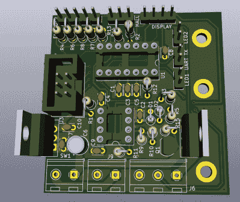

# 自制韦勒 RT 焊接站

> 原文：<https://hackaday.com/2020/01/06/a-homebrew-weller-rt-soldering-station/>

像他之前的许多黑客一样，[MarcelMG]对 Weller 的 RT 烙铁头印象深刻，但对他们设计进入的工作站的高昂购买价格却不太感兴趣。受到类似项目的启发，他决定尝试[建造自己的焊接站，从这些积极的技巧中获益](https://marcelmg.github.io/soldering_station/)而不会受到价格冲击。

该站的用户界面故意保持简单，只有一个四位数的 LED 显示屏来显示温度和一个旋转编码器来设置温度。旋转旋钮时，显示屏每隔几秒钟就会在当前温度和设定温度之间切换，如果按下旋钮，设定温度将被保存为下次的默认温度。

【Marcel mg】还包括一项功能，当熨斗放在支架上时，它可以降低熨斗的温度，减少尖端磨损和能耗。他最初计划使用霍尔效应传感器来检测熨斗何时被放入护套，而不需要与它进行物理接触，但最终他意识到最简单的方法是简单地将微控制器上的一个输入引脚连接到金属支架。由于尖端是接地的，他可以通过几行代码轻松地检测出它是否就位。

说到这里，该站由 ATtiny24A 驱动，其固件使用 Atmel Studio IDE 用 C 编写。[MarcelMG]提到 24A 上有限的存储空间是一个挑战，并建议任何希望跟随他脚步的人使用引擎盖下有更多闪光灯的东西。LED 显示器是一种非常常见的 TM1637 类型，旋转编码器是从一台收音机中抢救出来的，电源来自一台旧笔记本电脑。总的来说，这看起来是一个非常经济的建筑。

根据你的需要，一个 DIY 焊接站可以拥有与商业模式相媲美的功能，或者过于简单的 T2。无论是哪种情况，低电压烙铁和活性烙铁头的出现都让自建焊台变得更加触手可及。没有使用这些现代细节的尝试[往往不那么迷人](https://hackaday.com/2014/08/10/homemade-soldering-stations-for-cheapy-irons/)。