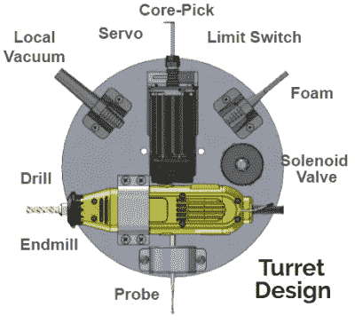

# 由 Arduino 驱动的蜂窝修补机器人

> 原文：<https://hackaday.com/2020/03/03/a-honeycomb-patching-robot-powered-by-arduino/>

不，这不是你可能想到的那种蜂窝。我们谈论的是航天应用中常用的轻质面板。显然，它们在搬运过程中很容易出现凹痕和其他损坏，因此波音公司与加州州立大学的学生合作，想出一种方法来自动化耗时的维修过程。

你可以在休息后看到这台机器的运行，它是一项非凡的工程。但更重要的是，这是对现成组件的令人印象深刻的使用。唯一比看到这个机器人机器进行巧妙的修理更令人着迷的事情是数一数你在商店里放了多少核心部件。

 由铝挤压制成，由 Arduino Due 提供动力，旋转一个 Dewalt 切断工具，看起来像是刚从家得宝(Home Depot)拿回来的，你可以轻松地自己采购大部分硬件。假设你需要自动修复航空级蜂窝板。

这个项目的核心是一个旋转的“炮塔”,它容纳了维修所需的所有工具。转台归位后，所有切削工具的状况得到验证，在受损单元的顶部钻孔。然后将一个小工具小心地插入孔中(这是一个机械运动的小技巧)以去除孔中的毛刺，并使用真空吸出之前操作产生的任何锉屑。最后，将喷嘴移动到位，并用膨胀泡沫填充空隙。

波音公司表示，一个人进行同样的维修需要长达四个小时。坦白地说，这对我们来说似乎有点疯狂。但话说回来，如果我们是负责为价值数亿美元的通信卫星或飞机修理结构面板的人，我们可能也会慢慢来。视频明显加速了，所以很难说这个自动化过程需要多长时间，但从开始到结束似乎不会超过几分钟。

 [https://www.youtube.com/embed/q-pWUgsOAQo?version=3&rel=1&showsearch=0&showinfo=1&iv_load_policy=1&fs=1&hl=en-US&autohide=2&wmode=transparent](https://www.youtube.com/embed/q-pWUgsOAQo?version=3&rel=1&showsearch=0&showinfo=1&iv_load_policy=1&fs=1&hl=en-US&autohide=2&wmode=transparent)

