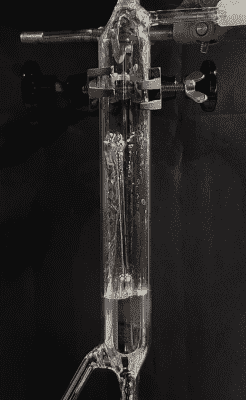

# 在室温下工作的液态金属喷泉

> 原文：<https://hackaday.com/2022/09/01/a-liquid-metal-fountain-that-works-at-room-temperature/>

喷泉是给枯燥的池塘增添一点趣味的好方法。你只需要一个泵，一个过滤器和一些管道，以及一个喷嘴，以某种美观的方式分散加压水。喷泉通常是相当安全的:如果任何一个部分发生故障，最糟糕的事情可能是一些小洪水。

这对[高级修补]最近的项目，NaK 喷泉来说是多么的不同。如果这一次发生泄漏，它很可能会以一个巨大的火球带走周围的环境。这是因为里面的液体是钠钾比例约为 1:3 的合金，称为 NaK(发音像“knack”)，在室温下是液体。不幸的是，它也是高度反应性的:NaK 暴露在空气中会迅速氧化，甚至会自燃。与水接触将导致剧烈爆炸，腐蚀性液体四处飞溅。

 【先进的修修补补】因此在一个定制的玻璃外壳内建立了整个设置。在他的视频(插播后)中，他展示了他的玻璃吹制技能，在一个充当蓄水池的较大玻璃管内制作了一个小喷嘴，用一根管子将液体带回喷嘴。玻璃制品中还嵌入了两个钨电极，用于实现一种相当不寻常的泵。

这种磁流体动力泵的工作归功于洛伦兹力。这两个电极用于使电流沿 *x* 方向通过液态金属，而一对位于外面的钕磁铁提供沿 *y* 轴定向的磁场。洛伦兹力然后在 *z* 方向作用于液体，推动其通过喷嘴。这种泵在处理高活性液体时很方便，因为它不需要任何可能泄漏或腐蚀的活动部件。

[高级修补]为他的玻璃作品经历了几次迭代，尝试了不同的管道方向和密封电极的方法。使用真空泵除去所有痕量的水分和氧气，氩气为 NaK 提供惰性气氛，使其自由流动而不积累氧化物。最终的结果相当令人印象深刻:一股液态金属喷流似乎达到约 15 厘米高。

如果你想自己尝试一下(显然我们不推荐)，有一个相当简单的方法可以获得金属钠。你还需要学习一些玻璃吹制，这并不像看起来那么难。

 [https://www.youtube.com/embed/-NWc9BGMDaA?version=3&rel=1&showsearch=0&showinfo=1&iv_load_policy=1&fs=1&hl=en-US&autohide=2&wmode=transparent](https://www.youtube.com/embed/-NWc9BGMDaA?version=3&rel=1&showsearch=0&showinfo=1&iv_load_policy=1&fs=1&hl=en-US&autohide=2&wmode=transparent)

