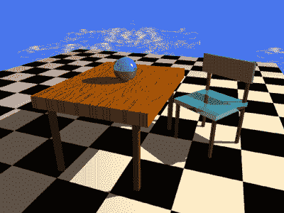
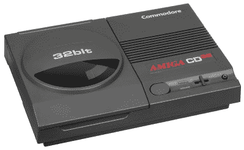

# 给我失去的阿米加的情书

> 原文：<https://hackaday.com/2022/12/20/a-love-letter-to-my-lost-amiga/>

我的初恋是一个黑色的楔子。那是 1982 年，我已经攒钱买了一辆 Sinclair ZX81。这台小电脑是我多年来拥有的众多电脑中唯一一台，我可以真正说我完全了解它的工作原理；虽然我知道写这篇文章的 i7 笔记本电脑是如何工作的，但我只能粗略地说一下，因为它是一个非常复杂的设备。

对计算机的忠诚是变化无常的，虽然我从未失去对小辛克莱的感情，但我会在大约八年后作为一名电子工程学生遇到我真正的电子灵魂伴侣。它不再是我的工作台，但这是我后来拥有的所有机器都将用来衡量的计算机，我希望它没有提前从我身边被夺走，我希望我可以和它一起变老。那台机器是 Commodore Amiga，这是一封情书，一部分是对可能发生的事情的沉思，一部分是对有史以来最好的桌面计算机平台出了什么问题的咆哮。

## 为什么阿米加这么好？

如果我们对阿米加平台的承诺如此深信不疑，以至于看不到它赖以建立的摇摇欲坠的基础，那么到底是什么诱惑了我们？也许在这一点上，有必要快速浏览一下 16 位或以上计算机世界的竞争，看看我们的宿舍里还有什么。这是英国的观点，所以你的市场可能有一些其他玩家，但对我们来说，可能有五个主要竞争者。如果你没有 Amiga，你可能会有 Atari ST 如果你的父母为你选择了电脑，你可能会有 Amstrad PC-XT 克隆；如果你的学校使用了它们，你可能会有 Acorn Archimedes 如果你的父母非常富有，你可能会有一体机 Mac。苹果 IIgs 对英国人来说并不大，尽管德州仪器的家用电脑是 16 位的，但它们一直是 8 位时代的竞争对手。

In the early 90s being able to do this was a big deal. Morn, [CC0](https://commons.wikimedia.org/wiki/File:Amiga_Reflections_2.0_test_scene.png).

在其他平台中，雅达利有 MIDI，但 TOS/GEM 操作系统和桌面很笨重，个人电脑是每个人都告诉你应该拥有的东西，但速度慢，没有声音和糟糕的图形，阿基米德很酷，速度非常快，但有点奇怪，Mac 很棒，但负担不起。相比之下，Amiga 价格实惠，拥有令人惊叹的图形，良好的音频，在适当的多任务操作系统上有一个流畅的 GUI，并且由于其定制的协处理器芯片而感觉很快。到我学生时代的最后一年，人们都在购买 386sx-25 电脑，安装的是 Windows 3.1，即使是那些被认为是强大的电脑，与 Amiga 相比也显得迟缓和笨重。

运行在 7.16 MHz 的 68000 当然没有什么特别的，关键在于 Amiga 基于 ROM 的操作系统和那些额外特殊的定制芯片，这意味着 68k 可以计算，而不是浪费时间在图形和等待磁盘驱动器上。我的经历让我完成了一门电子工程本科课程:它编译 C 程序，为学生广播编辑音频，通宵玩马拉松*旅鼠*课程，甚至有一次花了一天多的时间在棋盘表面渲染必须的光线跟踪镜球。

## 我们做了阿米加。他们搞砸了

上面这句话是 1990 年我拥有第一台 A500 时的一个传说，是埋在 1.2 版 Kickstart ROM 中的一条消息。这是 Amiga 开发团队幸存成员对 Commodore 惨淡的管理和营销的评论，但我们这些几年后喝着 Amiga Kool-Aid 的痴迷于技术的年轻人却天真无知，对这些事情一无所知。对我们来说，这是遥遥领先于其他一切，肯定有一个充满希望的未来。我们错得多离谱。

The Amiga 1000 launch advert is a minute long. Incredibly, you only see a glimpse of the computer at the very end, and they don’t show you any of what it can do.

作为一名前 Amiga 用户，一篇非常有启发性的阅读来自我们的黑客同事 Bil Herd，在 [*回到*风暴](https://hackaday.com/2021/09/08/books-you-should-read-bil-herds-back-into-the-storm/)，这是他在 20 世纪 80 年代中期为 Commodore 工作的自传。他带给我们的是 TED 系列的 8 位计算机，而不是 Amiga，但他很好地说明了上层统治的混乱和无能。

我从它和阅读 Amiga 的早期历史中获得的印象是，工程团队正在建造令人印象深刻的硬件，但该公司一心想把一切都打造成另一个 Commodore 64，而不是认识到计算机市场有超越大众市场家庭游戏平台的潜力。这是[Dave Haynie] 在阿米加的晚年重复的故事，他让我们看到了阿米加可能拥有的诱人一瞥，当时我们在 20 世纪 90 年代初得到的东西令人印象深刻，太少，太晚。

1.2 Kickstart ROM 中的这句臭名昭著的短语指的是 1985 年 Commodore 对最初的 Amiga 1000 的惨淡营销，当时它本可以与竞争对手的最佳产品并列或领先于许多产品。Commodore 的创始人杰克·特拉米尔(Jack Tramiel)在离职前疏远了他的经销商网络，供应短缺加上最乏味的电视广告活动注定无法弥补任何缺口。惨淡的市场继续与更实惠的阿米加 500 和它的 2000 专业马厩。A500 成为热门，尽管，而不是因为，准将的努力。

## 从无限承诺到失败的游戏主机

Taking on Nintendo and Sega without some very special new tricks in your console made you either very brave or stupid in 1993\. Evan-Amos, [Public domain](https://commons.wikimedia.org/wiki/File:Amiga-CD32-HFR.jpg).

当他们的潜在竞争对手苹果公司升级他们的产品线，推出包含更快处理器和更多扩展的新型号时，准将满足于他们的荣誉。在 A1000 推出后的 7 年多时间里，他们以发布新型号为名，多次重新包装基本相同的 7.16 MHz 68000，在 1992 年 Amiga 600 上市时达到高潮。

当他们用 A3000 升级到 68030 时，它是大多数客户无法企及的高端型号，当 68020 成为 A1200 中的低端 Amiga 时，它是没有内存管理单元的廉价“EC”版本。

1994 年，Commodore 在一款本质上是 A1200 的游戏机上与世嘉(Sega)和任天堂(Nintendo)竞争失败，最终破产，当时 Amiga 系列被视为主要是一个游戏平台，而且是一个越来越过时的平台。所有权通过 Escom 和 Gateway 传递，没有新的型号，最终以获得许可的名称结束，现在是少数爱好者的少数平台。正如偶尔的操作系统更新所证明的那样，火焰仍在燃烧，但梦想肯定已经结束。

人们很容易陷入渴望的可能成为的故事中，毫无疑问，每当一些阿米加爱好者举起酒杯时，就会发生这种情况。我们没有一个人在准将老板的办公室，尽管很难相信我们会做得更糟。不难看出他们可能已经尝试了什么:有意义的硬件升级和向 PCI 等标准接口的转移。谁知道呢，如果发生了这种情况，我现在可能会在 Workbench 前这样做，而不是 GNOME。