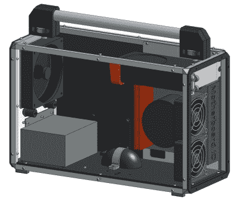

# 对“便携式”电脑的现代诠释

> 原文：<https://hackaday.com/2021/06/28/a-modern-take-on-the-luggable-computer/>

早在业界同意现在无处不在的便携式计算机的翻盖式外形之前，有一类不完全是台式的计算机，被社区亲切地称为“便携式”PC。这些机器来自 Kaypro 和 Osborne 等公司，它们的集成设计使得移动起来相对容易，从这个意义上来说，它们只是便携的。我们今天认为理所当然的东西，如电池供电的能力或轻到可以放在腿上的能力，直到后来才出现。

对于这个几十年前的老概念的当代诠释，[看看这个由[Ragnar84]](https://pcpartpicker.com/b/yjrV3C) 建造的奇妙建筑。它将一台现代台式电脑和一台 15.6 英寸的笔记本电脑显示器装入一个定制设计的箱子中，但像许多其他项目一样，魔鬼确实在这个项目的细节中。底部的支架、顶部的可拆卸手柄以及直角适配器(可从 GeForce GTX 1060 视频卡获取 HDMI 输出并将其重定向回机箱)等小细节加在一起，真正创造出一台令人惊讶的实用计算机，而不仅仅是其各部分的总和。

 虽然这个箱子看起来可能像你的标准游戏玩家装备，但[Ragnar84]用微型 T 型槽挤压和定制切割的铝和丙烯酸面板建造了整个东西。但在此之前，要对整个东西进行 3D 建模，以确保他选择的所有组件都合适。在很大程度上，内部结构与标准的迷你 ITX 没有什么不同，尽管他确实需要做一些特殊的添加，比如安装 N156H 液晶面板驱动板的架子，以及压住圆形 USB 扬声器的巧妙夹子。

我们在过去已经看到了一些令人印象深刻的经典游戏的再现，[但这些通常是由树莓派](https://hackaday.com/2020/01/10/a-luggable-computer-for-the-raspberry-pi-era/)和[提供动力，严重倾向于复古未来主义](https://hackaday.com/2020/06/03/a-dual-screen-luggable-with-integrated-rtl-sdr/)，这是新生的网络平台运动的标志。相比之下,[Ragnar84]已经整理出一些看起来完全可用的东西，我们敢说，甚至可能是实用的。