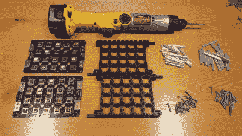

# 用于制造重型 18650 电池组的模块化系统

> 原文：<https://hackaday.com/2019/12/13/a-modular-system-for-building-heavy-duty-18650-battery-packs/>

由于 18650 电池既便宜又丰富，你可能会认为制造自己的定制电池组很简单。不幸的是，焊接电池是棘手的，并不是每个人都愿意投资点焊设置只是为了把标签放在他们身上。当然，这只是战斗的一半，你仍然需要一些电池保护和板载管理来保护电池。

缺乏一个好的开源系统来整合这一切，这就是为什么 Timothy Economu 创造了 DKblock。他在过去三年中开发的开源系统允许用户为电动汽车或家庭储能装配大型 18650 电池组，并配有集成的智能管理和保护系统。也许最棒的是不需要焊接，包装简单地用螺栓固定在一起。

 每块电池都是用螺丝和支架结合 ABS 塑料电池支架组装而成。电池组的每一侧都放置了一个 PCB，与传统电池盒中看到的标签没有什么不同，所有电池都可以连接起来，而无需焊接任何东西。这允许快速组装从 7.2 VDC 一直到 150 VDC 的电池组，并意味着将来需要时可以很容易地检查和更换单个电池。

为了监控电池，在每个电池块上安装了一个“电池块管理器”板，它通过无线方式与监控系统整体健康状况的“电池组管理器”板进行通信。显然，如果你只是想为你的四轴飞行器建造一个包，这样一个强大的系统可能有点大材小用，但是[如果你想建造一个 DIY Powerwall](https://hackaday.com/2016/09/29/homebrew-powerwall-sitting-at-20kwh/) 或[为定制电动汽车](https://hackaday.com/2016/03/02/converting-an-electric-scooter-to-lithium-batteries-and-disabling-safeties/)充电，这可能是你一直在寻找的电池管理系统。