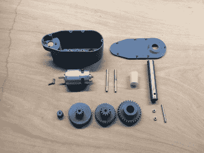

# (大部分)3D 打印伺服/齿轮减速

> 原文：<https://hackaday.com/2019/10/14/a-mostly-3d-printed-servo-gear-reduction/>

这个[伺服/齿轮减速](https://hackaday.io/project/162855-3d-printable-high-torque-servogear-reduction)几乎是用所有 3D 打印的零件组装的。除了一个刷 36 伏 DC 电机，一个不锈钢轴，和螺丝举行伺服在一起，唯一的其他非印刷部分是 BTS7960B 电机驱动器。

关于塑料伺服系统的一些有趣的统计数据——它的失速扭矩约为 55 千克/厘米，当使用输出 22-24 伏的 6s LiPo 电池时，达到 18 安的峰值电流。轴使用两个 20 毫米的孔和润滑进行旋转。(滚珠轴承本来是在设计中的，但是没有按时到组装。)

齿轮的孔直径为 6.2 毫米，以便安装在轴周围，尽管根据 3D 打印的质量，需要小心打磨或填充开口。

这并不是[布莱恩·布罗肯]在 3D 打印齿轮方面的唯一尝试。他还制造了几个爬行机器人、一个 T4 转盘和一辆完全由丙烯酸制成的发条车。的。该项目的 stl 文件都可以在网上获得，任何人都可以制作自己的 3D 打印伺服齿轮。

 [https://www.youtube.com/embed/8sq4pHdSXYM?version=3&rel=1&showsearch=0&showinfo=1&iv_load_policy=1&fs=1&hl=en-US&autohide=2&wmode=transparent](https://www.youtube.com/embed/8sq4pHdSXYM?version=3&rel=1&showsearch=0&showinfo=1&iv_load_policy=1&fs=1&hl=en-US&autohide=2&wmode=transparent)

The [HackadayPrize2019](https://prize.supplyframe.com) is Sponsored by:     