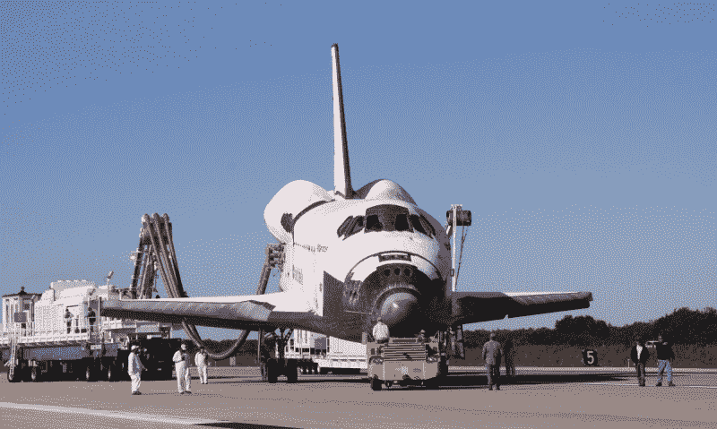
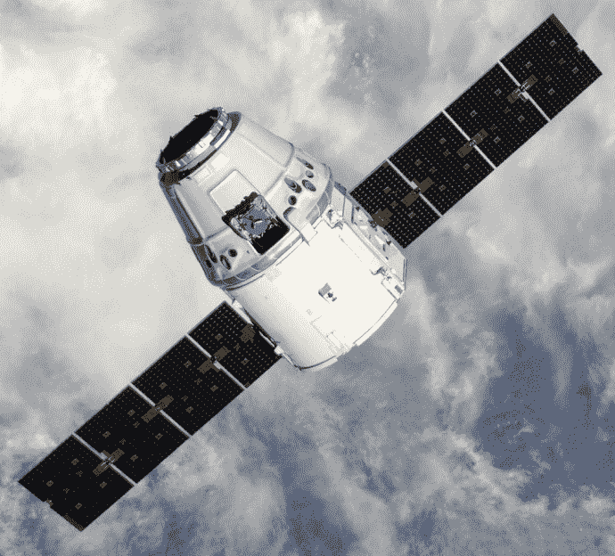
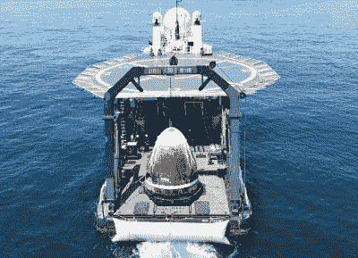
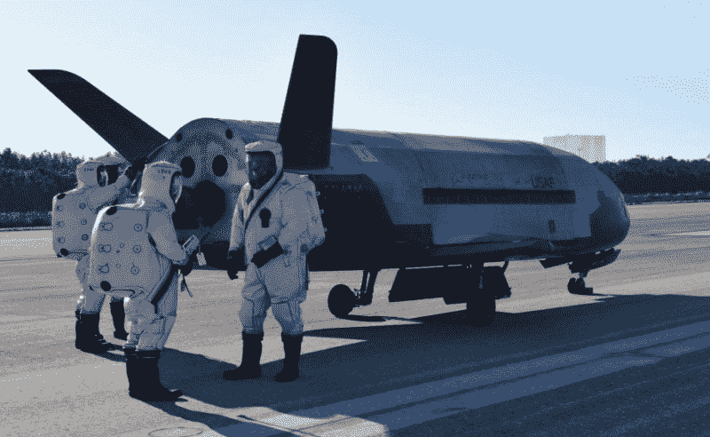

# 航天器的新时代准时传递科学

> 原文：<https://hackaday.com/2021/01/19/a-new-era-of-spacecraft-delivers-science-on-time/>

当亚特兰蒂斯号航天飞机在 2011 年执行最后一次任务时停下来，这确实是一个时代的终结。很少有人能否认这个项目已经变得过于复杂和昂贵，无法继续运行，但尽管如此，随着航天飞机舰队的退役，人类在低地球轨道上做有用工作的能力受到了严重打击。更糟糕的是，没有迹象表明何时或是否会开发出另一种航天器，能够真正与 20 世纪 60 年代末首次构想的有翼轨道飞行器的能力相匹敌。

虽然它的主要功能是将卫星等大型有效载荷送入轨道，但航天飞机从太空回收物体并将其带回的能力也同样重要。在其传奇的职业生涯中，由于飞船独特的设计，在国际空间站或轨道飞行器上进行的敏感实验被轻轻地送回地球。不像传统的宇宙飞船那样在大海中溅落，航天飞机像飞机一样缓慢降落在停机坪上。一旦着陆，实验可以迅速卸载并转移到附近的空间站处理设施，科学团队将在那里等待进行进一步的处理或分析。

*Atlantis* is towed from the runway for payload processing.

30 年来，航天飞机及其在肯尼迪航天中心的各种设施提供了一种可靠的方式，在离开轨道几个小时后，将脆弱或时间敏感的科学实验送到研究人员手中。这是一项在航天飞机出现之前根本不存在的有价值的服务，也是自航天飞机退役以来科学家们一直被剥夺的服务。

直到现在。随着第一艘货运龙 2 号在佛罗里达海岸成功溅落，美国国家航空航天局(NASA)离重获十年来从未拥有的关键能力又近了一步。虽然它仍然不像任务结束后简单地将航天飞机推入轨道飞行器处理设施那样方便，但 SpaceX 可以引导他们的太空舱进入太空海岸附近的水域，这一事实大大减少了将实验返回给设计它们的研究人员所需的时间。

## 在龙的翅膀上

虽然在航天飞机退役后，花费了近十年时间才在美国本土恢复载人发射，但货运飞行的停机时间却没有这么长。SpaceX 公司在 2010 年将他们的第一个龙太空舱送入轨道，在*亚特兰蒂斯*号最后一次飞行一年多后，他们准备开始向国际空间站进行定期补给任务。这种私人开发的飞船不仅可以将 6000 公斤(13000 磅)的加压和非加压货物运送到轨道前哨，还可以将大约 3000 公斤(6600 磅)的货物带回地球。

By 2012, SpaceX had already sent a Dragon to the ISS.

相比之下，航天飞机可以在它巨大的货舱中装载大约 14，400 公斤(31，700 磅)的货物安全着陆。但实际上，这种能力是为了运输卫星，对于简单地返回科学实验架来说完全是多余的。价格也是一个考虑因素:龙任务的成本只是航天飞机飞行的一小部分。结合“龙”更高的发射节奏，很明显哪种运载工具更适合定期往返国际空间站。

但是也有不好的一面。尽管 SpaceX 公司声称有朝一日会与 Dragon 一起执行精确的推进着陆，但这个小型航天器最终在降落伞下溅落在海洋中，就像它之前的阿波罗和双子座太空舱一样。这意味着乘坐龙返回地球是一次比航天飞机更艰难的旅程。虽然这对许多有效载荷来说不是问题，但对于一些敏感的实验来说，如那些旨在研究微重力下晶体生长的实验，这可能是一次毁灭性的经历。

让事情更加复杂的是，太空舱坠落在距离海岸几百公里的太平洋上。这使得总部位于加州的 SpaceX 公司的回收操作变得更加容易，但由于美国宇航局在西海岸缺乏合适的有效载荷处理设施，返回的货物需要运输到休斯顿的约翰逊航天中心或一路返回肯尼迪航天中心。实验在向科学家公开之前可能不得不忍受跨国飞行的前景，使得某些研究很难或不可能完成。

## 人的因素

虽然不太理想，但将货物和实验在西海岸着陆并运回佛罗里达，仍然比用联盟号从哈萨克斯坦运回要好。但当 SpaceX 开始将宇航员作为商业船员计划的一部分时，这就不太好了。美国宇航局希望新机组龙的主要溅落点尽可能靠近肯尼迪航天中心，以利用现有的航天飞机时代的资源和设施，在墨西哥湾的溅落是为了应对突发事件。

*GO Navigator* with Crew Dragon onboard.

这需要 SpaceX 的回收能力有相当大的扩展。该公司采购了两艘船， *GO Searcher* 和 *GO Navigator* ，配备了医疗设施、直升机停机坪和船尾的起重设备，用于将浮动的船员龙胶囊吊到甲板上。为了冗余，两艘飞船实际上是相同的，可以同时部署。

随着操作资产和训练有素的人员转移到东海岸的船员龙，恢复货运变种航天器在加利福尼亚州不再有财政意义。此外，考虑到这两种运载工具是如此相似，从海洋中拖出“货运龙”号所获得的经验将有助于改进载人回收作业。由于美国宇航局的要求规定宇航员必须在溅落后的 60 分钟内离开太空舱，这些团队需要尽可能多的练习。

除了交货时间更快之外，Cargo Dragon 还拥有其他一些优于其前身的优势。升级后的太空舱增加了有效载荷能力，储存敏感材料的气候控制储物柜数量增加了一倍，还有一个完全自主的对接系统，可以减少轨道前哨站上宇航员的工作量。它还可以更容易地翻新以供重复使用，这不仅降低了成本，而且允许比其他方式更高的发布频率。

## 追逐梦想

随着一架直升机等待将时间敏感的有效载荷从回收船运送到空间站处理设施，SpaceX 现在可以在溅落后 4 到 9 个小时内向科学家提供实验。与以前相比，这是一个巨大的进步，也可以说是对海上作业的现实预期。但是它仍然没有航天飞机快。

最终，不得不将航天器从海洋中拖出，并通过直升机将人类机组成员或科学有效载荷运送回陆地，这将比简单地将车辆降落在指定的设施上花费更长的时间。由于 SpaceX 公司不再追求龙飞船的目标推进着陆，这意味着另一家公司将不得不加紧应对真正快速有效载荷返回的挑战。

Dream Chaser prototype during testing.

碰巧的是，这正是内华达山脉公司希望用他们的追梦者太空飞机做的事情。目前计划在 2022 年飞行，作为美国宇航局商业再补给服务-2 计划的一部分，该车辆可以返回多达 1750 公斤(3860 磅)的货物，以平缓的水平着陆。追梦者号的大小是航天飞机轨道器的四分之一，它的优势在于能够使用任何足够长的跑道来容纳大型客机。

这种在地球上任何地方着陆的能力对国际科学合作都有明显的好处。但更重要的是，当该公司完成他们的人类级航天器变体的工作时，它可能是一种潜在的救生能力，以防医疗紧急情况需要尽快将一名机组人员送回地球。

## 太空力量引领潮流

事实上，多个商业运营的航天器现在正在竞争将货物和机组人员带到国际空间站和更远的地方，这是一个令人难以置信的成就。这是许多业内人士认为永远不会发生的事情，事情才刚刚开始。下一个十年将会看到更多的运载工具和助推器上线，都在努力成为最快、最可靠，当然也是最便宜的。太空民主化正式开始了。

The X-37B on the Shuttle runway at Kennedy Space Center.

但正如历史上经常出现的情况一样，军方似乎大大领先于潮流。波音 X-37B 空天飞机现在由新成立的太空部队运营，是轨道研究和开发的理想平台，在许多方面超过了其商业同行的能力。

自然，关于这个神秘的飞行器，我们还有很多不知道的，但是它进行自由飞行实验和将科学载荷从太空返回到软着陆跑道的能力已经公开展示了几次。由于完全自主，X-37B 也能够比任何载人飞行器在轨道上停留更长时间。这为在完全隔离的情况下进行长期实验提供了独特的机会；这在熙熙攘攘的国际空间站是不可能的。

正如你所料，在 X-37B 上进行的大部分研究都是机密的。一些人认为该飞行器是为了评估新的侦察设备和技术而设计的，而另一些人认为它是反卫星武器的测试平台。但有迹象表明，太空部队愿意与非军事研究人员分享其微型太空飞机，5 月份的最后一次发射携带了创纪录数量的美国宇航局实验。

最终，这些运载工具中没有一个能比航天飞机携带更多的科学载荷，而且到目前为止，只有政府运营的飞船能够达到真正对时间敏感的实验所需的快速周转。但是有史以来第一次，研究人员可以有一系列竞争性的选择，他们想把他们的有效载荷送上太空，然后完好无损地返回；这无疑是朝着正确方向迈出的一步。