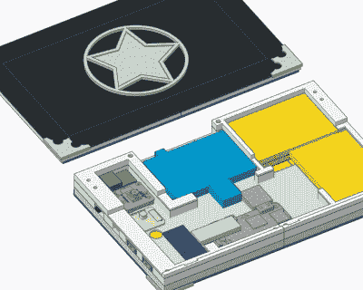

# 命令行向导的覆盆子 Pi 魔法书

> 原文：<https://hackaday.com/2019/02/25/a-raspberry-pi-grimoire-for-the-command-line-wizard/>

谁说没有魔法这种东西？可以肯定的是，没有人知道 Unix 管道是什么。如果你对着闪烁的光标念一些最棒的咒语，这台由[Calvin] 创造的[scrubber Pi Zero“spell book”笔记本电脑可能正是药剂师所订购的。对我们来说幸运的是，他很友好地为任何想涉足 GNU 黑魔法的人记录了这本企鹅动力的大部头书的设计和构造。](https://hackaday.io/project/164091-spellbook)

 在休息后的系列视频中，观众有机会观看一个项目从创意到最终产品的过程。第一个视频是在项目完成前近一个月上传的，讲述了项目的一些设计元素以及[Calvin]在组件放置等方面的不同想法。在整个视频中，他用 TinkerCAD 展示了他的想法，对于一个如此复杂的项目来说，tinker CAD 可能不是我们的第一选择，但它确实展示了基于网络的免费 CAD 包的可能性。

在第二个视频中，[Calvin]已经打印了一些零件，现在已经将硬件组装起来。总的想法是,“书”的外部面板是由从旧计算机的侧面板切割下来的钢制成的，3D 打印的组件在电子组件之间采取隔离物的形式。这些塑料“页面”不仅比一个完整的箱子更容易和更快地打印，而且当从侧面看时，有助于销售书籍的外观。

[Calvin]分享了他的 TinkerCAD 设计，这样其他人可以打印出这本书所需的组件，尽管你必须自己采购钢板。他还分解了他使用的所有主要组件，并给出了从显示器和键盘到螺丝和支架的购买链接。他选择了 Pi Zero，并坚持主要在控制台上工作，但如果你想要一个功能足够强大的图形环境，他说 Pi 3 也有一席之地。

黑客们似乎很喜欢把硬件藏在书、计划或其他东西里。我们最近已经看到一个 iPad 被舒适地放在一个笔记本里，当然，没有一个房子是完整的，如果没有一本书兼作隐藏开关的 T2。

 [https://www.youtube.com/embed/YzPa3XTZbz4?version=3&rel=1&showsearch=0&showinfo=1&iv_load_policy=1&fs=1&hl=en-US&autohide=2&wmode=transparent](https://www.youtube.com/embed/YzPa3XTZbz4?version=3&rel=1&showsearch=0&showinfo=1&iv_load_policy=1&fs=1&hl=en-US&autohide=2&wmode=transparent)

 [https://www.youtube.com/embed/kjdEVaSI5tQ?version=3&rel=1&showsearch=0&showinfo=1&iv_load_policy=1&fs=1&hl=en-US&autohide=2&wmode=transparent](https://www.youtube.com/embed/kjdEVaSI5tQ?version=3&rel=1&showsearch=0&showinfo=1&iv_load_policy=1&fs=1&hl=en-US&autohide=2&wmode=transparent)

 [https://www.youtube.com/embed/9PDkytWfMA0?version=3&rel=1&showsearch=0&showinfo=1&iv_load_policy=1&fs=1&hl=en-US&autohide=2&wmode=transparent](https://www.youtube.com/embed/9PDkytWfMA0?version=3&rel=1&showsearch=0&showinfo=1&iv_load_policy=1&fs=1&hl=en-US&autohide=2&wmode=transparent)

