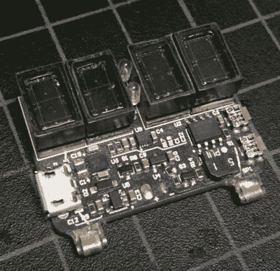

# 一款非常实用的 Numitron 手表

> 原文：<https://hackaday.com/2018/08/16/a-surprisingly-practical-numitron-watch/>

经常阅读 Hackaday 的读者肯定对谢妮电子管很熟悉:这是一种非常复古的冷阴极显示设备，黑客们将其融入到各种设备(尤其是钟表)中，给它们注入了一种强烈的人造怀旧情绪。但不幸的是，谢妮显示器相当脆弱，由于其高电压要求，驱动起来可能很棘手。对于那些想用更宽容的方式工作的人来说，一个可能的选择是每段都使用白炽灯丝的 Numitron。

 利用 Numitrons 的现有技术并不多，但这种情况可能会改变，因为这款由[Dycus]设计的腕表看起来非常棒。凭借多天的电池寿命、日光下的可读性和相对简单的结构，[fila watch 很可能最终成为未来 Numitron 手表的参考设计](https://imgur.com/a/dUXScHW)。

到目前为止，戴克斯已经对 Filawatch 进行了三次修改，可能至少还有一次修改正在进行中。当前版本由 ATmega328 微控制器供电，带有双 16 位 LED 驱动器，用于控制 KW-104S Numitron 显示模块中的灯丝。他还包括一个加速计，以确定佩戴者何时在看显示器，甚至还包括一个光传感器，以根据环境光水平控制显示器的亮度。

如果说 Numitron 显示器有什么缺点的话，那就是它们巨大的能耗。就像我们大多数人已经放弃使用 LED 的白炽灯泡一样，要让灯丝发光需要很多能量。[Dycus]报告称，显示器在打开时消耗高达 350 mA 的电流，但每次只点亮 5 秒钟，就可以在手表需要充电之前检查大约 150 次。

我们已经有几年没有看到 Numitron 手表了，看到[的技术水平如何发展](https://hackaday.com/2011/12/21/numitron-tube-tutorial/)很有意思。

[通过[/r/电子](https://www.reddit.com/r/electronics/comments/97j98y/a_watch_i_built_that_uses_numitrons_incandescent/)