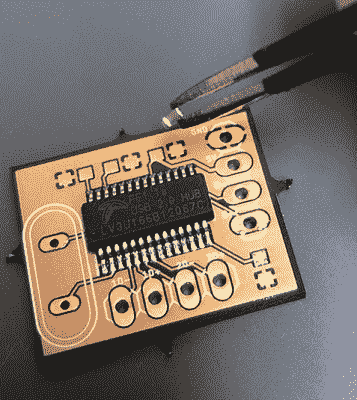

# 满足您所有硬件改装需求的微型 USB 集线器

> 原文：<https://hackaday.com/2020/02/02/a-tiny-usb-hub-for-all-your-hardware-modding-needs/>

追溯到 Eee PC 改装的鼎盛时期，硬件黑客们一直在寻找小型 USB 集线器，这种集线器可以轻松地从机箱中解放出来，并集成到他们正在进行的任何项目中。你不时会看到推荐的品牌和型号适合这种用途，但要找到这样一个基本组件似乎比必要的要困难得多。

 这就是为什么[【retro cution】开发了一个 USB 集线器，它不仅非常小](https://www.retrocution.com/2020/01/15/easy-diy-tiny-usb-hub-for-raspberry-pi-projects/)，而且相对容易组装，只有六个组件。此外，最重要的是，它们非常便宜。

当你把制造印刷电路板和购买所有 SMD 元件的成本加起来，这些集线器的单价只有几美元。如果你有能力自制 PCB，那就更好了。考虑到这些东西可以使其他项目变得更加容易，它似乎比前期成本更值得。

展会的明星是 FE1.1s，一款采用 SSOP-28 封装的四端口 USB 2.0 控制器。在撰写本文时，通常海外来源的价格约为 25 美分(对于较大的订单，价格甚至更低)。再增加几个 10 μF 陶瓷电容、一个 2.7kω电阻和一个 12 MHz 晶振。

设计中没有提供实际的 USB 端口，但它们无论如何都会占用空间；该集线器旨在直接焊接到其他设备上。顺便提一下，为了减少 PCB 上的走线和焊盘数量，下游器件也没有电源线。所以你需要分别给它们供电。

无源元件是 0603，但是晶体是一个很好的老式通孔元件。【逆向】用焊膏模板和热风站组装电路板，[但是如果你有一点实践](https://hackaday.com/2019/11/18/a-newbie-takes-the-smd-challenge-at-supercon/)，你肯定可以用熨斗来做。有了这样一个简单的设计，你可以在一个下午建立一个终身供应的这些小枢纽。不管怎样，这肯定是我们的计划。

 [https://www.youtube.com/embed/gb1BlFKrX1Y?version=3&rel=1&showsearch=0&showinfo=1&iv_load_policy=1&fs=1&hl=en-US&autohide=2&wmode=transparent](https://www.youtube.com/embed/gb1BlFKrX1Y?version=3&rel=1&showsearch=0&showinfo=1&iv_load_policy=1&fs=1&hl=en-US&autohide=2&wmode=transparent)

