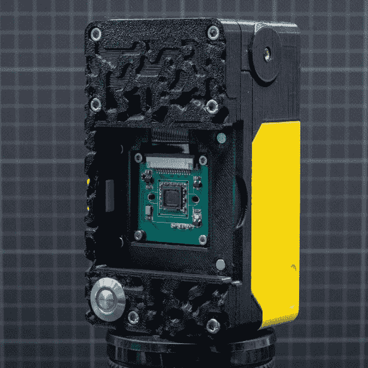

# 使用 Python 向 3D 打印零件添加柏林噪声

> 原文：<https://hackaday.com/2022/07/31/adding-perlin-noise-to-3d-printed-parts-with-python/>

想要给 3D 打印的零件增加一点视觉效果吗？这正是[volzo]所追求的，这让他创建了一个能够生成大量柏林噪声的 Python 脚本，呈现为 STL 文件。那看起来像什么？不可预测的随机丘陵和山谷景观。

The script can give printed parts a more appealing finish.

这个想法是用脚本的结果修改一个 3D 模型，留下一个比无聊的平面更有趣的东西。[volzo]解释了如何使用 OpenSCAD 来做到这一点，但也可以将脚本创建的 STL 文件导入到自己选择的 CAD 程序中，并通过一些布尔运算进行修改。

如果这种效果看起来有点熟悉，很可能是因为他用这种方法设计了我们最近展示的 3D 打印“玩具”相机的一部分。

[volzo]的方法并不完全是即插即用的，但在设计下一个部件时，它仍然可以方便地放在你的后口袋里。也有其他方法来修改印刷品的表面，以获得更好的美学效果；我们之前已经介绍过[速度绘画](https://hackaday.com/2018/07/05/tattoo-your-3d-prints-with-velocity-painting/)(在一些切片器中也被称为‘纹身’)，以及[模糊皮肤](https://help.prusa3d.com/article/fuzzy-skin_246186)。

Perlin noise 是由[Ken Perlin]在 80 年代早期创作的，当时他正在制作原始的 *Tron* 电影，以帮助生成更逼真的纹理。[即使在今天](https://hackaday.com/2021/03/10/perlin-noise-helps-make-trippy-typographic-art/)，它仍然以各种方式履行着艺术功能。