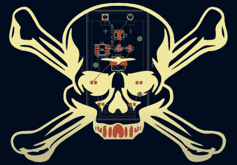

# 使用 KiCAD 6 和 Inkscape 的高级 PCB 图形

> 原文：<https://hackaday.com/2022/01/08/advanced-pcb-graphics-with-kicad-6-and-inkscape/>

有很多很多关于 PCB 功能侧设计的视频教程，为您提供原理图构建和布局技巧。比较难找到的是图形方面的教程，涵盖了从创作艺术品到如何驱动工具让它们在 PCB 上看起来不错，最大限度地利用丝网印刷、焊料和铜层的过程。[Stuart Patterson]介绍了他在 KiCAD 6.0 和 Inkscape 中的[高级 PCB 图形指南，](https://www.youtube.com/watch?v=zjnwlTgil4A)(视频，嵌入下方)，帮助您打造外观酷炫的 PCB。

Silkscreen layers in yellow, solder mask opening in red

第一步是得到你的位图，不管你是自己创建的，还是下载的，然后使用 Inkscape 的“跟踪位图”工具将其跟踪成一组矢量。如果你从 SVG 或者类似的矢量图形开始，那么你可以跳过这个阶段。

接下来，只需通过删除不属于轮廓的所有细节来创建 PCB 轮廓形状。这里和那里的一点缩放，以获得正确的尺寸，你完成了第一部分。[Stuart]有一个更早的视频[展示了这个过程](https://www.youtube.com/watch?v=rhqlP8CRct0)。

KiCAD 6.0 中的可用性改进有很多，但一个非常需要的功能是分组对象的能力，就像在 Inkscape 和任何其他矢量图形工具中一样。这意味着您可以简单地将 SVG 轮廓导入到边缘中。切割 PCB 层，所有曲线将很好地结合在一起。接下来，你选择你想要的丝网印刷层，阻焊去除层和任何非电路铜的细节。在 Inkscape 中，明智的做法是使用层功能将不同的材质类型分配给一个唯一命名的层，这样就可以隐藏它们以便导出。除了轮廓、槽和孔的任何矢量细节之外，这允许您从单个主文件处理丝绸、掩模和铜 PNG 导出。

一旦你有了丝绸，面具等的 PNG 位图输出。您需要使用 KiCAD 图像转换器工具在电路板专用库中创建一个封装外形。有趣的是，您可以从工具中导出一个新的图像足迹，并将其直接粘贴到足迹编辑器中，同时调整所有的可见性细节。那肯定会节省一些时间和精力。无论如何，我们希望来自[Stuart]的这个小教程能有所帮助，并且我们一定会在接下来的几个月里带给你更多。

KiCAD 需要更多帮助吗？查看这个教程，如果你想从这个工具中获得更多的能力，你需要[一些动作插件](https://hackaday.com/2019/11/19/kicad-action-plugins/)！

 [https://www.youtube.com/embed/zjnwlTgil4A?version=3&rel=1&showsearch=0&showinfo=1&iv_load_policy=1&fs=1&hl=en-US&autohide=2&wmode=transparent](https://www.youtube.com/embed/zjnwlTgil4A?version=3&rel=1&showsearch=0&showinfo=1&iv_load_policy=1&fs=1&hl=en-US&autohide=2&wmode=transparent)

