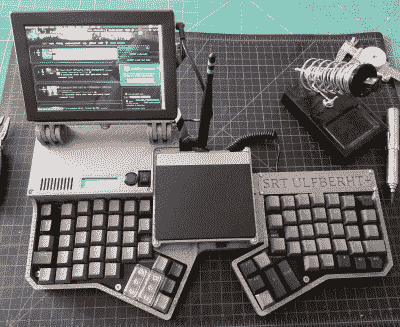

# 推进网络甲板技术的发展

> 原文：<https://hackaday.com/2019/12/24/advancing-the-state-of-cyberdeck-technology/>

能够见证一项技术的诞生和随后的演变有点罕见，至少在足够短的时间范围内欣赏它，但现在我们足够幸运地看到它在蓬勃发展的 cyberdeck builders 社区中发生。在过去一年左右的时间里，我们已经看到了 cyberdeck 项目的绝对爆炸，但是[这个来自【锡箔 _ 服饰店】的最新项目真正推动了艺术的发展](https://imgur.com/gallery/Nx1dnUw)。除了将你的意识传送到母体，我们不确定你能多接近威廉·吉布森最初的视觉。

 该设计基于一个分离式人体工程学键盘，中间是一个英特尔 NUC，一侧倾斜安装有一个 1920×1200 IPS 面板。自从显示器作为 DSLR 显示器诞生以来，它没有触摸板，但那些尚未掌握无鼠标工作流程的人会很高兴知道 NUC 的盖子内置了触摸板。多亏了一个聪明的燕尾接头，如果你想在双手之间留出更多空间，或者只是为了在你背着它穿过蔓延时让整个事情不那么令人生畏，甲板也可以分成两半。

电源由一个定制的 18650 电池组提供，该电池组在 18 伏电压下运行，由自制的点焊机组装而成。他包括降压和升压转换器，因此如果他发现自己在现场需要一些电力，cyberdeck 可以用各种电压供电。为了最大限度地延长电池寿命，他还在继电器中工作，以便在 NUC 睡眠时切断显示器的电源，还有一个物理主开关，可以在长时间不活动时完全断开所有连接。

Hackaday 上的第一个网络平台是由[Tinfoil _ haberharery]建立的，我们很高兴看到他没有满足于他的荣誉。虽然第一层本身确实令人印象深刻，但这座建筑[从我们](https://hackaday.com/2019/11/25/patrol-the-sprawl-with-this-battle-ready-cyberdeck/)[从其他硬件黑客](https://hackaday.com/2019/09/20/3d-printed-virtuscope-is-a-raspberry-pi-4-cyberdeck-with-a-purpose/)那里看到不可思议的作品中获得灵感，并提高了这个专注社区的可能性。