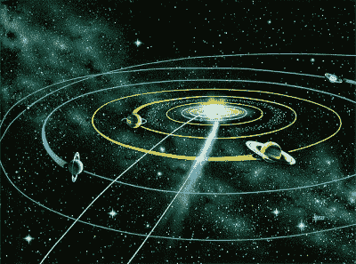

# 中断八个月后，深空网络与旅行者 2 号重新连接

> 原文：<https://hackaday.com/2020/11/12/after-eight-month-break-deep-space-network-reconnects-with-voyager-2/>

最近，当消息传出“旅行者 2 号”终于与“旅行者 1 号”重新建立了联系时，我感到一阵恐慌。自从 1977 年双太空探测器发射以来，我一直在跟踪旅行者号的任务，我一直在担心不可避免的一天，当他们的放射性同位素热发生器中的最后一点钚衰变到他们不再能够与我们交谈的程度，他们在星际空间的深渊中沉默了。根据这些头条新闻，旅行者 2 号已经停止通信 8 个月了——这可能是最后一次睡眠前的快速小睡吗？

谢天谢地，没有。事实证明，最近发生在我们最遥远的人类工程前哨的停电是完全预料到的，而且完全发生在地球上。升级和维护是在深空网络天线上进行的，这些天线需要与旅行者通话。但这给我留下了一个问题:DSN 的其余部分呢？难道他们没有收拾残局，让我们在旅行者号穿越星际空间时保持联系吗？答案是射频工程和轨道动力学的有趣结合。

## 腰带以下

为了理解这次中断，人们需要对深空网络及其工作原理有所了解。我[过去详细讨论过这个问题](https://hackaday.com/2017/07/21/serious-dx-the-deep-space-network/)，但这里有一个快速总结。DSN 由三个站点组成:西班牙的马德里、加利福尼亚州的戈德斯通以及澳大利亚堪培拉的站点。每个站点都有一个碟形天线阵列，从直径 26 米到高达 70 米的碟形天线不等。这三个站点共同合作，提供了一个强大的通信基础设施，几乎支持了过去 50 年左右发射的所有航天器。

DSN 站点的有趣之处在于它们的地理布局。从北极俯视地球，DSN 站点几乎正好相隔 120 度。这意味着每个站点的天空视图与另一个站点的重叠约 30 万公里，从而为每个空间探测器提供全天候覆盖。但是太空旅行不一定只是二维的，这就是地球的地理奇特之处，奇怪的是，太阳系本身的诞生，在最近的旅行者号昏厥中发挥了作用。

The ecliptic, with a comet. [ESO.org](https://www.eso.org/public/outreach/eduoff/vt-2004/Background/Infol2/EIS-D3.html)

几乎所有围绕太阳运行的东西都是在一个被称为黄道的非常明确的平面上运行的。黄道面可能是早期尘埃和碎片盘的残余，最终凝结成我们的太阳和行星。太阳系中唯一与黄道稍有不同的主要天体是冥王星，它的轨道与黄道倾斜约 17 度。地球几乎总是在黄道上，因此任何离开地球的东西也几乎会留在那个平面上，除非做好准备改变它的轨道。

这正是航海家双胞胎的遭遇。旅行者号探测器的发射是为了利用每 175 年才会发生一次的外行星轨道排列的古怪现象，因为每次行星相遇都计划给探测器一个引力辅助，将它们抛向下一个目的地，所以旅行者号探测器能够完成他们的伟大旅行。在与木星轨道相交并加速前往土星之前，两个探测器在旅程的第一部分都非常靠近黄道平面。

在土星上，这两个探测器将会分开去执行完全不同的任务。为了更好地观察土星的卫星泰坦，旅行者 1 号从黄道下方靠近这颗行星，从南极下方靠近。重力辅助使它进入黄道平面上方的轨道，大致方向是蛇夫座。然而，旅行者 2 号继续在黄道上飞行，利用它的引力辅助，首先飞向天王星，最终飞向海王星。在那里，与它的孪生兄弟用来探索土卫六的技巧一样，旅行者 2 号飞越了海王星的北极，这使它接近它的卫星海卫一，并沿着人马座的大致方向飞行。

 [https://www.youtube.com/embed/l8TA7BU2Bvo?version=3&rel=1&showsearch=0&showinfo=1&iv_load_policy=1&fs=1&hl=en-US&autohide=2&wmode=transparent](https://www.youtube.com/embed/l8TA7BU2Bvo?version=3&rel=1&showsearch=0&showinfo=1&iv_load_policy=1&fs=1&hl=en-US&autohide=2&wmode=transparent)

## 你好，堪培拉呼叫

正是这最后一步，最终使旅行者 2 号完全依赖堪培拉进行通讯。堪培拉是唯一一个位于赤道下方的 DSN 站点，即使赤道和黄道平面不共面——它们相差大约 23°的地轴倾角——最终旅行者号将到达黄道平面下方很远的地方，以至于北半球的 DSN 站点都无法看到它。

幸运的是，堪培拉已经准备好支持旅行者 2 号。随着探测器以 55，000 公里/小时的速度飞离家园，其燃料慢慢衰减，旅行者号越来越难通话。堪培拉的巨型 70 米碟形天线被称为 DSS-43，它提供了所需的增益，足以发射足够强大的信号，跨越我们和旅行者号之间 17 光时的差距。有趣的是，堪培拉的 DSN 控制员理查德·斯蒂芬森报告说，尽管综合设施中较小的 34 米碟形天线仍可用于向旅行者号发射控制信号，但这种接触是“喷射和祈祷”的事情，可能会或可能不会被探测器接收并采取行动。只有 DSS-43 有能力和收益来有效地指挥飞船。

尽管 DSS-43 在继续航海家星际任务(VIM)中起着重要作用，但它已经开始老化，不得不安排维修。正如我们在 7 月报道的那样，大碟于 2020 年 3 月下线，此后一直在升级。八个月之后，维修工作已经进展到了 DSS-43 可以尝试与旅行者 2 号进行简单的命令链接的程度——仅仅是一句基本的“你还在吗？”10 月 29 日发的 ping。

令人高兴的是，尽管旅行者号在此期间已经额外穿越了 3 亿公里的星际空间，但探测器在几乎一天半后返回了对命令的确认。在天线于 2021 年 1 月恢复全面服务之前，仍有许多 DSS-34 升级任务要完成，但看起来控制器无法忍受与旅行者号失去联系。

如果你想了解 DSS-43 的具体进展，以及堪培拉 DSN 的总体情况，我强烈推荐你查看理查德·斯蒂芬森的推特消息。他有大量精彩的推文，大量大菜的照片，以及丰富的内幕信息。衷心感谢他参与了这个故事，感谢所有让 DSN 继续提供重要科学的工程师。

【特色图片来源: [CSIRO](https://www.csiro.au/) 、 [JPL/NASA](https://www.nasa.gov/feature/jpl/nasas-deep-space-station-in-australia-is-getting-an-upgrade)