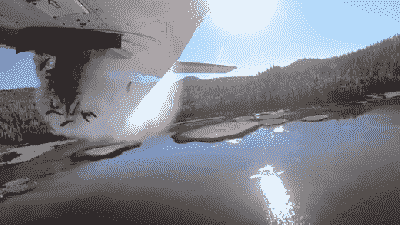
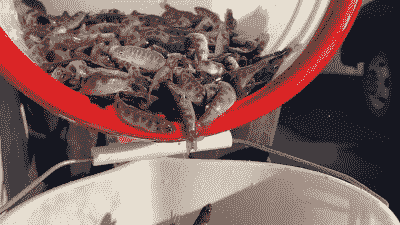

# 空投活鱼是一件事，它看起来很壮观

> 原文：<https://hackaday.com/2021/08/18/airdropping-live-fish-is-a-thing-and-it-looks-magnificent/>

犹他州是一个以奇妙多样的荒野为特色的地方。它的多山地形是许多山谷、池塘和溪流的家园。他们是休闲垂钓者的最爱，他们会到这个地区进行大型垂钓。然而，这些地区经常被游客捕捞，需要重新进货。其他环境因素也在减少人口中发挥作用。

A plane delivering live fish to the lakes of Utah via air drop. Source: Utah DWR

当这种情况在一些地区发生时，只需开一辆装满水和鱼的卡车，把它们倒进湖里。问题是这些湖泊和河流中有许多很难通过步行或公路到达。信不信由你，迄今为止发现的处理这个问题最实用的方法是空运活鱼。事情是这样的。

## 活货

通常，落入这些偏远水道的鱼非常年轻，大约有 1-3 英寸长。这些鱼是专门饲养的，以便以后捕捞，而且通常是不育的，这使得犹他州野生动物资源部门更容易管理数量。当需要给偏远的湖泊补充食物时，水弹飞机会装满水，装上鱼。

A variety of trout and other species are specifically hatched to repopulate the streams and lakes of Utah for fishing. The fish dropped are usually just 1″-3″ long, with their small size and light weight helping them survive the drop due to their low terminal velocity. Source: Utah DWR

这种小而轻的鱼倾向于随水而下，存活率非常高。官员估计 95-99%的鱼在落入水中后仍然存活。虽然这听起来很有压力，但他们说这比类似的公路旅行对鱼的伤害要小。在这种情况下，鱼很难在长途跋涉中保持良好的氧气水平。

[实践已经进行了相当一段时间](https://wildlife.utah.gov/news/wildlife-blog/188-extreme-fish-stocking.html) ( [缓存](https://webcache.googleusercontent.com/search?q=cache:LQIhd-uAC7QJ:https://wildlife.utah.gov/news/wildlife-blog/188-extreme-fish-stocking.html+&cd=4&hl=en&ct=clnk&gl=au))。在空投程序在 20 世纪 50 年代成为标准之前，鱼经常被装进旧牛奶罐，用马驮到山上。根据需要服务的区域，还可以使用其他方法。可以用水桶，也可以用装满水和鱼的背包，由徒步队背到荒野深处。在犹他州 DWR 的生物学家马特·麦克科尔所谓的“极端鱼类放养”中，全地形车和越野车被用来进入偏远水域，给它们重新装载鱼类。

 [https://www.youtube.com/embed/HDuRXSZgBWU?version=3&rel=1&showsearch=0&showinfo=1&iv_load_policy=1&fs=1&hl=en-US&autohide=2&wmode=transparent](https://www.youtube.com/embed/HDuRXSZgBWU?version=3&rel=1&showsearch=0&showinfo=1&iv_load_policy=1&fs=1&hl=en-US&autohide=2&wmode=transparent)

小型通用航空飞机被用于这一目的，与那些用于空中灭火的飞机没有什么不同。这些飞机一次飞行可以运送 35，000 条鱼，远远超过了其他方法可以轻松实现的目标。选择空投的鱼通常是垂钓者喜欢的，也非常适合犹他州的环境。为此目的饲养的鱼包括虹鳟鱼、割喉鳟鱼、溪鳟鱼、虎鳟鱼、斑鳟和北极灰鳟。

## 重新进货作为环境控制

控制鱼类资源是避免犹他州湖泊环境问题的关键。保持本地物种的快乐和河道的健康需要对区域本身和它们周围的法规进行仔细的管理。今年，由于夏季干旱肆虐，犹他州 DWR 面临着高温和低水位的特殊问题。最近[提高了捕鱼配额](https://www.fox13now.com/news/local-news/utah-increases-fishing-limits-to-avoid-potential-die-offs) — [实际上这个月提高了两次](https://www.fox13now.com/news/local-news/utah-dwr-raises-daily-fishing-limits-at-more-waterbodies-due-to-low-water-levels)——试图解决这个问题。温度较高的水域储存的氧气较少，低水位加剧了这些问题。鱼的数量必须依次减少，以免出现疾病或大量死亡，这可能会给当局以后的清理工作带来更大的问题。

虽然犹他 DWR 队今年夏天可能会有工作要做，但它有丰富的经验和良好的武装来处理这些问题。从表面上看，用一船活鱼轰炸湖泊似乎有点可笑，但这一程序有超过 70 年的良好效果来支持其有效性，它做得很好。希望当水位在冬天上升时，该机构能够恢复这些湖泊的水位，并保持一切顺利进行。