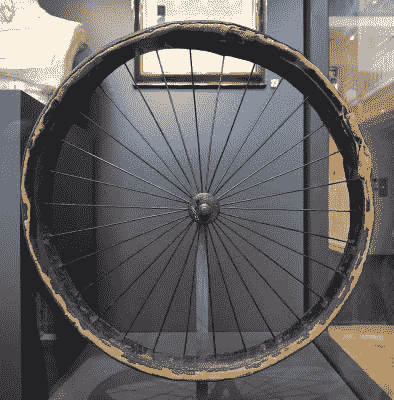
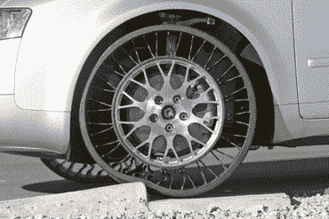
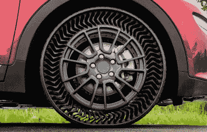
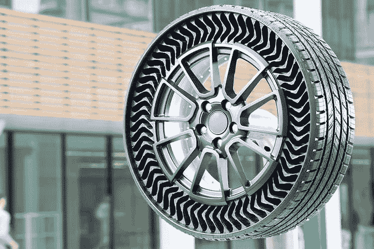

# 你的汽车轮胎不充气:米其林说 2024 年，这是他们面临的情况

> 原文：<https://hackaday.com/2019/07/25/airless-tire-for-your-car-michelin-says-2024-heres-what-theyre-up-against/>

如今，普通驾车者有很多东西要记。无论是油箱里还剩多少燃料，电池里还剩多少电量，还是后面的警察是否注意到他们在查看 Twitter，司机心里都有很多想法。他们没有想到的一件事是轮胎，他们的或其他任何人的轮胎。这证明了轮胎技术的状态，他们只是工作，并在相当长的时间内需要更换。

大约 50 年来，基础技术没有发生重大变化。但是时代在变，新的轮胎技术被认为就在眼前。几家公司正在质疑充气轮胎是否是最重要的和最终的，并且在世界各地的贸易展上已经发现了具有未来感的原型。

## 充气轮胎经历了漫长的一局

John Dunlop’s first pneumatic tyre, built for a bicycle.

充气轮胎在 19 世纪首次出现，并于 1895 年由安德烈·米其林首次安装到汽车上，效果不一。在接下来的几十年里，这项技术迅速成熟，进步日新月异。

快进 100 多年后，充气轮胎继续称雄。最后一次重大的技术变革是从斜交转向子午线结构，到 20 世纪 70 年代，绝大多数汽车制造商放弃了前者。在此期间，轮胎化合物和胎面设计得到了稳步、持续的改进，但普通消费者很少会注意到这一点。

对于充气轮胎来说，唯一剩下的维修任务是确保轮胎中有空气。否则会导致轮胎过早磨损，并可能导致爆胎。为了避免疏忽大意的车主的复杂化，一些制造商已经开发了完全不使用空气的轮胎设计。

## 新来者是辐条的回归

  Michelin’s 2005 Tweel concept. Early designs had issues with noise and vibration at high speed, which the manufacturer reports have been worked out in later prototypes.  Michelin Uptis design planned for 2024

绝大多数的无空气设计遵循一个相似的主题。外环装有橡胶胎面，它通过一系列聚合物辐条连接到轮毂。车辆的重量悬挂在环的顶部，使辐条处于张紧状态。普利司通和[住友](https://autoweek.com/article/technology/are-airless-tires-coming-soon-hybrid-or-electric-car-near-you)都展示了原型设计，但是米其林为这项技术做了最大的公开宣传。

米其林最近宣布了其新的 Uptis 设计，轮辐呈人字形。该公司和[计划最早于 2024 年](https://interestingengineering.com/puncture-proof-tires-revealed-by-gm-and-michelin)与通用汽车合作推出该产品。这是一条漫长的道路，米其林在 2005 年首次公开了他们的 Tweel 原型[。最初的原型遭受了噪音和振动，但有足够的希望让开发球滚动。](https://www.nytimes.com/2005/01/03/automobiles/reinventing-the-wheel-and-the-tire-too.html)

Airless tires have been of great interest for military applications.

也有其他不知名的玩家。2009 年，弹性技术公司在 SEMA 首次推出了一种用于军事应用的无空气系统，尽管此后鲜有消息。然而，追溯到更早的时候，马丁弹性轮胎[早在 20 世纪 30 年代就已经开发出来，并在当时的吉普车上进行了测试。](https://www.youtube.com/watch?v=jQ05RbGa0zM)

到目前为止，这些概念都没有进入汽车市场。为了理解为什么，我们应该首先看看为什么有人会想开发无气轮胎。

## 一个充满希望的概念

无气轮胎的好处已经被制造商们广为宣传。这项技术已经提供了许多丰富的成果。

最明显的是爆胎、漏气和爆裂将成为过去。这不仅有减少不便的直接好处，还意味着行李空间被释放出来，因为不再需要携带备用轮胎，而且由于消除了自重，里程数也有所增加。轮胎压力监测系统也不再是必需品。由于这个原因，每年都有大量的轮胎被扔掉，远在胎面或其他部件磨损之前。解决这个问题有望显著提高轮胎寿命。

一个主要的好处是横向稳定性。在标准子午线轮胎中，不可能在不影响轮胎其他性能的情况下提高横向刚度。以这种方式加强轮胎会导致轮胎行驶不平稳，特别是在颠簸的路面上。然而，由于无气设计的构造，轮胎可以被制成在垂直轴上是宽松的，同时从一侧到另一侧是坚硬的。这有利于使处理更敏锐，这是体育和高性能的应用特别感兴趣。

无气轮胎的接触印痕是另一个有趣的地方。与充气轮胎不同，充气轮胎在气压的作用下必然会向两侧凸出，而无气轮胎的接触区域会更加一致和平坦。由于没有空气，它不再依靠司机的肩膀来确保他们的轮胎处于正确的压力下，以保持适当的接触面积。

这项技术的另一个好处是耐磨。尽管轮胎压力监测器现在很普遍，制造商也试图教育司机正确的轮胎轮换做法，但很少有消费者好好保养他们的轮胎。在充气不足或充气过度的情况下跑步会过早磨损一套轮胎，但在无气设计下，这不是问题。此外，制造商声称，在这种设计上，应该可以容易和安全地更换胎面，而性能几乎没有下降。这将产生巨大的可持续性影响；目前估计每年有 15 亿个轮胎被丢弃。轮胎部件可回收性的任何改善都会产生重大影响。

还有更多不可思议的可能性。无气设计可能会在轮胎上打孔，为水流出创造通道。不再需要将水从轮胎下推出。这一领域的发展可以大大减少在死水中行驶时打滑的可能性。由于打滑会导致车辆完全失去控制，在这一领域的任何改进都有可能节省金钱和生命。

当然，直到橡胶真正上路，这都是这里说的。[虽然米其林已经推出 Tweel 产品好几年了](https://www.greenvilleonline.com/story/money/business/2014/11/20/see-tweel-sweeping-market-time/19301995/)，但它们仅限于低速坚固应用，如滑移装载机和乘载式割草机。为高速公路准备好无气轮胎还需要一些时间。

## 有什么事耽搁了？

尽管这一概念早在 2005 年就首次见诸报端，[2013 年在飞车手罗德动力之旅成功试运营，](https://arquivo.pt/wayback/20160518081220/http://www.fbccsc.org/newsletters/fbcc_newsletter_july13.pdf)我们还没有看到这些产品大规模应用于乘用车。在无空气设计成为主流之前，有几个工程问题需要解决。

一个显而易见的主要问题是碎片可能会卡在辐条上。为了正常工作，辐条必须能够自由弯曲，如果硬物被卷入内部，可能会很快损坏辐条，沙子、泥土或雪可能会堵塞它们，导致车轮失去平衡。

Michelin’s new Uptis design is slated to hit the streets in 2024\. Research and development has led to significant differences in its design compared to the earlier Tweel project.

速度一直是米其林设计的一个特别的症结，他们目前的大多数 Tweel 产品都局限于低速运行。他们即将推出的 Uptis 设计与他们早期的 Tweel 原型大相径庭,以更好地满足乘用车的需求，乘用车比 utv 和割草机更重，行驶速度更快。任何可行的设计都必须能够承受数小时的高速公路行驶，而不会过热、脱层或出现其他故障——[轮胎公司甚至在传统设计上也很难做到正确。](https://jalopnik.com/the-tragedy-of-goodyear-s-allegedly-defective-g159-tire-1830404569)

虽然根据定义，无气轮胎不会爆胎或漏气，但它也有自己独特的问题。辐条可能被切割、撕裂、撕裂或以其他方式损坏，从而缩短轮胎的寿命。目前，由于该技术的原型性质，关于这些故障的数据非常少。还有胎面和外环分层的可能性，以及与轮胎独特结构相关的其他故障。在轮胎投入大众使用之前，解决这些问题是很重要的。要做到这一点，需要大量的测试，这必然需要大量的时间。

消费者的意见可能需要一段时间来接受这个想法，充气轮胎已经过时一个多世纪了，无气设计与以前的设计大相径庭。制造商可能需要付出巨大的努力来帮助消费者习惯新技术的古怪之处。将会有固有的、不可预见的限制，并且设计可能不适合现有的车辆。

这些问题不太可能无法解决。然而，要克服这些问题，并使新的设计能够面对外部世界，需要大量的工程努力。米其林似乎在这一领域处于领先地位，自 20 世纪 90 年代末以来一直在缓慢推进这一项目。

虽然没有人能说这些无气轮胎是否会起飞，但我希望看到测试和开发的速度比我们在过去十年中观察到的要快。随着每个公开原型的出现，这项技术变得更加成熟。很明显，有重大的收获，证明了对这一概念的持续投资。我渴望知道接下来会发生什么，迫不及待地想在路上试用最新的轮胎。