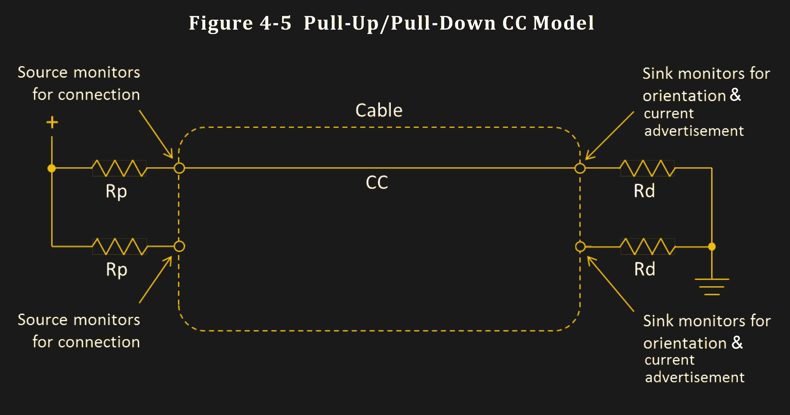
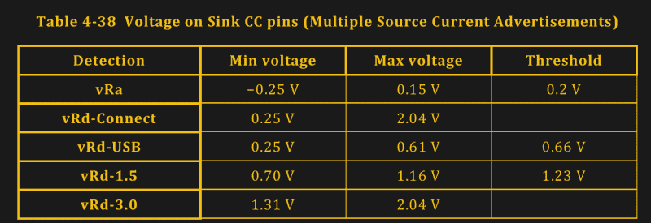
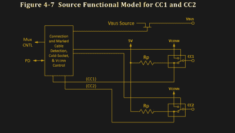
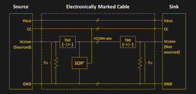
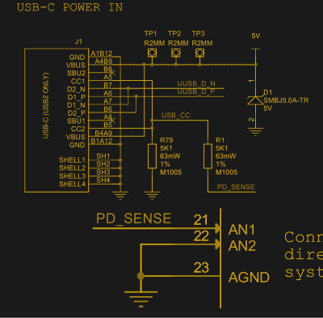

# 关于 USB-C 的一切:电阻和电子标记

> 原文：<https://hackaday.com/2023/01/04/all-about-usb-c-resistors-and-emarkers/>

如果您一直关注我们的 USB-C 系列，您会知道 USB-C 电缆中的 CC 线用于通信和极性检测。然而，不太为人所知的是，USB-C 中有两种通信协议——模拟协议和数字协议。今天，我们来看看 USB-C 中使用的模拟信号，部分是为了了解更多关于传说中的 5.1kω电阻及其工作原理。我们还将了解电子标记和神秘的实体 VCONN！

USB-C 电源在 VBUS 上提供 5 V 电压之前，会检测 CC 线路上的某个下拉值，任何更高的电压都必须进行数字协商。PSU，无论是笔记本电脑的端口还是充电器，都可以检测下拉(称为`Rd`)，因为它会在 CC 线上保持一个上拉(称为`Rp`)，然后检查 CC 上是否形成了分压器，以及产生的电压是否在可接受的范围内。

如果您插入的设备不能通过电缆中的 CC 线进行下拉，您的设备将永远无法从 USB-C 端口获得电源，只能通过 USB-A 到 USB-C 电缆工作。即使是可以使用 USB-C 数字部分的更智能的设备也有可能会有下拉，只是这些下拉位于所用 USB-C 通信 IC 的内部。想要接收电源的 USB-C 端口需要下拉。

这一部分现在已经广为人知，但我们已经在大量廉价器件中看到电阻不足的故障，通俗的建议是“增加 5.1kω电阻”。你可能害怕认为这很简单，但你会感到惊讶。

## 上拉、下拉和由此产生的分压器

USB-C 端口有两种电源角色——电源端和用户端。USB-C 的模拟端允许设计人员在 5 V 下使用 USB-C 时增加一种简单的协商电源要求的方法，无需使用特定或昂贵的 ICs 对源使用上拉，对汇使用下拉。上拉和下拉的组合形成一个分压器，电压本身代表充电器的电流能力。

 现在，在模拟信号模式下，信号源可以根据可用的功率预算来调整上拉，这非常有用。想象一下，一台笔记本电脑或一个充电器有多个 USB-C 端口。随着每个端口的负载增加，提供给其他端口的电流将会减少，这在很大程度上取决于器件的内部构造。以框架笔记本电脑为例，它配备了四个 USB-C 端口。每个端口在 5 V / 3 A 时可以提供 15 W 的功率，但如果您想同时为 4 个仅吸收电流的 USB-C 设备供电，则第三和第四个端口只能提供 1.5 A 的功率，从工程角度来看，这是一个相当合理的限制。

这意味着，1.5 A 和 3 A(最大值)等高功耗器件需要监控 CC 线路上的电压，以确定它们是否会通过调整功率需求来超出功率预算，或者在超出新设定的电流限值时关断。

The “Default” power refers to the USB stated current limits we’ve been used to – 500mA max for USB2 devices and 900mA max for USB3 devices. While hardly ever enforced, these are the USB standard-stated limitations, indeed.

作为用户，这对你意味着什么？没什么，如果你的设备功率足够低的话。您的设备需要监控 CC 线路上的电压，并相应地调整它们的需求。一些商店购买的设备不会这样做，但这是罕见的。作为黑客？如果您构建一个从 USB-C 端口获取电源的设备，并且您的目标是在 5 V 下获得完整的 3 A，请记住，并非所有 USB-C 端口都将为您提供这一点。但是，您可以通过测量 CC 线上的电压来检查 3 A 的可用性。或者不要，我不是你的妈妈，许多黑客设备蓬勃发展与零检测。

在 CC 线上你能期待什么电压？这种电压可以用微控制器的基本 ADC 读取，甚至可以用比较器读取。

正如您所看到的，它的电压都低于 3.3 V，因此如果您使用全摆幅微控制器 ADC，就不需要分压器。哦，如果你有一个 USB-C 插座，当然记得分别监控两个 CC 引脚。

## 我真的有必要吗？

你真的需要监控 CC 电压吗？当你只是在做某件事情时，并不是真的，但如果你想超过 0.5 A–1 A，它会有所帮助。如果你超过了源端口可以提供的电流需求，它应该会直接停止向你的设备供电，这是一个非常安全的结果。另一方面，USB-C 的理念是拥有多层保护，如果你用简单的 5.1kω电阻方法构建一个 15 W 器件，你还不如让它成为一个可以检测其电源不足的器件。还有，做起来也挺容易的！

否则，你可以期待你的设备会希望与一个总是在 5 V 时提供 3 A 的充电器配对，绝大多数充电器都是这样的。然后，您将永远不会遇到问题-始终能够以 15 瓦的功率工作。但是，如果您将设备连接到笔记本电脑端口，无论是 USB-C 还是带有 USB-C 适配器的 USB-A，您都不能完全指望 3 A 总是存在-您实际上需要检查。

5.1kω不是你会遇到的唯一下拉。有一种不同的下拉，我们黑客以前遇到过，这就是`Ra`——当我们谈论电子标记电缆时，它就会发挥作用。

## 正确地喂养你的电子马克

电子标记器基本上是可以谈论 USB PD 协议的存储芯片。它们用于比普通电缆略显花哨的电缆，例如 USB3 和 Thunderbolt 等具有高速能力的电缆以及 5 A 电缆。它们接入电缆上的 CC 线，可以被信源或信宿查询，尽管它们通常被信源查询。

如果你的 USB-C 电缆中有一个电子标记，它需要一些电源，USB-C 有一种方法可以为它提供电源-它被称为 VCONN。众所周知，只有一个 CC 引脚用于通信。不连接到 CC 线的相对的 CC 引脚用于向电子标记器供电；另一个 CC 引脚是 VCONN。

在 USB-C 插头中，您将知道哪个 CC 引脚连接到 CC 线，因此，您预先知道哪个引脚将充当 VCONN。然而，您可以在两个不同的方向插入插头，这意味着插座必须能够将两个 CC 引脚中的任何一个视为 CC 通信线路或 VCONN 引脚。这使得电缆相对来说又笨又便宜，让设备自己处理复杂性。

作为一名黑客，你十有八九不需要担心 VCONN。我们中的大多数人将使用 USB2 或 USB3，不高于 3 A 的电流，并且电子标记检查将不是所有必要的。除此之外，还有一些 IC 可以为您处理多种 USB-C 问题，包括提供 VCONN。

VCONN 的电压要求非常宽松，与 VBUS 的 5 V 电压要求相反，允许范围为 3 V 至 5.5V；通常，在智能手机实施中，它是直接的锂离子单体电池电压，这意味着您可以避免两次转换，并可以节省相当多的功率。毕竟，VCONN 电源不仅仅适用于电子标记器，它还可以用于为小型配件和耳机适配器供电，功率预算高达 1 W。[这份来自 USB-C 黑客的有趣演示文稿](https://www.usb.org/document-library/ctvpds-and-making-your-own-usb-cr-thingamajig)讲述了 VCONN 供电器件的原型制作，涵盖了 USB-C 规范允许 VCONN 供电器件实现的所有功能。

也就是说，电子标记是需要 VCONN 的最普遍的东西，而且它们非常简单。有时一根电缆包含两个电子标记，有时包含一个，这是制造选择。在单电子标记电缆的情况下，电缆的一端将包含电子标记，并且将有一条额外的“将电子标记电源连接到另一端”VCONN 线从配备电子标记的插头穿过电缆，连接到另一个电缆插头上的 VCONN 引脚。因此，如果你曾经看到有人提到 VCONN 线，那就是它的意思——一根二极管隔离线连接到电缆一端未使用的 CC 引脚，它只是为另一端的电子标记器供电。

现在，这很有趣，但是那个`Ra`下拉的东西呢？

## Ra-sp berry Pi ^ 4 问题

电子标记器通过向 VCONN 引脚施加下拉电阻(称为`Ra`)来表示其存在；平均为 1kω，在 800ω到 1200ω范围内。如果插座能够提供 VCONN，它会在 CC 引脚上查找当前未用于通信的电阻，并在检测到该电阻时将 VCONN 馈入该引脚。因此，该电阻在电缆插头内的第二个 CC 引脚上可用——在电缆的两个插头上都可用。

如果您将设备插座中的两个 CC 引脚短接在一起，然后插入一根高性能的带标记电缆，会发生什么？5.1kω电阻与 1kω电阻并联，总下拉电阻为 840ω。电源在 CC 线上看到的就是这种下拉，超出了 5.1kω的预期。具体来说，分压器将电压拉得太低，电源无法为 VBUS 提供 5 V 电压。 

这就是 Raspberry Pi 4 第一次改版时做的，记得吗？因此，你无法通过 Type-C 充电器用带电子标记的电缆为 Pi 4 供电——你需要一根不带电子标记的电缆，或者可能是一根带 USB-A 电源的 USB-A 到 USB-C 电缆。当然，官方的 Raspberry Pi 电源在其专属电缆中没有电子标记。它也不一定要有电子标记——毕竟，电子标记是用来询问未知电缆的，而根据定义，受控电缆是已知电缆。

我没见过有人问的问题是——他们为什么要这么做？如果您查看原理图，您会看到来自相连 CC 引脚的`PD_SENSE`网络连接到 PMIC 上的一个模拟输入引脚。你现在可能已经猜到了——他们实现了标准的“电压监控”部分，但没有正确实现“电子标记”部分。他们实际上做了多少电压监控，[值得怀疑，](https://forums.raspberrypi.com/viewtopic.php?p=1506352#p1506352)但能力至少是有的。

Raspberry Pi 在即将到来的版本中解决了这个问题，如果你有旧版本，你可以自己打补丁。我们[还不知道他们是如何修补的，](https://hackaday.com/2021/06/23/the-compromises-of-raspberry-pi-hardware-documentation/)但我们最终会知道的。与此同时，这是所有你应该知道的关于电阻、电子标记和难以捉摸的 VCONN 的知识。

接下来:USB-C 电源输入端口、电源角色和更高的电压！