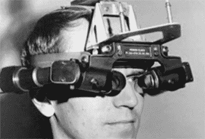
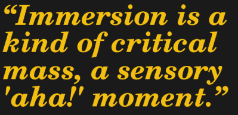

# 所有好的虚拟现实想法都是在 60 年代想出来的

> 原文：<https://hackaday.com/2021/01/04/all-the-good-vr-ideas-were-dreamt-up-in-the-60s/>

虚拟现实在过去几年里取得了巨大的进步。鉴于其最近的发展热潮，可能会有点惊讶地得知，支撑我们现在所谓的虚拟现实的想法早在 60 年代就已经存在了。并非所有想象的可能性都成为现实，但我们已经了解了对于引人注目的虚拟现实体验来说什么是重要的(什么是不重要的)，并获得了关于接下来可能会发生什么的见解。

如果虚拟现实最好的想法来自 60 年代，它们是什么，结果如何？

## 互动和模拟

首先，我想简要介绍一下我们所认为的虚拟现实的两个重要前身:交互和模拟。在 20 世纪 60 年代之前，两者的最先进的例子是*链接训练器*和*传感器摄像机*。

链接训练器是一种早期的飞行模拟器，它的目标是在飞机飞行控制上提供真实的仪器和力反馈。这使得学生能够安全地了解不同的飞行条件，尽管他们没有实际经历过。Link Trainer 没有模拟飞行体验的任何其他部分，但它的成功表明了反馈和互动——即使是人工的和有限的——可以让一个人获得对实际不存在的力量的“感觉”。

Sensorama 是一个专门的 pod，可以播放立体 3D 短片，同时与风扇、气味发射器、电动椅子和立体声同步。这是一项严肃的工作，旨在以模拟环境的方式吸引用户的感官。但作为一种预先录制的体验，它本质上是被动的，没有互动的元素。

将交互和模拟有效地结合起来不得不等到 60 年代，那时数字革命和计算机提供了合适的工具。

## 终极展示

1965 年，计算机科学家伊凡·苏泽兰写了一篇名为 *[终极显示器](http://worrydream.com/refs/Sutherland%20-%20The%20Ultimate%20Display.pdf)* (PDF)的文章，其中他提出了远超当时技术水平的想法。人们可能会认为*最终的展示*是一个很长的文档。它不是。它只有两页，第一页的大部分是对 60 年代新兴的交互式计算机输入方法的思考。

第二部分是有趣的地方，因为萨瑟兰分享了他对计算机控制的输出设备的未来的看法，并描述了一种尽可能服务于多种感官的理想“动觉显示器”。萨瑟兰看到了计算机模拟想法和输出不仅是视觉信息，还产生有意义的声音和触摸输出的潜力，同时在自我修改的反馈循环中接受和整合用户的输入。这是前瞻性的东西；回想一下，当这个文档被写出来的时候，计算机甚至还没有产生任何真正复杂的有意义的声音，更不用说能够显示任意内容的视觉显示了。

## 一种体验虚幻的方式

 

萨瑟兰的*达摩克利斯之剑*的特写镜头，一个悬挂在天花板上的系统，使用者的头被绑在里面。【图片来源:[VR 的历史](https://virtualspeech.com/blog/history-of-vr)

萨瑟兰的主要观点是这样的:作为人类，我们对我们所能看到和感受到的东西有一种直观的熟悉感。重力的影响，启动或停止物体运动的感觉，或者想象一个物体从不同的角度看起来会是什么样子，这些都是我们毫不费力就能理解的事情。

如果我们也能体验在现实世界中无法实现的概念，那会怎样？这将是一种获得对概念的直觉和亲密的熟悉的方法，否则我们是得不到的。

作为实现这些想法的第一步，萨瑟兰和他的一些学生创造了一个被称为达摩克利斯之剑的大型天花板悬挂系统。这是第一个视觉效果不是来自摄像机，而是由计算机生成的头戴式显示器。它只显示基于线条的矢量图形，但它能够根据头部位置和用户输入实时修改显示的内容。

利用计算机处理反馈和动态生成视觉效果的能力是交互式系统能够生成自己的模拟环境的关键。第一次，一种有意义地融合交互和抽象模拟的方法触手可及，除了向上，别无选择。

## 发生在 60 年代的想法

萨瑟兰预言的许多概念已经成为现实，至少是部分成为现实，并且以某种现代形式出现。

#### 计算机显示的物体不需要遵循现实的一般规则

能够定义不受物理现实限制的事物，并随意调整它们的属性，包括 CAD 建模和其他模拟工作等功能，以及游戏等娱乐。事实上，公平地说，游戏在这个领域尤其繁荣。

萨瑟兰把计算机控制的显示器想象成数学仙境的镜子。这个概念的一个很好的例子是[这个非欧几里德几何的 3D 引擎](https://www.youtube.com/watch?v=kEB11PQ9Eo8)，它以一种熟悉的、互动的方式呈现不可能的几何图形。

#### 触觉和触觉反馈

今天的虚拟现实控制器(以及手机等移动设备)在很大程度上依赖于能够提供一系列微妙的振动作为有意义的反馈。虽然没有达到萨瑟兰精确模拟复杂物理等事物的理想，但它仍然让用户对看不见的力和边界有了直观的理解，尽管很简单，就像不作为物理对象存在的按钮。

#### 头部跟踪

根据你看的地方改变显示是虚拟现实的一个主要特征。虽然萨瑟兰只是简短地提到了这个概念，但准确和低延迟的跟踪已被证明是一个至关重要的功能。[当 Valve 第一次研究 VR 和 AR](https://hackaday.com/2016/06/22/behold-valves-vr-and-ar-prototypes/) 时，当研究人员体验到低持续显示与高质量跟踪相结合的可能性时，他们就发现了一些东西；它被描述为透过窗户看到另一个世界。

#### 手和身体跟踪，包括凝视跟踪

萨瑟兰设想计算机能够读取用户的身体作为输入方法，特别是像手和眼睛这样的高灵敏身体部位。如今，手部跟踪在消费类虚拟现实系统中越来越常见。眼球追踪是存在的，但一会儿会有更多。

## 有些想法还没有实现

有许多概念还没有出现，或者仅以非常有限的方式存在，但是这个列表正在缩小。这里是最引人注目的突出。

#### 鲁棒的眼球追踪很难

萨瑟兰写道“我们是否可以用眼神的语言来控制电脑，这还有待观察”，到目前为止，情况依然如此。

事实证明，眼球追踪很容易得到大部分正确的结果:人们只需将相机对准红外线照射的眼球，寻找瞳孔的黑色圆圈，并测量其位置，以确定它的主人在看哪里。那里没有问题，并且[有事业心的黑客已经做了很多聪明眼追踪项目](https://hackaday.com/tag/eye-tracking/)。

当需要高水平的可靠准确性时，眼球追踪变得更加棘手，例如使用它来根据用户正在看的地方来改变视觉效果的呈现方式。这有很多原因:不仅人眼会频繁地、不由自主地进行被称为[扫视](http://www.scholarpedia.org/article/Human_saccadic_eye_movements)的运动，而且大约 1%的人的瞳孔不会呈现出漂亮的圆形黑色，这使得软件很难分辨出来。除此之外，还有一个更深层次的问题。因为瞳孔只不过是虹膜弹性组织中的一个开口，所以它的形状并不总是一致的。事实上，每当眼睛移动时，瞳孔就会摆动，这是经常发生的，这使得高度精确的定位很难解释。[这里有一个视频演示的链接(提示至 37:55 英寸)，解释了这些问题](https://youtu.be/LQwMAl9bGNY?t=2275)，展示了为什么在某些应用中避免眼球追踪是可取的。

#### 模拟-精确的力反馈还没有准备好

力反馈设备已经存在多年，由于虚拟现实的发展，人们对力反馈再次产生了兴趣。但我们远远没有按照萨瑟兰设想的方式使用它:模拟并获得对复杂概念和现象的直观熟悉，像了解我们自己的自然世界一样学习它们。

根据这一标准，模拟握手或拥抱这样的事情应该很简单，但能够有意义地模拟简单物理的力反馈仍然是昂贵的利基应用程序的领域，没有专门的硬件就无法存在。

#### 全息甲板级仿真

也许最常被引用的部分是《终极展示》的最后几句话，其中萨瑟兰描述了一些听起来非常像《T2》星际迷航中全息甲板的东西:

> 当然，最终的展示将是一个房间，在这个房间里，计算机可以控制物质的存在。在这样的房间里摆放一把椅子就足够好坐了。在这样一个房间里展示的手铐将是限制性的，而在这样一个房间里展示的子弹将是致命的。通过适当的编程，这种显示器简直可以成为爱丽丝走进的仙境。

很明显，我们离这一点还很远，但如果我们曾经接近过，这可能是我们需要发明的最后一样东西。

## 重要功能与酷功能的对比

最好的想法可能来自 60 年代，但从那时起，我们学到了很多关于创造沉浸式体验的重要和不重要的东西。重要的特性是一项技术真正需要提供的，因为它们对沉浸感至关重要。沉浸感是一种临界质量，一种感官上的“啊哈！”在这一时刻，人们不再注意所涉及的单个工作位，并开始以[流](https://en.wikipedia.org/wiki/Flow_(psychology))的状态与内容进行无缝和直观的交互。重要的功能有助于实现这一点。

 例如，HMD 的宽广视野似乎对沉浸感很重要，但事实证明并非如此。[我们报道了一场精彩的演讲](https://hackaday.com/2020/08/03/see-the-science-behind-vr-display-design-and-what-makes-a-problem-important/)，讲述了人类视觉如何利用各种线索来判断事物的“真实”程度，以及这对 HMD 的发展意味着什么。事实证明，显示器中非常宽的视野*是可取的*，但对于增加沉浸感来说*并不特别重要*。音频也有类似的问题，各种各样的东西被发现对提供令人信服的音频模拟很重要。例如，通过耳塞将声音直接传入耳道被证明是一种强大的方式，无论声音模拟得多么准确，大脑都可以将其归类为“非真实”。很适合听音乐，但不太适合令人信服的模拟。

另一个至关重要的特征是具有鲁棒跟踪和低延迟的显示器。我第一次在现代 VR 头戴设备上尝试完美无瑕的运动跟踪时，就亲身经历了这一点。无论我如何移动或环顾四周，没有明显的滞后或漂移。我几乎可以感觉到我的大脑毫不费力地滑入一个凹槽，好像它已经决定了我所在的空间和我正在看的东西与我戴在头上的东西完全分开。这是我在 90 年代中期戴着 [Forte VFX1](https://en.wikipedia.org/wiki/VFX1_Headgear) VR 耳机时绝对没有*没有*的感觉。当时，困扰我的不是低分辨率或小视野，而是我记忆最深刻的漂移和模糊的头部跟踪。有潜力，但也难怪 VR 在 90 年代没有开花结果。

## 下一步是什么？

有一件事符合萨瑟兰关于身体跟踪的一般预测，但他可能没有预见到，那就是面部和表情跟踪。这是脸书的一项实验性工作，但它越来越重要，主要是为了与他人进行数字互动，而不是作为一种计算机输入手段。

说到脸书，[一个引领虚拟现实发展的社交网络](https://hackaday.com/2020/11/03/as-facebook-tightens-their-grip-on-vr-jailbreaking-looks-more-likely/)(同时加强对它的控制)在 60 年代肯定没有被预测到，然而它似乎是虚拟现实的下一个。但是我从来没有说过虚拟现实的*未来*来自 60 年代，只是说*好的*想法来自 60 年代。