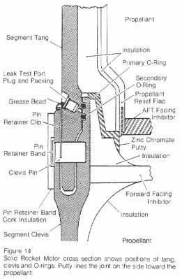
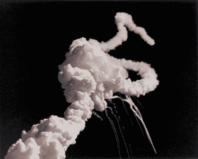
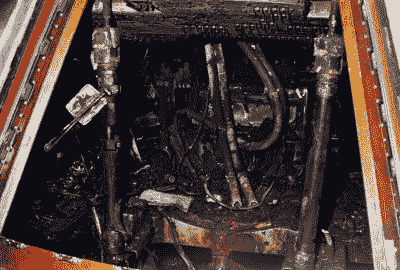
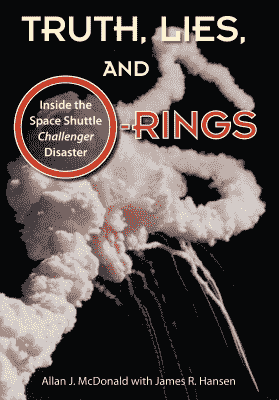

# 艾伦·麦克唐纳的遗产和决策伦理

> 原文：<https://hackaday.com/2021/03/10/allan-mcdonalds-legacy-and-the-ethics-of-decision-making/>

1986 年 1 月 28 日的航天飞机 [*挑战者号*灾难](https://en.wikipedia.org/wiki/Space_Shuttle_Challenger_disaster)对许多人来说是一个改变人生的事件，从收看美国第一位教师乘坐的航天飞机发射的人，到参与制造、维护和发射这些复杂航天器的无数人。然而，尽管这一经历令人精神创伤，但对一群人来说，他们对美国国家航空航天局的可怕预测和警告以最糟糕的方式突然变成了现实。

这个小组由莫顿-索科尔公司的工程师组成，负责航天飞机固体火箭助推器的部件。由于天气非常寒冷，他们警告不要发射航天飞机，担心在如此低的温度下，SRB 中的 O 形环密封将无法防止 SRB 的热气破坏 SRB 和航天飞机。

艾伦·麦克唐纳就是这些竭尽全力阻止发射的工程师之一。直到他于 2021 年 3 月 6 日去世，围绕*挑战者*灾难的经历使他成为道德决策话题的直言不讳的声音，也是无论环境多么困难都做出正确决定的著名例子。

## 不该发生的事

艾伦·j·麦克唐纳出生于 1937 年 7 月 9 日，在蒙大拿州的比林斯长大。他是一个杂货商的儿子，但没有追随他父亲的脚步。从蒙大拿州立大学获得化学工程学位后，他于 1959 年开始为莫顿-硫科尔公司工作。这家公司因生产固体火箭助推器(SRB)而闻名，并在 20 世纪 50 年代末签订了“民兵”洲际弹道导弹计划合同。

随着航天飞机项目的进行，1972 年 8 月，Morton-Thiokol 签约为航天飞机生产 SRB，这使得 McDonald 成为负责航天飞机 SRB 项目的工程师之一。到那时，SRB 已经成为人们熟悉的技术，也有反对者和支持者。波音公司是主张液体燃料助推器的人之一，而即使是 SRB 的支持者麦克唐纳·道格拉斯在 1971 年的一份报告中也表示，他们认为热气体沿着 SRB 的侧面逸出是一种致命的情况，没有恢复的可能。

Diagram of the Space Shuttle Solid Rocket Booster field joint assembly. From the Rogers Commission report.

当比较液体燃料和固体火箭时，发现 SRB 总体上更可靠，这是载人航天飞机计划的一个主要问题。通过在 SRB 段之间的每个接头处使用两个 O 型密封圈，烧穿问题被认为得到了充分解决。不幸的是，后来发现管片外壳在点火期间会发生弯曲，此时 SRB 内部的压力会导致密封件和管片之间形成间隙。

这个“联合旋转”的问题被 NASA 工程师视为一个问题，他们会写信给 SRB 计划的经理乔治·哈迪，指出他们的担忧。尽管如此，第一次航天飞机任务使用了这种联合设计，甚至在 STS-2 的 SRB 显示出 O 型圈被经过它们的热气体侵蚀的明显迹象之后。由于这些 SRB 可以重复使用，因此在每次回收后都要对其进行检查，1984 年 STS-41-D 任务中使用的 SRB 显示主 O 形圈和副 O 形圈都在退化。在 1985 年的 STS-51-B 任务中(也由*挑战者号*执行)，人们发现热气体已经从两个 O 型环中逸出，就像一年后一样。

尽管这些共同的问题和发射过程中的热气泄漏是 NASA 和 Thiokol 的一个众所周知的问题，但没有采取任何措施来改进设计，导致了 1986 年 1 月 28 日那个寒冷的日子里灾难性的*挑战者*发射。

## 内疚

航天飞机的 SRB 额定发射温度低至 4°C(40°F ),但目标发射日的温度远低于此，预计温度为 1°C(30°F ),夜间温度低至 18°F(8°C)。1 月 27 日，在*挑战者*的第十次任务(STS-51-L)的发射准备期间，包括艾伦·麦克唐纳(Allan McDonald)在内的 Thiokol 工程师和经理们与美国宇航局(NASA)和马歇尔航天飞行中心(Marshall Space Flight Center)讨论了天气状况。

在这一点上，Thiokol 工程师非常清楚 O 型环接头解决方案远非理想，他们指出，他们甚至不能保证接头在低于 54°F(12°C)的温度下也能正确密封，因为橡胶的弹性变小，因此在这种低温下密封分段接头的能力降低。他们主张推迟发射，直到气温上升。

The explosion of Space Shuttle Challenger, seconds after the accident.

不幸的是，接下来发生的事情众所周知。在 Thiokol 管理层软化并否决了他们工程师的指导意见后，NASA 经理继续发射。这些工程师，包括首席工程师艾伦·麦克唐纳、[鲍勃·艾伯林](https://en.wikipedia.org/wiki/Bob_Ebeling)和[罗杰·布瓦乔利](https://en.wikipedia.org/wiki/Roger_Boisjoly)因此发现自己看着*挑战者*第二天发射，祈祷什么都不会发生，同时害怕最坏的情况。

在航天飞机的上升过程中，一切看起来都很正常，航天飞机进行着正常的操作。似乎没有什么会出错。几秒钟后，挑战者号解体了，两个 SRB 螺旋脱离了航天飞机的残骸和主油箱。对于那些在地面上观看的人来说，没有什么可以拯救船上七个灵魂中的任何一个。

对于试图警告 NASA 的 Thiokol 工程师来说，这是毁灭性的。对于艾伯林来说，他在 1985 年就这个问题写了一份绝望的备忘录，悲伤和负罪感从未消失。

## 这不是一个特例

在随后的调查中，发现与以前的发射非常相似，其中一个密封失效，热气体进入 SRB 外部，靠近将 SRB 固定在主油箱上的支柱。最初，一个由 SRB 燃烧过的推进剂中的氧化铝制成的密封物封住了缝隙，但在一次突然的风切变使 SRB 发出嘎嘎声后，这个临时密封物失效了，逸出的热气自由地完成了它们的破坏性工作。这正是 Thiokol 的工程师们所担心的，他们在以前回收的硫酸盐还原菌上看到了强烈的警告。

里根总统在 1986 年 6 月成立了罗杰斯委员会调查这一事件。该委员会的调查结果是，O 型圈的设计缺陷是事故的根源，同时强烈批评发射的决定。他们的报告得出结论:

> …沟通失败…导致基于不完整且有时误导性的信息做出发射 51-L 的决定，工程数据和管理判断之间的冲突，以及允许内部飞行安全问题绕过主要航天飞机管理者的 NASA 管理结构

麦克唐纳和布瓦乔利是作为证人为委员会作证的两名 Thiokol 工程师。他们的诚实导致麦克唐纳在 Thiokol 被降职，而 Boisjoly 辞去了他在 Thiokol 的职位。然而，国会成员得知麦克唐纳被边缘化，并威胁说塞科尔将被排除在未来的 NASA 合同之外。Thiokol 管理层态度缓和，结果 McDonald 被提升为副总裁，负责未来航天飞机任务的 SRB 的重新设计和重新认证。

罗杰斯委员会发现，即使工程师和高层管理人员之间的沟通不畅，这些都无法解释 NASA 为何如此坚决地要发射。特别是在几十年来对联合密封的明确关注和即将发生的灾难的明确证据之后。在这种情况下，参与者的安全应该是最重要的，人们可以说这一决定是对人类生命的无情漠视。

## 一条生命的代价

The inside of Apollo 1’s capsule after the fire.

有时候进步的代价是有代价的，就像阿波罗 1 号一样，不幸的设计决策导致了三个人的死亡。然而，这样的事故与像*挑战者*灾难这样的事故形成了鲜明的对比。事后看来，阿波罗 1 号的设计是有缺陷的，但主要是由于在与苏联的太空竞赛中的仓促发展，采取了不幸的捷径，并吸取了痛苦的教训。

在挑战者号的情况下，没有匆忙的开发，而是一个据称已经完成的轨道器，带有活跃的姐妹航天器和多年的任务数据，这些数据将会——也确实——揭示设计中的弱点。正如罗杰斯委员会得出的结论，挑战者号航天飞机灾难“根植于历史”，美国宇航局随后试图掩盖无视工程师的反对意见。

这些也不是航天工业独有的。正如我们最近在波音 737 MAX T1 上看到的，以及过去在 T2 福特 Pinto T3 和 T4 Therac-25 T5 放射治疗机上看到的，任意和不道德的决定。通过匆忙将产品推向市场，通过偷工减料来节省成本，或者通过省略某些测试或设计元素，人们很可能会受伤，甚至死亡。

## 前进的道路

Allan J. McDonald’s book on the Challenger disaster.

艾伦·麦克唐纳和罗杰·布瓦乔利在挑战者号灾难发生后花了很多时间告诉人们发生了什么，尤其是导致灾难的情况。麦当劳 2009 年出版的关于这场灾难的书《真相、谎言和 O 型圈》深入探讨了所发生的一切。

他们两人都会在研讨会和其他活动上发表演讲，让人们记住做正确的事情和做出正确的决定的必要性，或者像麦当劳所说的那样:“在正确的时间和正确的人，为正确的原因做正确的事情”。对做过的事情的后悔会被时间冲淡，而对没做过的事情的后悔会一直存在。

挑战者号灾难发生后的几十年里，麦克唐纳不得不面对那些逝去生命的负罪感，但他意识到自己没有理由感到内疚。他和他的工程师同事们在正确的时间和正确的人一起做了正确的事情。

即使他们的请求和反对被置若罔闻，他们也不必承担罪责和责任。他和那些先辈们一样，现在把做正确的事情的责任留给了下一代。所有这些都是为了在未来不会有更多的工程师看着他们害怕的灾难在他们眼前展开。