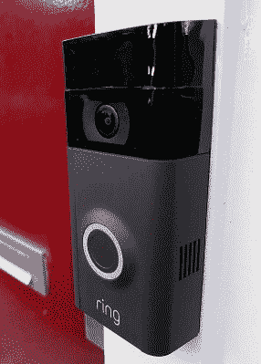

# 亚马逊 Sidewalk:你应该被加入一个私人社区 LoRa 网络吗？

> 原文：<https://hackaday.com/2020/11/30/amazon-sidewalk-should-you-be-co-opted-into-a-private-neighbourhood-lora-network/>

WiFi 不太擅长穿越建筑物。对于一个普通家庭的主要生活区域来说，这很好，但一旦我们冒险进入我们领域的外围，它就开始变得不那么可靠了。对于家庭核心之外的联网设备来说，这是一个问题，亚马逊希望通过他们的 Sidewalk 产品来解决这个问题。

这是一个低带宽的网络系统，使用一些回声和环设备已经内置的功能，加上所有者的一部分宽带连接到互联网。其想法是即使在 WiFi 网络不可用的情况下，也能在更长的距离内向兼容设备提供基本的连接，但最令人感兴趣和担忧的是，它也会将其自身暴露给其他人拥有的设备。如果您的互联网连接中断，那么您的戒指设备仍将通过您邻居拥有的亚马逊设备提供的本地低带宽广域无线网络提供基本版本的功能。

## 我可以从这里看到你的亚马逊戒指

It looks so harmless, doesn’t it. Amin, [CC BY-SA 4.0](https://commons.wikimedia.org/wiki/File:Ring_Video_Doorbell_2.jpg)

这家大型在线零售商和物联网云提供商希望通过您的家庭安全设备，通过无线网络向陌生人拥有的其他类似设备开放一部分家庭宽带连接。在亚马逊的文献中，它被吹捧为给 Ring 和 Echo 的所有者提供了各种有用的好处，但它显然会对其他人的设备携带的数据的隐私以及不属于你的设备通过网络传输流量时你自己网络的安全产生影响。出于好奇，有一份白皮书提供了对该系统的更多见解，除了透露它使用 900 MHz FSK 和 LoRa 作为其 RF 层外，没有太多关于其工作原理的信息。正如你所料，他们已经通过加密解决了隐私和安全问题，最大限度地减少了传输的数据，并不断改变标识符。从字面上理解亚马逊文档就是进入一个可以对产品获得一些信心的世界。

持怀疑态度的读者口中的问题无疑是:哪里可能出错？我们预计，设备本身和网络的无线电部分将由那些以做此类事情为己任的人进行彻底调查，虽然总有可能有人会发现其中的缺陷，但更有可能的是，在位于系统顶部的应用程序中会发现弱点。这种情况以前一直困扰着亚马逊的物联网产品，例如去年他们的邻居应用程序[被发现位于一个比预期更絮絮叨叨的 API](https://hackaday.com/2019/12/21/amazon-ring-neighbors-leaking-data-on-neighbors/)之上，导致比他们预想的更多的邻居信息被共享。如果亚马逊的广告是可信的，那么这个系统将向第三方物联网设备和应用程序开发者开放，随着每一个人的出现，等待被发现的漏洞的可能性增加。他们一出现，我们就通知你。

亚马逊 Echo 和 Ring 等产品是 21 世纪技术的绝佳展示。他们是自动化的未来的活生生的体现，如果我们说我们不想从这种未来中分得一杯羹，那我们就是在撒谎。但正如你们所知，他们和他们的竞争对手兜售的未来版本是一个有很大缺陷的版本，购买产品的消费者在很大程度上不知道他们创造了多少数据。从纯粹的技术角度来看，家庭安全产品在主网络故障的情况下自动形成低带宽网络的想法是一个非常酷的想法，但当与亚马逊这个庞然大物的庞大数据 slurp 相结合时，它假设了一组稍微更令人担忧的可能性。没有斯派西先生在你身后盯着你，有可能成为乔治·杰特森吗？