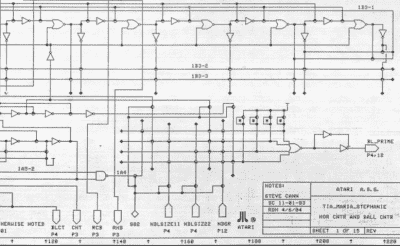

# 一个雅达利图形芯片，随时为您建立

> 原文：<https://hackaday.com/2019/11/10/an-atari-graphics-chip-ready-for-you-to-build/>

8 位黄金时代最引人注目的家用电脑和控制台硬件并不是从现成的硅获得令人印象深刻的声音和图形，而是依靠秘密的定制芯片组来超越竞争对手。不幸的是，对于老式游戏爱好者来说，这些芯片现在已经停产很久了，而且在许多情况下，几乎没有关于它们操作的信息。

 这使得[在 Atari 7800 控制台中发现的“Tia Maria”图形芯片的原理图](http://www.atarimuseum.com/videogames/consoles/7800/tiamaria/tia-maria.pdf) (PDF 链接)的发现是一件不寻常的事情，应该会引起仿真社区的特别兴趣。它们可以在雅达利博物馆的其余 7800 信息中找到。

这样一份有用的文件之所以能找到，是因为在雅达利倒闭后的一个垃圾箱里幸运地发现了一份珍贵的文件。似乎 Atari 社区已经知道这些原理图的存在有一段时间了，我们预计不久这些信息将进入 7800 的 FPGA 实现中；尤其是因为该系统几乎完全向后兼容大获成功的 Atari 2600。

当这种情况发生时，我们希望能够把它带给你，但这不是第一次有人在 FPGA 上制作 Atari。

通过 [RetroRGB](https://www.retrorgb.com/atari-7800-schematics-found-in-dumpster-treasure-trove.html)

标题图像:Bilby [ [CC BY 3.0](https://commons.wikimedia.org/wiki/File:Atari_7800_with_cartridge_and_controller.jpg) ]