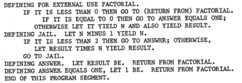

# OBP 的模拟器，20 世纪 60 年代的航天计算机

> 原文：<https://hackaday.com/2021/11/01/an-emulator-for-obp-the-spaceflight-computer-from-the-1960s/>

[David Given]经常投身于逆向计算，我们不仅仅指他翻新旧电脑。我们指的是像[为 OBP 航天计算机](http://cowlark.com/2021-07-03-obp-simulator/index.html)创建一个模拟器和汇编器，它被用于 OAO-3 哥白尼太空望远镜，如上图所示。星上处理器(OBP)远远不是一项小众和被遗忘的技术，它被用于几个航天器，并被先进的星上处理器(AOP)所取代，这又导致了美国宇航局标准航天计算机(NSSC-1)，用于[哈勃太空望远镜](https://hackaday.com/2021/07/16/the-fix-is-in-hubbles-troubles-appear-over-for-now/)。OBP 也完全是由或非门创建的，这很简洁。

[David]在这个过程中学到的一件事是，虽然这个经典的设计有其独特之处，但总的来说，这个架构有许多有用的功能，并且很容易使用。然而，它有点慢。它的运行频率仅为 250 kHz，许多指令需要几个周期才能完成。

Sample of the natural-language-looking programming syntax for the assembler. (Example from page 68 of the [instruction set manual for the OBP](https://cdn.hackaday.io/files/1804677721100128/OAO-3_Instruction_set.pdf).)

关于原始汇编程序的一件奇怪的事情是文档显示它是打算用看起来像自然语言的语法来编程的，这里显示了一个例子。为了处理这一点，汇编程序简单地将关键短语映射到特定的汇编指令。正如[David]所指出的，这是一个来来去去的想法(事实上，OBP 的继任者 AOP 根本没有提到它，所以很明显它“走了”)。)由于程序员无论如何都必须遵循非常严格的语法和结构来使任何东西工作，所以人们还不如跳过处理它，直接编写汇编指令，这至少具有完全明确的好处。

我们不确定谁能达到这种细节水平，但下面嵌入的是[David]编写汇编程序和 OBP 仿真器的视频，以防有人既有贪得无厌的复古渴望，又有八个半小时的空闲时间。如果你只喜欢文件，可以查看一下项目的 GitHub 库。

 [https://www.youtube.com/embed/wlMz6n2eISs?version=3&rel=1&showsearch=0&showinfo=1&iv_load_policy=1&fs=1&hl=en-US&autohide=2&wmode=transparent](https://www.youtube.com/embed/wlMz6n2eISs?version=3&rel=1&showsearch=0&showinfo=1&iv_load_policy=1&fs=1&hl=en-US&autohide=2&wmode=transparent)

