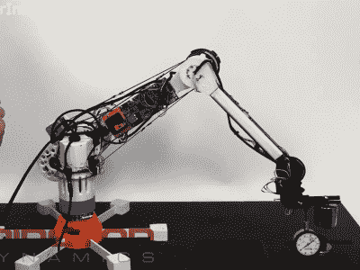
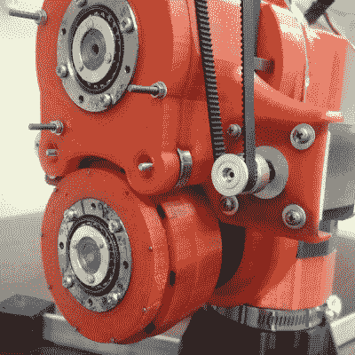

# 深入了解机器人手臂 Dexter

> 原文：<https://hackaday.com/2018/11/15/an-in-depth-look-at-dexter-the-robotic-arm/>

 [https://www.youtube.com/embed/0f7cqrwz0G0?version=3&rel=1&showsearch=0&showinfo=1&iv_load_policy=1&fs=1&hl=en-US&autohide=2&wmode=transparent](https://www.youtube.com/embed/0f7cqrwz0G0?version=3&rel=1&showsearch=0&showinfo=1&iv_load_policy=1&fs=1&hl=en-US&autohide=2&wmode=transparent)

Dexter 是一个非常棒的机器人手臂项目，刚刚在 2018 年 Hackaday 奖中获得了最高荣誉，并带走了 5 万美元继续他们的项目。作为对 Hackaday 和社区的致敬，Dexter 背后的公司 Haddington Dynamics 也同意开源他们最新版本的 Dexter。正如詹姆斯·牛顿(James Newton)在颁奖典礼上接受奖杯时所说，“因为你们对我们的信任，因为这个奖项，我们被感动到开源下一代 Dexter。”一些非常聪明的工作进入生产德克斯特，我们迫不及待地想看看有什么进一步的改进！

无论如何，德克斯特不是镇上唯一的机械臂。但就业余爱好者级别的机器人而言，它是迄今为止我们见过的最完整的机器人手臂，它包括几个设计功能，使其位置准确性和整体可用性都脱颖而出。这是一个机器人手臂，有十万美元机器人的许多功能，但预算只有几千美元。

 此外，许多设计创新可以零碎地用于你自己的项目中。例如，[我们的评委](https://hackaday.com/2018/10/08/the-incredible-judges-of-the-hackaday-prize/)特别喜欢 Dexter 的[巧妙的编码器设计](https://github.com/HaddingtonDynamics/Dexter/wiki/Encoders)。光学编码器通常使用一个有孔的圆盘；让光穿过圆盘照射到传感器上，你可以通过计算产生的脉冲数来确定位置。

Dexter 更进一步，使用光传感器的*模拟*值，允许它跟踪每个孔的几千个位置*，倍增可用的分辨率。这意味着，通过 3D 打印的编码器轮和一些严肃的数学运算将其转换为位置，Dexter 的编码器每转可以解析超过一百万个位置。这是令人震惊的精度，而且由于计算能力的进步，它可以相对便宜地获得。*

具体来说，[一个 FPGA](https://github.com/HaddingtonDynamics/Dexter/wiki/MicroZed) 和一些定制的“gateware”逻辑代码运行编码器数据到机械臂位置的转换。没错，他们用一台嵌入式 Linux 计算机和 FPGA 外设来计算两个关节的位置。你可能会认为这是多余的，但对于这样的手臂，桌子上第一个关节的任何小角度误差都会乘以手臂的范围。如果你希望半米臂末端的位置精度达到 0.1 毫米，那么你看到的是 0.01 度的角分辨率。使用 3D 打印的编码器轮和一些繁重的计算来获得这样的分辨率是一项伟大的创新。

 将这种详细的位置反馈与一些好的软件结合起来，你就可以设计出一种既柔顺又强壮的手臂，只需移动它就可以轻松训练。Dexter 对一些轴使用谐波驱动，虽然通常不希望强制谐波驱动，但位置传感器的极高分辨率让机器人知道它何时被推出位置，并施加更多力来保持位置，或者在它试图学习新动作时沿运动方向驱动电机。这使得训练变得容易，很大程度上类似于[巴克斯特](https://en.wikipedia.org/wiki/Baxter_(robot))的风格，这个机器人显然启发了德克斯特，但是成本明显更高并且不是开源的。

在棍子的尖端，Dexter 有一组可扩展的[末端执行器](https://github.com/HaddingtonDynamics/Dexter/wiki/End-Effectors)，通过一个简单的 3D 打印锁环和弹簧针排列连接。无论你需要吸尘器、剪刀还是机械臂末端的夹子，Dexter 都能满足你。

如果 Dexter 有一个缺陷，那就是运行编码器的 FPGA 代码是用专有的硬件描述语言 Viva 编写的。因此，虽然 Dexter 的人可以为我们提供一个比特流，以闪存到我们自己的 FPGAs 中，但我们不能调整编码器的算法。这是一种耻辱，但哈丁顿动力公司的立场是，他们负担不起为了成为完全开源而重新设计 FPGA 代码。

然而，最终，德克斯特的力量远远超过了它各个部分的总和。哈丁顿动力公司应用了我们的法官奎因·邓基所说的“真正的黑客精神”,尽可能使建造更加经济实惠，但仍然保持高质量。如果你对建造一个机器人手臂感兴趣，这里有大量的课程要学，如果你需要一个黑客预算的高级解决方案，这是我们开始的地方。我们迫不及待地想看看最新版本中有什么更新！

恭喜德克斯特和哈丁顿动力公司。

The [HackadayPrize2018](https://hackaday.io/prize) is Sponsored by:     