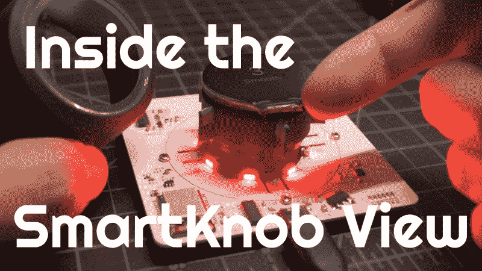

# 深入了解触觉智能旋钮

> 原文：<https://hackaday.com/2022/06/24/an-in-depth-look-at-the-haptic-smart-knob/>

在 Hackaday，我们喜欢那些有机会跟进我们已经展示过的项目的时候。一般来说，这是因为项目在某些重要的方面取得了进展，这总是很好的。然而，有时原始项目的新细节是可用的，这就是我们发现自己与[Scott Bez]和[他的触觉智能旋钮项目](https://www.youtube.com/watch?v=Q76dMggUH1M)在一起的地方。

机警的读者可能还记得[【Scott】在三月份](https://hackaday.com/2022/03/13/haptic-smart-knob-does-several-jobs/#more-526563)宣布这个项目。它引起了不小的轰动，好评如潮，还有一句通用的“我怎么没想到呢？”共鸣。而且有充分的理由；构建质量非常好，想法简单而强大。通过在无刷 DC 电机的轴上安装一个旋钮，并在中间安装一个小的圆形液晶显示屏，[Scott]设计出了一种可以动态重新编程的输入设备。BLDC 可以在任何时间间隔提供虚拟制动，同时为按钮按压生成触觉反馈，并且 LCD 屏幕可以提供用户反馈。

但是这样的东西是怎么建成的呢？这是当前视频的主题，其中有大量简洁的设计细节和构建见解。[Scott]面临的最大挑战是在旋钮中间支撑液晶显示屏，同时仍然允许旋钮和电机旋转。可悲的是，解决方案的一部分是一个空心轴电机，在他发布这个项目后很快就脱销了；希望很快会有合适的替代者。另一个巧妙的特点是[Scott]在 PCB 本身内置了微型应变仪，它可以拾取作为输入按钮的旋钮压力。我们还发现，通过快速拉动电机轴来提供按钮按压触觉的方式非常巧妙。

这是一个看起来像是等待解决问题的解决方案的项目，是你仅仅为了酷的因素而建造的东西。向[Scott]致敬，他跟进了一个同样有趣的细节。

