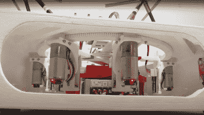

# 一个有趣的圆形斯图尔特平台

> 原文：<https://hackaday.com/2022/06/10/an-interesting-circular-stewart-platform/>

Stewart 平台非常简洁，在野外并不常见，可能是因为没有大量的黑客友好的应用程序需要在如此有限的移动范围内有这么多的自由度。无论如何，这里有一个有趣的实现,来自名字奇怪的[Circular-Base-Stewart-Platform]YouTube 频道(不，我们找不到设计者的真实姓名),有一个几年前的系列视频，展示了这样一个庞然大物的构造和操作。这是一个非常简洁的机械装置，由六个齿轮马达组成，安装在臂的末端，与一个大的内部齿轮啮合。每个臂的公共端骑在中心轴上，每个臂都有自己的轴承。加上通常的六个连杆、十二个球形接头和几个支架，一个完整的平台就实现了。

这种圆形排列如此简单，以至于我们无法相信以前没有遇到过。与通常的 Stewart 平台布置相比，一个有趣的变化是使用中央滑环连接器来提供动力，除了该机构通常允许的六个自由度之外，还允许整个组件连续旋转。控制由 Arduino Pro Mini 提供，它使用少量 Pololu [TB6612](https://www.pololu.com/file/0J86/TB6612FNG.pdf) (PDF)双 H 桥驱动模块驱动电机。显然，在 Arduino 上运行的草图会给这个东西一个固定的运动，但在中央滑环设置上添加一个额外的数据链路(或者可能是无线链路)，它会更有用。

我们最近看到了另一个 [6 自由度致动器设计，使用 flexures](https://hackaday.com/2022/05/06/flexures-make-this-six-dof-positioner-accurate-to-the-micron-level/) ，还有另一个[球平衡黑客](https://hackaday.com/2019/02/02/high-style-ball-balancing-platform/)，但是如果你想要一个实际有用的 Stewart 平台应用程序，请检查这个[台球机器人](https://hackaday.com/2021/02/24/robotic-pool-cue-can-be-your-friend-or-your-foe/)！

 [https://www.youtube.com/embed/RR4pmNEWuo4?version=3&rel=1&showsearch=0&showinfo=1&iv_load_policy=1&fs=1&hl=en-US&autohide=2&wmode=transparent](https://www.youtube.com/embed/RR4pmNEWuo4?version=3&rel=1&showsearch=0&showinfo=1&iv_load_policy=1&fs=1&hl=en-US&autohide=2&wmode=transparent)

感谢[quibble_droid]的提示！