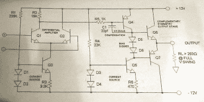

# 一个全新的运算放大器

> 原文：<https://hackaday.com/2020/05/09/an-op-amp-from-the-ground-up/>

我们都习惯于将运算放大器作为一个小黑盒，从中我们可以获得一系列非常有用的电路功能。当然，在它的内部隐藏着一个芯片上的晶体管电路，理解该电路的工作原理可以让我们深入了解运算放大器本身。这是[IMSAI Guy]在封锁期间解决的一个问题，他录制了一组视频来解释一个简单的分立元件运算放大器。

The op-amp circuit in question.

他从电流源开始，这是一个由两个二极管、一个电阻和一个晶体管组成的简单电路，为双晶体管[差分放大器](https://www.youtube.com/watch?v=T8RKIpNi5Qw)设置偏置。接下来是对[输出驱动器](https://www.youtube.com/watch?v=yFONwpneemQ)的观察，我们预计很快会有一个关于输出本身的视频。从第一集开始，我们把它放在休息时间的下面。

他的风格是悠闲的，当他在试验板上构建每个电路并借助万用表解释其操作时，这使它成为一款宁静的手表。如果这激起了你对简单运算放大器的兴趣，[我们回顾了 2018 年的首款集成电路运算放大器](https://hackaday.com/2018/02/20/deconstructing-a-simple-op-amp/)。

 [https://www.youtube.com/embed/Z8JDsvfZjL8?version=3&rel=1&showsearch=0&showinfo=1&iv_load_policy=1&fs=1&hl=en-US&autohide=2&wmode=transparent](https://www.youtube.com/embed/Z8JDsvfZjL8?version=3&rel=1&showsearch=0&showinfo=1&iv_load_policy=1&fs=1&hl=en-US&autohide=2&wmode=transparent)

感谢[IanS]的提示！