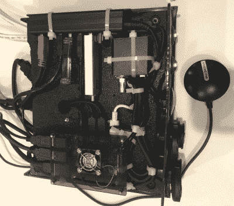

# 一个开源的舰载计算机系统

> 原文：<https://hackaday.com/2020/03/28/an-open-source-shipboard-computer-system/>

我们不确定你们中有多少人拥有一艘足够大的船，可以拥有自己的集成计算机网络，但这并不重要。即使你不能亲自使用这个项目，也不可能不对【mgrouch】在“光船必需品”项目中投入的工作[印象深刻。从硬件的构造到非凡的文档，即使是旱鸭子也能从这个项目中学到很多东西。](https://bareboat-necessities.github.io/my-bareboat/)

在其完全实现的形式中，车载计算机系统包括几个部件，它们一起工作以向操作者提供大量有价值的信息。

Inside the Boat Computer module

[mgrouch]称之为“船上电脑”的东西包含一个 Raspberry Pi 4、一个 dAISy AIS 接收器、一个 RTL-SDR、一个 GPS 接收器、串行适配器，以及让它们在一个防风雨的外壳内相互通信所需的无数电线。正如你所料，这涉及到通过防水面板安装运行所有的连接。

结合一套开源软件工具，“船计算机”能够与 NMEA 传感器和硬件接口，直接从 NOAA 卫星接收天气信息，跟踪船只，当然还可以在数字海图上标出你的当前位置。计算机本身被设计为安全地呆在甲板下，而操作员通过位于驾驶舱的 Argonaut M7 防水 HDMI 触摸屏与它进行交互。

对一些人来说，这可能就足够了。但对于那些想做大的人来说，[mgrouch]进一步详细介绍了“船闸”设备。这个单元包含一个运行 OpenWrt 的配备 LTE 的 WiFi 路由器和将船变成漂浮热点所需的所有外部天线。当然，它也有 RJ45 插孔连接到机载系统的其他组件，它甚至包括一个带 LAN 模块的 M5Stack 内核，因此它可以显示传感器读数和导航数据的选定子集。

如果你想在稍微小一点的规模上做类似的事情，我们已经看到航行计算机[将所有数据推送到可穿戴显示器](https://hackaday.com/2016/03/19/better-sailing-computers-with-wearable-electronics/)或[甚至是重新设计的电子书阅读器](https://hackaday.com/2012/09/07/adding-epaper-navigation-data-to-a-sailboat/)。