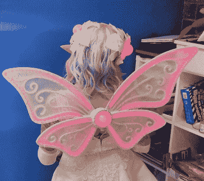
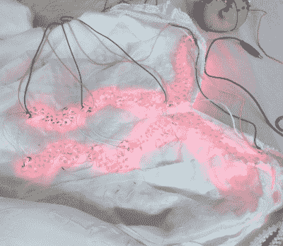
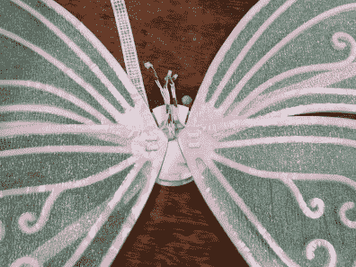
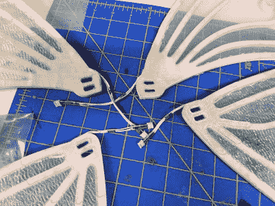
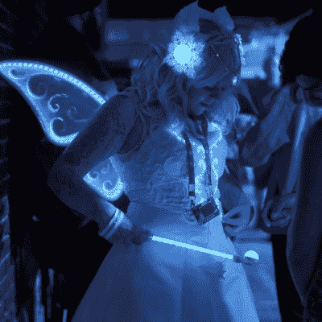

# 安吉拉·希恩正在奇思妙想地开发可穿戴技术

> 原文：<https://hackaday.com/2019/12/11/angela-sheehan-is-developing-wearable-tech-with-whimsy/>

作为一个概念，可穿戴技术让我们很多人兴奋，但在实践中，很难确定。到目前为止，普通人可能佩戴的最高科技的东西是手表。像谷歌眼镜这样的设备试图推动最先进的技术，但它可以说提出了更多的问题，而不是回答。它以一种非常公开的方式表明，开发同时具有视觉吸引力、实用性和足够强大的可穿戴技术来处理日常生活是非常困难的。如果谷歌都做不到，我们这些低级黑客还有什么希望呢？

 但也许我们一直在以错误的方式做事。尽管最终结果看起来令人信服，但从手表到头戴式电脑的转变是一个技术和心理上的巨大飞跃。为了帮助开发构建实用的可穿戴电子产品所必需的技能和技术，采取一种稍微更富于*想象力的*方法可能会有所帮助。

至少对安吉拉·希恩来说，这似乎很管用。 [*在 2019 年 Hackaday 超级大会上，她在“打造异想天开的可穿戴设备:通过有趣的原型开发提升水平”*](https://www.youtube.com/watch?v=lsHAuvVUj20) 的演讲中，回顾了她在开发偷色仙女服装时学到的一些东西。这款服装是多年迭代设计的产物，能够通过使用无线传感器棒来模仿环境中看到的颜色，并具有许多对任何成功的可穿戴项目至关重要的设计元素。

即使定制的 RGB 仙女服装不在你的项目清单上，这个演讲中的信息肯定会引起任何考虑过可穿戴项目的人的兴趣。从电池放置等技术方面到后勤考虑，如为多个佩戴者进行调整，安吉拉的虚拟创作已经成为现实世界考虑的试验台。

 [https://www.youtube.com/embed/lsHAuvVUj20?version=3&rel=1&showsearch=0&showinfo=1&iv_load_policy=1&fs=1&hl=en-US&autohide=2&wmode=transparent](https://www.youtube.com/embed/lsHAuvVUj20?version=3&rel=1&showsearch=0&showinfo=1&iv_load_policy=1&fs=1&hl=en-US&autohide=2&wmode=transparent)

## 将想象力带入生活

安吉拉在演讲开始时说，她不是一名程序员或工程师，而是一名“迫降”到可穿戴技术世界的艺术家。当她开始这个项目时，她的目标更多是情感上的，而不是技术上的。她只是想要一种方法来重现电影中看到的魔法效果，尤其是动画《睡美人》中的魔法变色连衣裙。她确切地知道她想把这个项目进行到哪里，她所要做的就是找出如何到达那里。

Angela’s earlier efforts were difficult to maintain and wear.

因此，她给任何想开始自己项目的人的第一条建议是做一些让他们兴奋的事情。即使只是为了你自己的享受，没有任何实际的目的，如果你对它充满热情，当你可能会放弃的时候，你会有继续前进的动力。与此同时，你会增加你的个人知识，磨练你的技能。

来自更艺术化的背景。安吉拉可能还有一段路要走，但她最终找到了一个发挥她独特优势的工作流程。她把自己描述成一个“二维思考者”，从概念上来说，她的设计是一层层堆叠起来的平面。她还成功地在 Adobe Illustrator 中勾画出自己的想法，将设计作为 DXF 文件导入她的 CAD 软件，然后将其挤压成三维。有趣的是，另一位可穿戴创作者 Sophy Wong 利用类似的技术将她的手绘草图带入现实世界。

## 从经验中学习

在承担这个项目的过程中，Angela 检查了清单上的许多“第一次”,从在 Eagle 中创建定制 PCB 到学习 Fusion 360。从纯粹的个人角度来看，自从她致力于实现童年的梦想以来，她的技能已经取得了很大的进步。单就这些优点而言，该项目已经取得了令人难以置信的成功，她是一个更好、更全面的制作者。

但是在制作偷色精灵服装和分享她一路上所学到的东西的过程中，她为其他从事自己可穿戴项目的人做了一件无价的服务。通过她在 Supercon 的演讲和为服装精心准备的 Hackaday.io 页面，她揭示了大量信息，即使你理想的可穿戴设备不包括巨大的发光蝴蝶翅膀，你也可以利用这些信息。

也许她学到的最大教训是，现实世界在硬件上可以有多粗糙。在简单地四处走动和年幼的孩子们看到服装亮起来时似乎忍不住跑上去搂住她的事实之间，她的第一代激光切割泡沫翅膀在离开车间后并没有持续很长时间。安吉拉不想在她的目标上妥协，即让翅膀足够轻，穿着舒适，她最终修改了设计，在保持轻盈外观的同时，加入了 Delrin 肋骨，以增加机械强度。

她最终采用了模块化设计，连接器可以快速轻松地拆卸，因为这不仅使维修和维护更容易，也意味着她可以将服装拆开，以便更容易地运输。她还意识到，将电池嵌入服装不仅不方便，而且可能不安全。在她的情况下，解决方案是使用臀部安装的电池组，它总是在伸手可及的地方。

    

第一次有人要求在演出中使用她的服装也是一次宝贵的学习经历。作为这件作品的创作者，她在佩戴它时总是非常小心，但一旦远离她几乎是母亲般的关怀，它就会受到比她预期的更粗暴的处理。虽然这套服装最终毫发无损地通过了考验，但它确实让安吉拉反思了“多用户”可穿戴技术的挑战。例如，设计足够的调整，使得它可以适合不同的穿戴者，而不需要显著的修改。

## 继续向前推进

安吉拉的演讲不是《童话制作 101(T1)》，她也没有假设每个观众都在做自己的角色扮演项目。事实上，她的演讲是关于跟随你的激情的好处，无论它可能带你去哪里，边走边学，不要因为你(还)没有实现目标的知识而让自己气馁。

 称之为“励志”可能有点过了。毕竟，参加 Hackaday Supercon 的大多数人很有可能在家里有一两个古怪的项目，他们正慢慢回到那里。但这是对*为什么*那些激情项目如此重要的奇妙提醒。作为黑客和创客，有时很容易忘记我们接手的每个项目都是一次学习经历。即使你是一个经验丰富的专业人士，偶尔做一些“无意义”的项目也是保持机敏的一个极好方法。

所以无论你对什么感兴趣，继续构建和迭代，直到它以你想要的方式出现。但不要藏在心里。拍照，记录项目，甚至可能就此发表演讲！有一个很好的机会，有人可以从你的经历中学习，最终，这就是整个社区的意义所在。