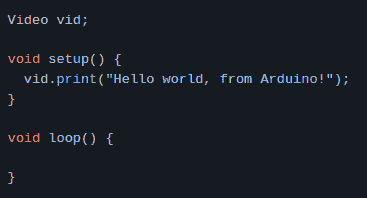

# Arduino IDE 创建可引导的 X86 软盘

> 原文：<https://hackaday.com/2022/01/12/arduino-ide-creates-bootable-x86-floppy-disks/>

可以说 Arduino 生态系统的最大优势是让你的代码运行起来非常容易。在 IDE 中键入几行，点击按钮，几秒钟后，您会看到 LED 闪烁或一些文本通过串行端口返回。但是如果同样的易用性不局限于微控制器呢？如果您可以使用 Arduino IDE 来创建计算机软件，会怎么样？

这正是由[Jean THOMAS]开发的项目 boot 2 duino 所希望完成的。正如你可能从名字中猜到的那样，你在 Arduino 中写的代码被转换成一个可启动的软盘映像，你可以把它粘贴到一台旧电脑中。几秒钟的哔哔声和研磨声之后，你的“Hello World”应该会出现在显示器上，你就拥有了世界上最大的 Arduino。

A minimal x86 Arduino sketch.

现在要澄清的是，这不是某种启动并运行编译好的 C 程序的最小 Linux 环境。[Jean]创建了一个 Arduino 内核，在 x86 硬件上提供基本功能。您的代码可以完全控制计算机，并且没有操作系统开销需要处理。正如一系列视频所展示的，用 boot2duino 编写的程序可以显示文本，从键盘上读取，并通过 PC 的扬声器播放音调。

boot2duino 的文档说这个项目没有实际用途，但是我们不确定。虽然功能集很少，但低开销意味着理论上你可以将真正古老的个人电脑投入使用。当然，能够在现代操作系统上编写代码并毫不费力地将其部署在复古计算机上是有吸引力的，从早期计算机游戏的现代化版本到更实际的应用程序。如果任何读者最终进一步探索这个概念，请务必[让我们知道进展如何](https://hackaday.com/submit-a-tip/)。

[https://player.vimeo.com/video/656339999](https://player.vimeo.com/video/656339999)