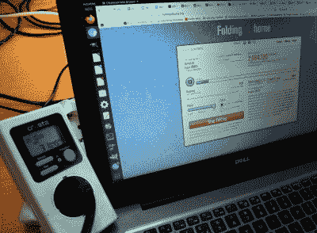

# 问 Hackaday:用笔记本电脑加热帐篷的最好方法是什么？

> 原文：<https://hackaday.com/2021/09/16/ask-hackaday-whats-the-best-way-to-heat-a-tent-with-a-laptop/>

对于欧洲人来说，八月通常是酷热的一个月，日复一日无云的天空和烈日使水果成熟，并将我们当地人变成各种各样的粉红色。这个月的黑客营是凉爽项目的慵懒日子，是激光、俱乐部伙伴和电子音乐的炎热夜晚，帐篷在夜空下足够温暖，完全不需要睡袋。

不过，有时全球天气模式的变化对我们黑客的影响会更小，我们温暖的暑假会变得更加寒冷。例如在博恩哈克 2021，我们为热浪打包行李，结果遇到了北方气团控制下的丹麦。黑客如何保暖？

## 环游世界的黑客作家的冷酷世界

Folding@home makes for a 31W heater.

白天 20 多摄氏度仍然足够温暖，但晚上温度会低得多，对于只带了一个薄睡袋的人来说有点冷。在一个小活动中，在附近的城镇花几克朗买一个电暖器肯定会变得不受电力团队的欢迎，那么还剩下什么呢？答案，也是我们村里一场有趣讨论的催化剂，是在笔记本电脑上运行一项计算密集型任务，以产生足够的热量来度过一个舒适的夜晚。对我来说，这意味着折叠@home [为 Hackaday 团队的总积分](https://hackaday.com/2020/03/18/join-team-hackaday-to-crunch-covid-19-through-foldinghome/)处理一些医学研究工作单位，但尽管结果是度过了一个舒适的夜晚，我是否发现了计算供暖的最佳解决方案？这就是你的观点出现的地方，所以在下面的评论中分享吧。

## 如何从旧戴尔电脑中获得超过 31W 的功率？

我的 Hackaday 文章要么是在华硕 Chromebook 上完成的，要么是在 2017 年的戴尔英特尔 i7 笔记本电脑上完成的。华硕在散热方面不太好，因为它被设计为低功耗机器，电池续航时间短，但相比之下，戴尔能够在最轻微的通知下旋转风扇。除了它的四个处理器核心，它还有一个旋转生锈的磁盘驱动器，可以变得很好，一个 DVD 驱动器，必须适合一点热量，和一个漂亮的大 LCD，遗憾的是，我没有用它来产生热量，因为我需要睡觉。因此，使用 Folding@home 时，我并没有真正发挥笔记本电脑的全部潜力，因为我只是点亮了 CPU。闲置时用了 10W，Folding@home 最高能推 31W。我能找到一种算法或一种软件，让它更接近极限吗？也许我可以开采一种加密货币，也许我可以种植 Chia 来预热磁盘驱动器，而不是折叠@home，但值得指出的是，采用英特尔芯片组的 2017 年戴尔不会让我成为百万富翁。

所有这些引发了另一个讨论，我所做的是否浪费了计算能力？折叠@home 给我留下了一种支持医学研究的温馨感觉，但现在我却在担心在帐篷里秘密开采热能的道德足迹。鉴于电吹风加热器除了产生热量之外没有任何其他好处，也许我应该专注于热量。

因此，所有这些帐篷取暖的乐趣为 Hackaday 的读者提供了一种有趣的消遣，就像一群有点冷的黑客在丹麦的田野里吃早餐一样。你如何最大限度地利用笔记本电脑的热量？分布式计算，密码，或其他一些专门的算法？或者也许我从完全错误的方向着手解决这个问题，也许我应该在业余无线电部门做一些非常低效的事情。交给你了！