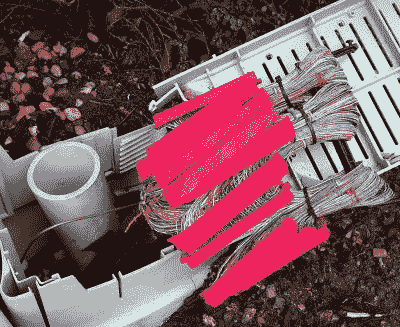
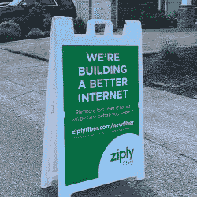

# 问 Hackaday:随着座机使用的下降，本地环路该怎么办？

> 原文：<https://hackaday.com/2020/10/12/ask-hackaday-with-landline-use-in-decline-whats-to-be-done-with-the-local-loop/>

散步是很好的锻炼，但对大脑也有好处:它给人时间去观察和思考。至少这是我在日常散步中所做的，而作为我，我通常观察和思考的是我沿途的当地基础设施。最近，我惊讶地看到人行道旁有许多电话公司的柜子敞开着。通常当你看到一个打开的盒子时，会有一个电话技术人员在那里工作。但这些都是敞开的，无人看管，我认为这是不寻常的。

当然，我借此机会详细检查了这些基座的内容。看着数百对颜色鲜艳的电线整齐地端接，显然安装和维护费用很高，我不禁想知道为什么有人会将如此宝贵的资产暴露在自然环境中。随着传统 POTS 或普通老式电话服务的衰落，世界可能不再需要数百万英里的铜缆反馈到电信中心局(COs)。但是，这种曾经至关重要的基础设施仍然有一些用处，这让我不禁要问:本地环路能做些什么？

## 植物内部，有一面罗宋汤

就像上一个世纪之前就存在的任何行业一样，电话行业充斥着行话。电信公司将他们用来运行系统的所有东西称为他们的物理设备。如果这使人想起工厂的形象，那就不远了:开关设备、电缆和支持设备真的是一台巨大的机器，最初，电信公司真的只是为了把声音从一个地方传到另一个地方而建造的工厂。

电信公司的物理设备可以分为两大类:室内设备和室外设备。顾名思义，室内植物是居住在屋顶下的一切。这包括开关设备本身、连接本地回路进线的主配线架，以及用于所谓的罗宋汤功能的所有支持设备，罗宋汤功能的缩写为:

*   **B** 电池(给本地回路供电的标称 48 VDC
*   本地回路上的过电压保护；
*   **R** 莺莺电压(约 89v RMS)；
*   **S** 信令或 **S** 监控，检测用户端的挂机或摘机状态并解码 [DTMF](https://hackaday.com/2017/09/05/in-band-signaling-dual-tone-multifrequency-dialing/) 音；
*   **C** oding，提供对数字编解码算法的支持；
*   **H** ybrid，将两线本地回路转化为四线连接；
*   测试，允许现场技术人员将用户直接连接到中心局的测试设备。

随着技术的进步，工厂内部的情况往往会变化得相当快。例如，许多 COs 开始时都装有步进式(SxS)或纵横制交换机，一个机架接一个机架地装着火花四射、噼啪作响的继电器和螺线管，这些继电器和螺线管将交换机内的一条用户线连接到另一条用户线，或者将它运送到另一个交换机以连接到它的一个用户。后来，电子开关出现了，取代了所有的旧齿轮，这种变化通常进行得如此之快，以至于用户几乎没有注意到这种变化。

## 室外工厂

外部设备是指电话公司安装在中心局外部的所有设备。如果它被挂在电线杆上，埋在地下，或者坐落在某处山顶的塔上，它就被算作室外植物。

最明显的外部设备是形成本地环路的数英里长的电线。在电话服务的早期，在北美至少可以追溯到 20 世纪 80 年代或 90 年代初，本地环路就是这样——从中心局的主配线架延伸到用户驻地分界点的一对铜导线。当电话摘机时，循环就完成了，拨打或接听电话的过程就开始了。

A telco pedestal for a condo in my area. This example of telco outside plant has been open to the elements for weeks.

与室内设备一样，室外设备的本地环路和其他组件也随着时间的推移发生了变化，增加了额外的设备来处理更新的数字技术，如综合业务数字网(ISDN)和数字用户线路(DSL)。但是，尽管技术在不断变化，电话公司为升级服务所做的很多事情都是基于利用他们最有价值的资产——所有这些绵延数英里的珍贵铜，精心制作成一个庞大的网络，几乎可以到达地图上的每个地址。

然而，可悲的是，你能推动 19 世纪的技术也就到此为止了，已经走投无路的电话公司从 21 世纪初开始面临双重挑战:手机的兴起和宽带的普及。人们不再被固定电话束缚，手机可以做同样的工作甚至更多。在手机信号覆盖较差的情况下，宽带连接很有可能被一种新的 VOIP 电话服务所利用，通过有线互联网提供商或具有讽刺意味的 DSL 连接进入用户的房屋。

Sign of the times: Ziply fiber is coming to town. Source: [Ziply Fiber](https://get.ziplyfiber.com/)

但是 DSL 连接的激增实际上是铜线本地环路的最后一搏。自 2000 年以来，美国的固定电话用户数量已从近 2 亿(约占当时人口的 70%)下降到 2018 年的 1.16 亿。人们不再有固定电话的有效使用案例。这解释了我早上散步时观察到的细节:几天前，一个电缆施工队出现在我发现的一个开放的基座附近，树立了一个招牌，宣布一个新的光纤网络的到来。原来，[在 5 月份快速收购了我所在地区的 Frontier Communications](https://www.channelpartnersonline.com/2020/05/04/ziply-fiber-takes-over-frontier-communications-northwest-operations/) 的业务和资产，并投资 5 亿美元升级网络。

## 轮到你了

据我所知，Ziply 主要对利用他们从 Frontier 继承的外部工厂的通行权感兴趣。剩下的几部座机似乎只不过是他们新网络建设的资金来源。我的问题是:这些铜线会变成什么样？

放弃如此宝贵的资产似乎是一种耻辱，但也许它只对不经营光纤公司的人有价值。也许有一天，所有的铜都会被证明只是一个讨厌的东西，一个消耗掉维护预算却没有什么回报的东西。也许在那个时候，废弃它是有意义的——将所有那些精心安装和盲目维护的电缆从电线杆和管道中拔出来，以废铜的价格卖掉。

或者，对于这样一笔看似有价值的资产，或许还有另一个计划？铜缆网络还能在通信生态系统中占有一席之地吗？这个生态系统利用了铜缆网络连接几乎每个家庭和企业的独特地位。我们很想听听您对本地环路的看法，我们尤其想听听那些致力于建设这些令人惊叹的网络并保持其活力的电信工程师们的看法。关于外面的工厂，肯定有很多内幕，如果你能在下面的评论中分享，我们将不胜感激。