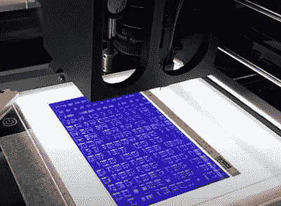

# 自动缩微胶片扫描仪将文件数字化

> 原文：<https://hackaday.com/2021/09/17/automatic-microfiche-scanner-digitizes-docs/>

虽然这个概念对今天的我们来说可能有些古怪，但缩微胶片曾经是存储和分发文件的一种非常引人注目的方式。通过光学手段将它们缩小到原始尺寸的百分之几，一张高分辨率的胶片上可以存储数百页内容。一盒这样的电影可以存储相当于几千兆字节的文本和图像，并且只需要一台相对简单的放映机就可以读取它们。

正如[【Joerg Hoppe】在为他的自动缩微胶片扫描仪](http://retrocmp.com/projects/scanning-micro-fiches/234-dec-micro-fiche-document-system)撰写的文章中解释的那样，像数字设备公司(DEC)这样的公司在 70 年代和 80 年代广泛使用这种技术向他们的服务部门分发手册、图表甚至源代码。幸运的是，这意味着所有这些有价值的信息的硬拷贝在 DEC 出版几十年后仍然完好无损地存在。当然，不利的一面是，缩微胶片阅读器现在在当地的大盒子电子商店里是买不到的。为了让当代人和后代人都能获得这些信息，需要将它们数字化。

The camera panning over a full DEC microfiche sheet.

[Joerg]注意到有商业服务可以为你做到这一点，但价格太高，对业余爱好者来说不切实际。交钥匙缩微胶片扫描仪也是如此。这就是为什么他开发了这个硬件和软件系统专门用来数字化 DEC 文档。用户将写在缩微胶片顶部的信息输入软件，然后将它放在基于廉价 3D 打印机的机器上。

该设备在胶片上二维移动佳能 DSLR 相机和适当的放大光学器件，使用 Z 轴微调焦点，然后命令相机拍摄每一页的图像。然后，这些图片通过各种过滤器来清理图像，并编译成可在现代硬件上轻松查看的 pdf。数字文档可以通过光学字符识别(OCR)进一步运行，因此可以轻松地搜索和处理文本。在休息后的视频中，你可以看到整个过程相当复杂，但一旦进入工作流程，[Joerg]说他的扫描仪可以在大约 10 分钟内数字化 100 页。

如果你有大量缩微胶片文件要看，像这样的机器是非常宝贵的，但如果你只有一两张想看的纸，那么用一台数码显微镜和一个回收的灯箱组装一个简单的装备，在必要时应该可以工作。

 [https://www.youtube.com/embed/X22gr5THBRA?version=3&rel=1&showsearch=0&showinfo=1&iv_load_policy=1&fs=1&hl=en-US&autohide=2&wmode=transparent](https://www.youtube.com/embed/X22gr5THBRA?version=3&rel=1&showsearch=0&showinfo=1&iv_load_policy=1&fs=1&hl=en-US&autohide=2&wmode=transparent)

