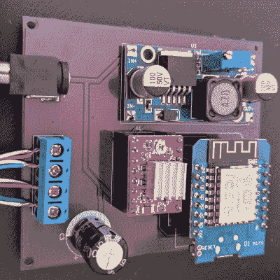

# 以租赁友好的方式自动化迷你百叶窗

> 原文：<https://hackaday.com/2020/08/19/automating-mini-blinds-the-rental-friendly-way/>

[克里斯·穆林斯]想在他的公寓里自动打开和关闭迷你百叶窗，并想出了一个系统来做这个有趣的项目。手动打开和关闭板条意味着扭转杆。使之自动化似乎很简单，但是像往常一样，当不得不解决已经存在的问题，不做永久性的改变时，就会出现复杂的情况。

百叶窗只有 1 英寸宽，几乎没有空间安装任何种类的硬件。虽然有很多自动百叶窗的现有技术，但他发现没有一种技术真正适合[Chris]的情况，[所以他推出了自己的](https://blog.christophermullins.com/2020/02/16/automating-blinds-with-a-retrofitted-external-motor/)。

 通常用来控制百叶窗的杆子被拿掉了，取而代之的是步进电机的转轴。[Chris]“安装解决方案适用于窄 1 英寸轨道的百叶窗(他发现现有项目依赖于 2 英寸轨道)，并且 3D 打印安装是完全可调的，因此 28BYJ 步进电机可以移动到准确的位置。说到步进电机，28BYJ 电机是单极的，但他想使用的 A4988 驱动器仅用于双极步进电机。幸运的是，只需在电机的 PCB 上切割一条走线，单极电机就能变成双极电机。

为了驱动电机并提供无线功能，整个系统需要一个 Wemos D1 ESP8266、一个 A4988 步进驱动器和一个降压转换器。虽然它在 perfboard 上一次性运行良好，但[Chris]将该项目作为学习如何使用 KiCad 制作 PCB 的机会；PCB 项目[在 GitHub](https://github.com/sidoh/motor_driver_pcb) 上，ESP8266 运行 [ESPHome](https://hackaday.com/2020/04/20/roll-your-own-automation-with-esphome/) 固件。请务必查看[博客](https://blog.christophermullins.com/2020/02/16/automating-blinds-with-a-retrofitted-external-motor/)上的项目页面，了解所有细节；[Chris]链接到那里的所有资源，涵盖了从材料清单到集成到开源[Home Assistant](https://www.home-assistant.io/)项目中的 ESPHome 配置的所有内容。

想控制自然光，但百叶窗不是你的菜？也许可以考虑[自动窗帘](https://hackaday.com/2019/10/14/the-morningrod-wants-your-mornings-easier-not-harder/)。