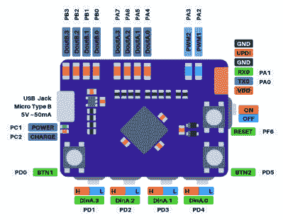

# 只有三个按钮的裸机编程

> 原文：<https://hackaday.com/2019/05/12/bare-metal-programming-with-only-three-buttons/>

对于任何看过类似 Altair 8800 这样的 20 世纪 70 年代微型计算机的人来说，你会知道这些庞然大物的核心是一系列用作输入和输出的 led 和拨动开关。当然，今天的计算机的能力是指数级的，但是不可否认的是，用笔、纸和耐心输入来开发软件是令人满意的。

 如果你想体验一下老派的直觉编程，但还没准备好投资一台 40 年前的电脑，[那么【GClown25】可能有你想要的答案](https://github.com/GClown25/BIT4)。他开发了一种口袋大小的“计算机”,他称之为 BIT4，只需三个触摸开关就能编程。实际上，它是一台运行 C 代码的 ATMega4809，但它确实能让你了解过去的机器是如何编程的。

在休息后的视频中，[GClown25]通过输入一个简单的二进制计数器程序来演示 BIT4。有了手写的程序副本作为参考，他遍历内存地址，输入命令，然后输入他想要操作的值。在疯狂地按下按钮几秒钟后，他将 BIT4 置于运行模式，你可以在 PCB 顶部边缘的 led 阵列上看到输出。

所有的硬件和软件都是开源的，任何人都有兴趣构建自己的副本，或者可能只是想看看[GClown25] [如何用现代技术重新想象经典的微机体验](https://hackaday.com/2018/06/13/vcf-east-cactus-retro-because-it-wants-to-be/)。[从概念上来说，这个项目让我们想起了 Digirule2](https://hackaday.com/2019/03/02/programmable-ruler-keeps-1970s-computing-alive/) ，但我们不得不承认这个版本不到一英尺长的事实非常引人注目。

 [https://www.youtube.com/embed/6CpZszKlP7Y?version=3&rel=1&showsearch=0&showinfo=1&iv_load_policy=1&fs=1&hl=en-US&autohide=2&wmode=transparent](https://www.youtube.com/embed/6CpZszKlP7Y?version=3&rel=1&showsearch=0&showinfo=1&iv_load_policy=1&fs=1&hl=en-US&autohide=2&wmode=transparent)

