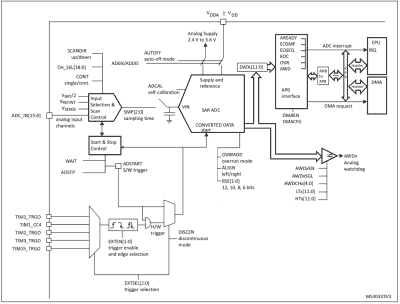
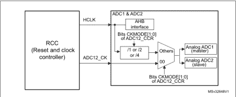
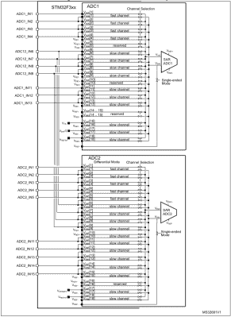

# 裸机 STM32:用 ADC 增加模拟触感

> 原文：<https://hackaday.com/2022/06/29/bare-metal-stm32-adding-an-analog-touch-with-adcs/>

模数转换器(ADC)的核心是一个简单的装置:通过测量设定范围内的模拟电压，并将测量值转换为数字值，我们可以在代码中使用该测量值。通过在微控制器中使用嵌入式 ADC，我们可以解决许多基本的使用案例，从测量电位计上的设置，到读取传感器上的模拟输出线路，包括 MCU 的内部温度和电压传感器。

STM32 MCUs 中的 ADC 分辨率在 12 至 16 位之间，前者是最常见的类型。根据具体的 ADC 外设，可以配置 ADC 来降低分辨率、设置特定的采样速度以及设置多模式配置。STM32 MCUs 至少有一个 ADC 外设，有些则有多个。在本文中，我们将了解如何配置和使用 STM32 MCUs 中 ADC 的基本特性，特别是 F0 中的 ADC 和大多数 F3 系列 MCU 中的 ADC5_V1_1 类型。

## 设置事物

[](https://hackaday.com/wp-content/uploads/2022/06/stm32f0_adc_block_diagram.png)

STM32F0 ADC block diagram (RM0091, 13.4).

配置 ADC 器件时，需要注意三个基本事项:

1.  在其复位和时钟控制(RCC)使能寄存器中使能其时钟。
2.  校准 ADC 器件。
3.  选择 ADC 公共时钟源。

第一项应该是显而易见的，因为这是 STM32 上任何其它外设的标准程序。尽管如此，在一些 STM32 MCUs 上还是有一些问题。具体来说，在 F334 等 MCU 上，其两个 ADC 器件(ADC1 和 ADC2)使用相同的时钟域(`RCC_AHBENR`寄存器中的`ADC12`位)。

启用外设时钟域后，我们可以开始运行其自校准程序。虽然这是可选的，但应用工厂提供的校准系数可以大大提高采样值的精度。

## 校准

运行校准程序会应用存储的校准系数来调整 ADC 外设。该校准系数在制造过程中进行测量和编程。运行校准程序要求 ADC 外设使能其时钟(在 RCC 中)，但关闭(`ADEN`位)。在 F0 和兼容的 MCU 上，通过写入`ADC_CR`寄存器中的`ADCAL`位开始校准，并通过检查`ADCAL`位值等待校准完成:

```

ADC1->CR |= ADC_CR_ADCAL;
while ((ADC1->CR & ADC_CR_ADCAL) != 0) { }

```

在 F3 器件上，程序非常相似，但也要求我们首先在器件上使能 ADC 的电压调节器。例如:

```

ADC1->CR &= ~ADC_CR_ADVREGEN;
ADC1->CR |= ADC_CR_ADVREGEN_0; 

```

关于`ADVREGEN`寄存器值的问题是，当改变它时，它必须总是通过 0x00 转换，这就是为什么我们必须首先将其复位。使能电压调节器后，我们必须等待 10 微秒，让调节器输出有时间建立。处理完毕后，我们可以按照之前针对 F0 所述的方式执行 ADCAL 程序。

## 时钟脉冲源

[](https://hackaday.com/wp-content/uploads/2022/06/stm32f334_adc_clock_scheme.png)

STM32F334 ADC clock scheme. (RM0364, 13.3.3)

ADC 时钟源本质上是同步(AHB 或 APB 产生)或异步(独立于时钟域再同步)之间的选择。一般来说，选择异步时钟源是一个安全的选择，例如，对于 STM32F0，通过设置`ADC_CFGR2`中`CKMODE`的值并启用高速 ADC 时钟(此处为 14 MHz HSI 时钟):

```

ADC1->CFGR2 &= ~ADC_CFGR2_CKMODE;
RCC->CR2 |= RCC_CR2_HSI14ON;
while ((RCC->CR2 & RCC_CR2_HSI14RDY) == 0) { }

```

这里重要的是等待时钟源稳定后再继续。当 HSI14 时钟在 F0 时，这是通过等待`RCC_CR2`中的`HSI14RDY`位被置位来完成的。

使用同步、总线衍生时钟模式也是一种选择，例如 F334 MCUs 上不带分频器的 AHB 时钟:

```

ADC1_2_COMMON_BASE->CCR |= ADC_CCR_CKMODE_1;

```

选择时钟模式后，前面的任务也从列表中划掉，我们可以继续配置希望在序列中采样的通道。

## 渠道配置

[](https://hackaday.com/wp-content/uploads/2022/06/stm32f334_adc1_adc2_connectivity.png)

STM32F334’s ADC1 and ADC2 channel connectivity. (RM0364, 13.3.4)

每个 ADC 都连接到多个模拟输入通道，包括一系列固定的外部(GPIO 连接)通道，以及另外一些所谓的内部通道。后面这些通道连接到内部温度传感器( *Vsense* )、内部基准电压( *Vrefint* )、电池电压( *Vbat* )，在 F334 MCUs 上，其第二个 ADC 外设的通道 17 上有 *Vopamp2* 用于嵌入式运算放大器。

通道的配置方式是 F0 和 F3 系列 ADC 开始出现显著差异的地方。我们来看看 F0，配置 ADC1 的通道是通过在 ADC_CHSELR 中将通道设置为有效，然后设置采样时间来实现的。例如，如果我们配置通道 1 (GPIO)和 16 (Vsense ),我们会得到:

```

ADC_BASE->CCR |= ADC_CCR_TSEN;
ADC1->CHSELR |= (1 << 1); 
ADC1->CHSELR |= (1 << 16); 
ADC1->SMPR = 7;

```

这会将通道选择寄存器中的通道 1 和 16 设置为有效，并将采样时间设置为最大长度(`0b111`)。对于通道 16 (Vsense)，这是采样 Vsense 的推荐采样长度(239.5 个 ADC 周期)。由于 F0 ADCs 的采样时间对所有通道都相同，因此我们必须选择所需的最长采样时间。

注意，为了启用该通道，我们还必须启用公共`ADC_CCR`寄存器中的`TSEN`位。其他内部通道也是如此，使用同一寄存器中的`VREFINT`和`VBAT`位。最后，请注意，我们必须在希望用于模拟输入的 GPIO 引脚上启用模拟模式。

接下来，让我们看看在 F334 设备上配置相同通道的情况:

```

ADC1_2_COMMON_BASE->CCR |= ADC_CCR_TSEN;
ADC1->SQR1 = 1;
ADC1->SQR1 |= (1 << 6);
ADC1->SQR2 |= (16 << (6 * 2));
ADC1->SMPR2 |= (7 << (3 * 6));

```

这里我们也必须启用`TSEN`位，但是设置采样序列的方式更加复杂。基本上，`SQR1`至`SQR4`寄存器包含序列中要采样的连续通道号，`ADC_SQR1`中的第一个条目包含整个序列中的通道号(0 表示一个通道)。

使用默认设置对通道进行配置后，我们就可以开始序列了。

## 运行序列

在开始序列之前，我们希望确保`ADC_ISR`寄存器中的`ADRDY`为 0。这让我们知道我们可以安全地开始一个新的序列。接下来，我们通过设置目标 ADC 外设的`ADC_CR`寄存器中的`ADEN`来使能该器件。现在，器件已准备好开始时序控制。

当我们写入`ADC_CR`寄存器的`ADSTART`位时，会导致 ADC 开始采样，默认情况下是单个序列，这意味着它会对每个有效通道采样一次，然后停止采样。当一个通道被采样后，我们可以通过等待`ADC_CR`寄存器中的 EOC(转换结束)位被置 1 来检测。一旦该位变为‘1’，我们可以从`ADC_DR`寄存器读取采样值，这将复位 EOC 位。一旦整个序列完成，`ADC_ISR`中的`EOSEQ`将被置位。

## 处理采样值

采样值将是 0 和最大比特值之间的数字:在 12 比特的情况下是 4095。这使得检测外部电位计的状态变得容易，该电位计将输出跨越整个范围的电压。如果你想知道输出的确切电压，你需要做一些调整。例如，如果为 ADC 提供 3.3 V 电压，那么实际上 1337 的读数就是 1337 / 4095 * 3.3 V = 1.077 V。

内部温度传感器的工作原理类似，但需要从电压到温度进行校准，或者您可以直接从数据手册中获取“典型值”。对于 F042 MCU，30°C 时为 0x1FFFF7B8，110°C 时为 0x1FFFF7C2。我们将 Vsense 的 12 位值作为原始温度(在`int16_t`变量中),并将其代入参考手册中给出的公式:

```

int32_t temperature = 0;
temperature = (((int16_t) raw) - *TEMP30_CAL_ADDR);
temperature = temperature * (int32_t)(110 - 30);
temperature = temperature / (int32_t)(*TEMP110_CAL_ADDR - *TEMP30_CAL_ADDR);
temperature = temperature + 30;

```

对于参考的 STM32F042 MCU，在将固件映像写入器件后不久，温度约为 36°C，室温约为 28°C。虽然 STM32 器件的内部温度传感器不能保证非常精确，但使用提供的校准值，它应该可以精确到几度以内，对于相对温度测量来说当然足够，这足以确定芯片是否过热。

## 仅仅是开始

当然，前面只是简单介绍了 STM32 MCUs 中的 ADC 外设。我们只使用了一个 ADC，并保留了采样分辨率、数据对齐等。默认情况下。我们将在下一篇文章中更详细地讨论这些选项，以及中断的使用、连续模式和多 ADC F3 MCUs 的多模式操作。

无论如何，利用目前提供的信息，应该可以执行许多基本的 ADC 相关任务，并了解其工作原理。