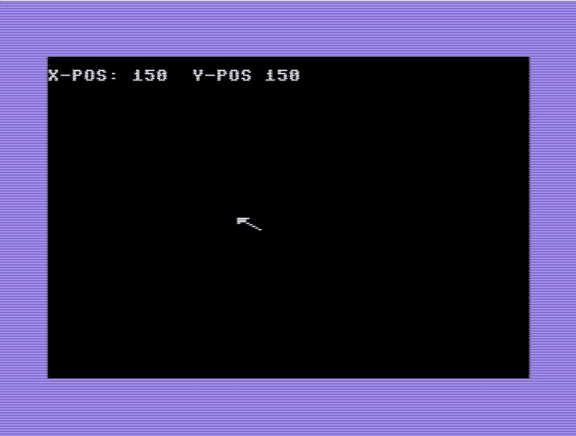
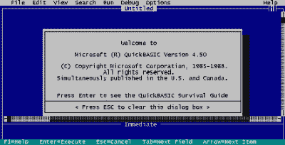
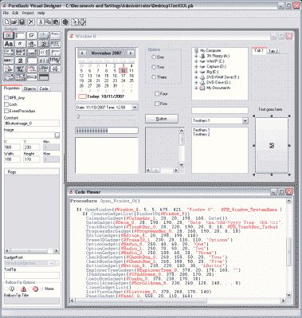

# 基本:跨平台软件黑客过去和现在

> 原文：<https://hackaday.com/2021/02/16/basic-cross-platform-software-hacking-then-and-now/>

现在 BASIC 肯定已经过时了，对吗？也许不是。除了激发了今天家庭计算的很大一部分，BASIC 今天仍然非常活跃，甚至在复古计算之外。

曾几何时，甚至就在不久前，家用电脑世界的通用语言是 [BASIC](https://en.wikipedia.org/wiki/BASIC) 。这不一定总是完全相同的 BASIC 无论任何一种家用电脑型号附带什么样的 BASIC 方言，其命令和语法都不相同(Commodore，Atari，Texas Instruments，Sinclair 或无数其他语言中的任何一种)。幸运的是，这些都是从最流行的 BASIC 微型计算机实现中获得许可或衍生出来的:[微软 BASIC](https://en.wikipedia.org/wiki/Microsoft_BASIC) 。

BASIC 植根于学术领域，旨在成为每个学生易于使用的编程语言，即使是那些传统 STEM 领域之外的学生。受 20 世纪 60 年代流行语言如 FORTRAN 和 ALGOL 的启发，它在学校的分时系统中广泛应用于 T2，甚至 IBM 在 1973 年也加入了 VS-BASIC 的行列。20 世纪 70 年代，微型计算机问世，体积小，价格便宜，任何人都可以购买并在家中使用，这似乎是很自然的，它们也将运行 BASIC 语言。

将 BASIC 集成到这些系统中的好处是显而易见的:不仅大多数购买这种家用计算机的人已经熟悉了 BASIC，而且它允许程序不经编译就能运行。这很好，因为编译一个程序需要大量的内存和存储器，而这两者在微型计算机中都不多。[基本解释器](https://en.wikipedia.org/wiki/BASIC_interpreter)不再编译基本源代码，而是一次解释并运行一行代码，用执行速度换取灵活性和低资源使用。

打开微型计算机后，BASIC 解释程序通常直接从板载 rom 中加载，而不是从成熟的操作系统中加载。在这个解释器外壳中，人们可以使用硬件，编写和装入 BASIC 程序，并把它们保存到磁带或磁盘上。在电脑上运行现有的基本代码和编译好的程序，甚至从杂志上的列表中键入它们，都属于选项。由于不同家用计算机之间的基本实现相对一致，这提供了很大的可移植性。

那是当时，这是现在。人们实际上还在使用 Basic 语言吗？

## 基本操纵杆乐趣

首先，让我们看一下 BASIC 是什么。关于如何使用 BASIC，有一个非常简单但有趣的例子，让我们来看看 Commodore 64 的一个应用程序([由 C64-Wiki](https://www.c64-wiki.com/wiki/Joystick) 提供)，它在屏幕上移动一个箭头，同时使用连接到第二个操纵杆端口的操纵杆打印屏幕坐标。C64 运行的是基于微软 BASIC 的 [Commodore BASIC](https://en.wikipedia.org/wiki/Commodore_BASIC) 2.0。

```

 10 S=2: X=150: Y=150: V=53248: GOTO 100
 15 J=PEEK(56320): IF J=127 THEN 15
 20 IF J=111 THEN POKE 56322,255:END
 25 IF J=123 THEN X=X-S
 30 IF J=119 THEN X=X+S
 35 IF J=125 THEN Y=Y+S
 40 IF J=126 THEN Y=Y-S
 45 IF J=122 THEN Y=Y-S
 50 IF J=118 THEN Y=Y-S
 55 IF J=117 THEN Y=Y-S
 60 IF J=121 THEN Y=Y-S
 65 IF X=>252 THEN X=10
 70 IF X=<10 THEN X=252 75 IF Y>254 THEN Y=44
 80 IF Y<44 THEN Y=254
 85 PRINT CHR$(147);CHR$(158);CHR$(17);"X-POS:";X;" Y-POS";Y
 90 POKE V,X:POKE V+1,Y: GOTO 15
100 FOR Z=832 TO 853 : POKE Z,0: NEXT Z
105 FOR Z=832 TO 853 STEP 3: READ J: POKE Z,J: NEXT Z
110 POKE V+21,1: POKE  V+39,7: POKE V+33,0: POKE V+29,1
115 POKE 56322,224: POKE 2040,13: GOTO 85
120 DATA 240, 224, 224, 144, 8, 4, 2, 1

```

上面的每一行都按原样输入，包括行号。在代码后的下一行，我们输入`RUN`并点击‘Return’(或‘Enter’，取决于一个人的键盘)。假设我们没有输错任何东西，代码现在将执行以显示以下屏幕:

[](https://hackaday.com/wp-content/uploads/2021/01/joystick_arrow_example_c64.jpg)

In this exciting game, we move the arrow around the screen using the joystick.

那么这段代码是做什么的呢？与任何 [BASIC 程序](https://www.c64-wiki.com/wiki/BASIC)一样，它从第一行开始，这里是 10。在跳到第 100 行之前，它在这里定义了一些变量(使用`GOTO`)。在一个`FOR`循环中，我们`POKE`(即写一个硬件寄存器)并在更多的地址中重复这一过程，这将显示更新到其初始配置。这里，READ 命令用于读取由`[DATA](https://www.c64-wiki.com/wiki/DATA)`定义的常量。

许多内存地址直接寻址视频适配器(C64 中的 VIC-II)。当我们在第 15 行使用 [PEEK](https://www.c64-wiki.com/wiki/PEEK) 时，它读取内存地址 56322 的内容，这对应于第二个操纵杆端口上的当前输入值。之后，我们可以使用位值检查每个输入的状态，并相应地调整屏幕上的箭头(第 90 行)和坐标(第 85 行)。

这个程序的 C64 Wiki 页面包括一个逐位比较版本。这应该运行得稍微快一点，因为它的代码行更少。然而，对于在屏幕上移动箭头来说，这种差异不太可能被注意到。

这里需要注意的重要一点是，由于每台计算机的系统布局不同，不同微机上的基本实现必须探测和查看不同的内存地址才能获得相同的效果。一些实现还会提供专门为该微型计算机系统定制的命令，随着图形和音频能力的增长，这变得更加相关。

## 解释型与编译型

[](https://hackaday.com/wp-content/uploads/2021/02/QuickBasic_Opening_Screen.png)

A familiar sight for some people: the QuickBasic IDE.

在大多数微型计算机上，BASIC 的解释性质是有利也有弊。一方面，它非常灵活，您可以简单地运行您的最新程序并快速修改它，而不必处理冗长的编译周期(至少在< 10 MHz Z80 或 6502 MPU 上)。另一方面，因为在解释器运行程序之前，代码中的任何错误都不会变得明显，这导致了与现代 JavaScript 和 Python 脚本相同的愉快体验，在解释器突然出现错误消息(如果幸运的话)之前，代码会正常运行。

在 BASIC 中，这通常以“第`<line>`行语法错误”的形式出现。然而，通过编译器运行相同的代码会发现这些错误。解释代码的这一特性意味着，作为计算机杂志和参考书中的列表，代码的简单分发方法只能与打印代码的质量和个人的打字技能一样好。幸运的是，在 C64 和类似的系统上，修复一个输入错误的行就像重新输入一样简单，点击“Return ”,解释器外壳就会更新有问题的行。

## 今日基础

[](https://hackaday.com/wp-content/uploads/2021/02/PureBasic_VD.png)

The PureBasic Visual Designer.

在这一点上，你可能会说一切都很好，但是今天没有人会拿出 C64 来做一些基本的编程。当然，除了那些喜欢玩旧电脑的人。这里需要注意的是，BASIC 并没有和 Commodore 和 Atari 同生共死。在微软，BASIC 衍生出了 Visual Basic、Visual Basic for Applications (VBA)和 VB .NET。NET 运行时。

微软还在 2008 年发布了小型 Basic 程序，据说目标是编程新手，例如以前使用过像 T2 Scratch T3 这样的可视化编程语言的学生。这不要与 [SmallBASIC](https://en.wikipedia.org/wiki/SmallBASIC) 混淆，后者是一种开源(GPL)基础方言，带有用于现代平台的解释器。

基本方言也可以在 Ti、HP、Casio 和其他公司的许多图形和可编程计算器中找到，尽管这些方言中有许多并不直接与最初的[基本标准](https://www.iso.org/standard/18321.html) (ISO/IEC 10279:1991)兼容。自 20 世纪 80 年代以来，BASIC 发展到不再需要行号，而是使用它可以跳转到的标签，同时采用新的编程范例。这是在 1985 年和 [QuickBasic](https://en.wikipedia.org/wiki/QuickBASIC) 一起推出的，现在已经很常见了。

Fantaisie Software 的 PureBasic 也站在了商业的一边，它为许多目标平台提供 ide 和编译器。 [True BASIC](https://en.wikipedia.org/wiki/True_BASIC) 是一个现代的 BASIC 工具链和 IDE，在语法上向 FORTRAN 靠拢，由 BASIC ( [Darthmouth BASIC](https://en.wikipedia.org/wiki/Dartmouth_BASIC) )的原始开发者开发。

就今天的开源 Basic 解释器和编译器而言，有可以追溯到苹果 MacIntosh 的[花栗鼠 Basic](https://en.wikipedia.org/wiki/Chipmunk_Basic) ，微软最近[开源了它的 GW-BASIC](https://devblogs.microsoft.com/commandline/microsoft-open-sources-gw-basic/) ，你甚至会发现[围绕 BASIC 有一个健康的 OSS 生态系统](https://www.ossblog.org/roundup-best-free-open-source-basic-tools/)。如果这些都不能引起你的兴趣，你可以实现[微小的基础](https://en.wikipedia.org/wiki/Tiny_BASIC)，直接来自 [BNF 文法](https://en.wikipedia.org/wiki/Backus-Naur_form)，如 1976 年第一期 Dobb 博士杂志所列[。几年前，我们的汤姆·纳尔迪](https://archive.org/details/dr_dobbs_journal_vol_01/page/n9/mode/2up)[写了他用 QB64](https://hackaday.com/2018/02/22/quickbasic-lives-on-with-qb64/) 将一个 20 世纪 90 年代的 QuickBasic 项目带入现代世界的经历。

## 为基本服务提供理由

显然，那时基本还没死。它在商业形式、无数的开源项目和活跃的逆向计算社区中都有日常使用。除了仍然是一种(可以说是)用来教授编程的好语言之外，它还是嵌入式应用程序的一个不错的选择，尤其是在今天许多人使用 MicroPython 或 kin 的地方，因为系统要求要低得多。例如，我们[报道了几年前带有 BASIC 解释器的 ARM MCU](https://hackaday.com/2012/09/20/programming-an-arm-with-basic/) 。

GitHub 上也有类似于 [UBASIC PLUS](https://github.com/mkostrun/UBASIC-PLUS) 的项目，目标是 STM32F0 MCUs，只需要 8 kB 的 RAM 和 64 kB 的 Flash。另一个针对 ARM 和 PIC32(以及 DOS 和 Windows)的项目是 [MMBasic](https://mmbasic.com/) ，上面列出了它的要求是 94 kB 的 Flash 和至少 16 kB 的 RAM。

随着 BASIC 在家用计算机的内存和存储容量比今天 5 美元的微控制器还少的时代发展，它成为了一种优秀的低资源语言，用于需要使用解释脚本而不是预编译二进制文件的情况，而不必为具有更多闪存和 RAM 的 MCU 买单。

今天，我们的读者中有没有经常使用某种形式的 BASIC 的人？如果是这样，请务必留下您的经验和建议，给那些可能有兴趣尝试 BASIC 的人，无论是在桌面、复古系统还是嵌入式系统上:)

[Header Image: [惠普 2000 系统](https://commons.wikimedia.org/wiki/File:ESO_Hewlett_Packard_2116_minicomputer.jpg)，主要用于运行分时 BASIC，CC-BY 3.0]