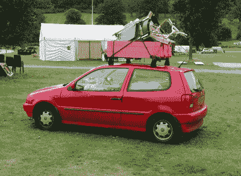
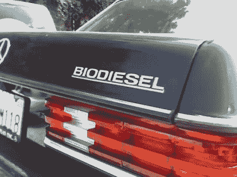

# 环保是富人的游戏

> 原文：<https://hackaday.com/2021/10/26/being-green-its-a-rich-mans-game/>

这是一个古老的说法，有一个虚构的起源:“*愿你生活在有趣的时代*”。我们英国人此刻肯定生活在有趣的时代，因为疫情的完美风暴，不断上涨的能源价格，全球供应链问题，以及可以说是后英国退出欧盟时代 EU-国家卡车司机的离开，给我们带来了从超市新鲜蔬菜到食品工业二氧化碳的一切短缺。特别令人担忧的是加油站的汽车燃料短缺，在有时咄咄逼人的加油队伍中，据报道[英国人在网上搜索电动汽车信息的人数创下新高](https://electrek.co/2021/09/28/the-british-have-a-gas-shortage-so-theyre-googling-electric-cars-like-crazy/)。

## 没有什么比危机更能让你变得环保

How I miss my little car, here loaded for [EMF 2018](https://hackaday.com/2018/10/05/electromagnetic-field-2018-event-review/).

这种对低碳驾驶的突然兴趣可能是由排队而不是对地球的关注所驱动的，但毫无疑问，作为一种文化，如果我们希望减少二氧化碳的排放并达到我们的气候目标，我们就应该采取这种行动。未来几年，我们的生活方式将会发生一系列的改变，而我们对汽车的选择只是其中的一部分。让我们再回到那些饱受困扰的英国人身上，一系列的环保抗议导致了伦敦周围高速公路网络的严重中断，不是抗议交通，而是为更好的家庭隔热而发起的运动。

出于个人情况而非原则的原因，今年早些时候，我把自己信赖的大众 Polo 送给了一位老大众车迷朋友，现在我只能依靠自行车了。住在我需要的一切触手可及的地方并不像我想象的那样具有挑战性，除了节省一点钱，我知道我的总体健康水平已经提高了。虽然我现在不像以前那样需要一辆车，但我打算在适当的时候给自己找一辆车，这样我就可以做一些傻事，比如把一个黑客村扔在后面，开车穿越半个欧洲去一个黑客营地。意识到无论我选择什么都应该尽我所能对地球有益，我一直在浏览二手车网站，看看我能找到什么。

## 在芯片脂肪上滚动

当然，我喜欢电动汽车，但有一个障碍，你们中的许多人无疑会和我一样，电动汽车不便宜。作为一个身无分文的抄写员，我几乎可以找到一个可能有十年历史的，但当它的范围小于我可以轻松循环而不感到疲劳时，它对我来说就其用途而言，就变得比一个非常昂贵的汽车项目好不了多少。我得出了一个奇怪的结论，我能找到的最环保的车辆之一表面上看是最不环保的，如果我驾驶一辆 1980 年代的柴油车，使用从植物油中提取的生物柴油，这种柴油在我居住的地方很容易从工业加工厂获得，那么我就可以尽可能接近碳中性地行驶。

This car is green, but not the *right* green. Mejidori, [Public domain](https://commons.wikimedia.org/wiki/File:Biodiesel_3.jpg).

所以我可以买一辆超级可靠的旧奔驰，然后骑着用过的芯片脂肪四处飘荡，但是在这里我遇到了一个问题。说到绿色环保，与其说是绿色环保，不如说是被视为绿色环保，因此，我们对这一问题的整体态度是一种感知和技术，而不是可负担性。简而言之:对高收入者来说，购买电动汽车、房屋隔热、安装太阳能电池板或购买热泵很容易，但对占人口大多数的低收入者来说，他们负担不起更换燃气锅炉的费用，尽管他们正在排放二氧化碳。

我的 chip fat Merc 每英里净二氧化碳排放量可能会比特斯拉低，特斯拉的电力来自燃煤或燃气发电站，但周围世界公认的看法是，它又旧又脏，我应该废弃它，以某种方式实现不可能的目标，并找到现金购买特斯拉。

困难就在这里。如果只有有钱人才能享受绿色生活的愿望变成了立法，并对社会各阶层的人提出要求，愿望和现实之间就不可避免地会出现脱节。可以理解的是，这导致了那些没有能力满足环境要求的人对这些要求的不满。

## 如果只有少数人负担得起环保，我们如何实现我们的目标？

这应该引起环保主义者和政治家的关注，但对于我们这些工程师来说，这也是一个问题。当我们处理环境问题时，我们用的是高科技的解决方案，我们的思维太过频繁地集中在解决方案的优雅上，而不是它对于大众采用的实用性上。我们应该思考如何将热泵系统改造成对收入不高的人来说显而易见的升级产品，或者为什么化石燃料汽车的电力转换行业除了少数精品老爷车之外还没有起飞，尽管有[有希望的迹象](https://hackaday.com/2020/06/07/crate-ev-motor-hits-market-the-swindon-powertrain/)。当客户根本无法在第一时间凑足一万美元时，说一万多美元的购买在这么多年里可以节省那么多的费用是没有用的。要在这些事情上取得进展，它们不能仅仅是一种生活方式的选择，让富人为自己的环保主义买单。

作为一个作家，用一些诙谐的单句涉及短语“花费地球”的话来结束文章，以此来一口气表明负担不起和紧急，这将是一个方便的手段。但最好以一个问题结尾:如果你有一个关于气候节约技术的伟大想法，给你送优步外卖的人负担得起吗？如果不是，我们需要做更多的工作才能称之为解决方案。

头图:CEphoto，Uwe Aranas / [CC-BY-SA-3.0](https://commons.wikimedia.org/wiki/File:Cologne_Germany_Electric-Car-Charging-Point-at-TUV-Rheinland-02.jpg) 。