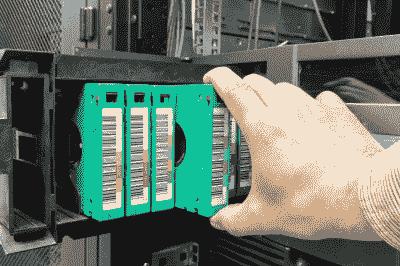
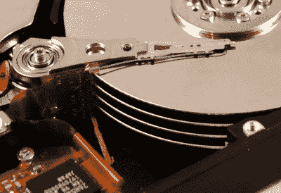
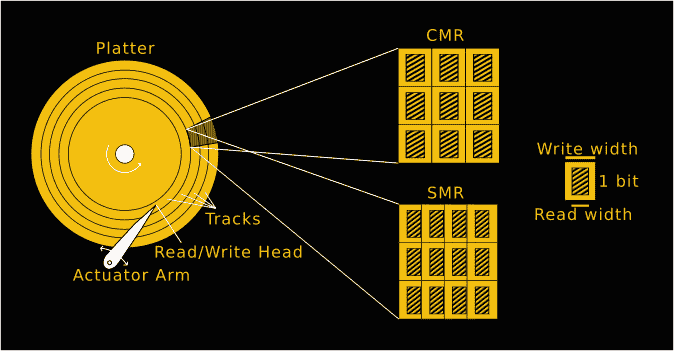
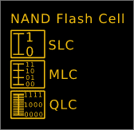
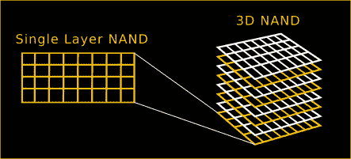

# 定制存储技术:现代硬盘及其他领域的字母汤

> 原文：<https://hackaday.com/2020/11/04/bespoke-storage-technologies-the-alphabet-soup-found-in-modern-hard-drives-and-beyond/>

似乎就在昨天(可能对你们中的一些人来说是这样)，我们正在将 Windows 3.1 从软盘驱动器安装到 256 MB 的硬盘驱动器上，但硬盘驱动器自此变得更大、更复杂，并且有比旋转盘片更多的选择。

存储选项的激增是解决各种利基使用的结果。典型的 torrenter 下载一个文件，该文件只写一次，但要多次读取。对于一些人来说，硬盘被用作备份，存储在其他地方，没有供电。对于其他人来说，它是一个频繁读写日志或交换文件等数据的服务器。在所有情况下，是物理学设定了存储介质的极限；如果你明智地选择你的用例，你会得到更好的性能。

这个领域的行话令人望而生畏:超顺磁极限、LMR、PMR、CMR、SMR、HAMR、MAMR、EAMR、XAMR 和 QLC，这是最常见的例子。让我们来看看我们是如何走到这一步的，以及持久存储的过去和现在是如何扩展硬盘这个词的实际含义以及在引擎盖下发现了什么。

## 数据颗粒

你可以把你的数据打成卷的纸带，或者压在光盘上，但是对于今天的文章，我们谈论的是可重写介质，因此，磁存储仍然是王道。

对于所有磁性技术来说，一个重要的概念是超顺磁极限，这是指每一位存储数据的材料颗粒(一个独特的原子集合)可以有多小。如果只有几个原子保持一个比特的磁性状态，那么读取器很难感知它们的值，写入器很难在不影响附近比特的情况下写入该比特。由于这个原因，写磁头通常比读磁头大，因此存储和读取的位值是正确的，并且克服了如此小尺寸的磁倾斜。这对磁带和硬盘很重要，但对固态硬盘(SSD)则不然。

## 磁带仍然是一个东西

磁带仍然受到档案管理员和有长期存储需求的人的青睐，并且仍然是一项正在积极开发的技术。凭借索尼在 2017 年实现的高达 201 gb/in ^( 2 ) (对不起，业界使用这一单位)的[面密度，以及磁带价格的下降，它是备份和很少访问的数据的绝佳选择，如果妥善储存，可以持续几十年。数据访问速度不快，但很可靠，如果你没有硬件，你可以通过在线公司外包你的磁带存储和检索。](https://www.sony.net/SonyInfo/News/Press/201708/17-070E/#:~:text=Combining%20this%20magnetic%20tape%20technology,the%20current*2%20mainstream%20coated)

这种存储器有线性磁道，所以当磁带经过时，一组磁头可以读/写数据。磁道密度可以高到超过磁头的宽度，这导致线性蛇形磁道；非常密集的磁道，但是磁头可以向旁边移动一点点来访问下一个磁道。曲目从磁带开头到磁带结尾，然后再回来(因为为什么要倒带开始下一首曲目？)，所以轨道最终看起来像一个短而宽的 s。

Linear Serpentine has multiple tracks per head, going back and forth along the tape.

有趣的是，盒式磁带可以是面向未来的，因为在某些情况下，磁带与更高的磁道密度兼容，所以它们可以与更新的硬件一起工作，甚至在使用该硬件格式化时有更多的存储空间。

## 旋转盘片

硬盘驱动器(HDD)是我们很久以前就知道的旋转盘片(最近在[玛雅·波许对硬盘驱动器精密工程的深入研究](https://hackaday.com/2020/09/23/hard-disk-drives-have-made-precision-engineering-commonplace/)中有所涉及)。就像 CD 甚至黑胶唱片一样，数据以小比特存储在同心圆的轨道上，磁头沿着半径移动来访问数据。由于超顺磁的限制，制造商基本上已经达到了密度的极限，但消费者并没有立即意识到这一点，因为他们可以增加相同外部物理尺寸的驱动器中的盘片数量，从而增加磁盘存储的大小。然后他们开始用氦气替换里面的空气，这样可以减少摩擦，让磁盘旋转得更快，并增加更多的盘片。但是盘片本身的存储机制已经发生了根本的变化。在过去的几年中，一些新技术正在开发，并开始进入市场。

硬盘最初使用纵向磁记录(LMR)，其中磁颗粒的磁极在磁盘表面是平的。这占用了大量空间，所以他们在垂直磁记录(PMR)驱动器中垂直排列颗粒。在 LMR 和 PMR，磁盘都有一系列同心磁道，磁道之间没有重叠；较小的读取区域紧贴在较大的写入区域内。实验室人员随后发明了叠瓦式磁记录(SMR)，增加了面密度，但由于它是 PMR 的变体，他们不得不将以前的类型重命名为传统磁记录(CMR)。

SMR tracks overlap the write head slightly, making the tracks more dense for greater storage, but at a cost of more work to write.

SMR 使用宽写磁头，但稍微重叠磁道，以便读取区域可以更加密集。这就是为什么它被称为带状疱疹。然而，这是有代价的。就像很难在不干扰屋顶上的木瓦的情况下替换屋顶中间的单个木瓦一样，不可能在不覆盖附近位的情况下在中间写入单个位，因此驱动器需要更多的数据管理逻辑。它通常通过向磁盘的空白部分写入新内容来实现这一点，然后返回旧区域并重新组织它以供将来使用，从而一次清空整个区域。这意味着 SMR 驱动器不适合特定的任务，如大量使用，因为它需要时间来重组轨道。它可能有更多的字节，这对于需要大容量存储且很少写入的人来说很好，但作为主驱动器，它可能会有性能问题。尽管有这个显著的缺点，制造商并没有预先知道哪些驱动器使用该技术，他们已经被发现将驱动器放在 NAS 设备中。

除了将轨道更紧密地包装在一起，物理学家还在努力利用热辅助磁记录(HAMR)和微波辅助磁记录(MAMR)以及能量辅助磁记录(EAMR)等技术推动超顺磁极限。这三者的运作方式基本相似，但实现方式略有不同。这个想法是，你希望晶粒足够稳定，不会自己翻转，也不会因温度变化或附近位的影响而翻转，但你也希望它足够强，易于读取，易于写入(称为矫顽力)。随着颗粒变得越来越小，密度越来越大，这变得越来越困难。XAMRs 解决这个问题的方法是，尽管颗粒紧密堆积，但仍使颗粒更坚固，使用具有更高抗变化能力的不同材料，然后提高写入功率，以实现翻转一位所需的更困难的能量要求。在 HAMR 的例子中，是用激光短暂地将颗粒加热到几百度，进行书写，然后让它迅速冷却。MAMR 用微波代替激光加热。EAMR 使用电流来增加写头上的能量。

另一个需要改进的地方是头部的运动。磁道越细，磁头的位置就必须越精确。这是通过[压电弯曲](https://documents.westerndigital.com/content/dam/doc-library/en_us/assets/public/western-digital/collateral/tech-brief/tech-brief-western-digital-micro-actuator.pdf)来实现的，这样磁头可以稍微旋转，并且可以更好地与轨道对齐。

## 帮我们一个忙

固态硬盘的存储容量也在不断增加，而且没有机械故障的可能，其简单性意味着速度更快、寿命更长。密度的进步有两种形式:层次和层次。

A single-level cell stores a single bit based on the voltage level of the cell. A quad-level cell stores 4 bits.

NAND 闪存被组织成单元，其中每个单元存储代表一位的电压电平。虽然它实际上是一个晶体管，但你可以把每个电池想象成一个电容器，非常擅长长时间保持电荷。最初，数据以每个单元一位的方式存储，这种方式非常快速可靠。然后，他们意识到单元中的电压水平可以被认为是模拟的，通过模数转换，他们可以通过改变电压水平在单个单元中存储多个位。我们现在处于四电平单元(QLC)技术，这意味着单个单元可以有 16 个不同的电压电平，解码为 4 位。这大大增加了可能的驱动器大小，但也带来了巨大的成本。

电压的微小变化意味着更低的可靠性，特别是随着时间的推移，电池最终会磨损，无法保持其电压水平，并且需要进行 ADC 转换会减慢速度。使问题更加复杂的是，每个单元也被更频繁地写入(因为它们保存更多的数据)，这意味着它们退化得更快。最后，NAND 闪存单元不会永远断电，如果不定期刷新，单元电压会慢慢下降，导致比特腐烂。QLC 最适合作为低成本驱动器，在读取量大的应用中取代硬盘，但作为无动力备份或写入量大的驱动器可能并不理想。

By layering sheets of NAND cells, 3D nand packs more bits onto a chip.

我们通常认为芯片大多是扁平的东西，但 3D NAND 是存储密度不断增加的另一种方式。所有的寻址机制都是相同的，内存单元的概念也是相同的，只是一大堆内存单元相互堆叠，有些驱动器已经达到了 128 层。现在，当整个堆栈被读出时，单个地址返回 128 位，而不是单个地址返回单个位。3D NAND 可以用单个长串实现，也可以用堆叠在彼此顶部并由绝缘层隔开的多个串实现。最简单的方法是想象一个多层酒店，每个地址不仅仅指一楼的房间，而是指它正上方的每个房间。换句话说，X01 给你 101，201，301，401…直到楼顶。一些驱动器结合了这两种技术，使用级别和层，以获得更高的密度。

## 混合物

为什么要选择你可以两者兼得的时候，以及计算机可以为你优化的时候呢？混合驱动器结合了盘片和芯片。这提供了大量的存储和速度。然后，驱动器开始分析哪些文件最常使用以及如何使用，并选择存储数据的位置以获得最高效率。对于只有足够空间容纳一个驱动器的笔记本电脑来说，这是有意义的，但是当你有足够的空间容纳两个驱动器时，你将会获得更好的性能和价格。

## 什么是适合我的？

Windows ME 的硬盘驱动器要求是 480-645 MB 可用空间，并且它没有指定硬盘驱动器的类型。对于较新的操作系统，固态硬盘的性能通常更好，但对于数据存储，PMR 硬盘更胜一筹。在物理学进步的帮助下，我们看到越来越大的存储容量，但代价是越来越精密的机械结构，以及更慢的访问速度。我支持你在科幻小说中看到的全息晶体电路，用透明的丙烯酸卡片。但实际上，最好的想法似乎是评估您的实际数据需求并购买合适的硬件，而不是只看字节数并购买您能负担得起的最大容量，或者假设 SSD>HDD >磁带可以满足所有需求。