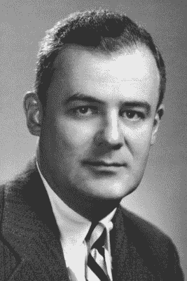
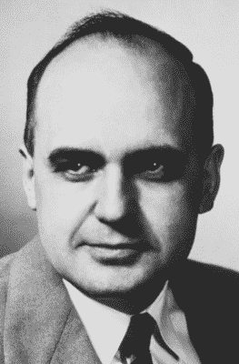

# 通过科学更好地生活:为什么你的孩子可能不会得麻疹

> 原文：<https://hackaday.com/2019/03/05/better-living-through-science-why-your-kids-probably-arent-getting-measles/>

奇怪的是，最近爆发了几次麻疹。我突然想到，当我还是个孩子的时候，几百个孩子得麻疹根本不是新闻。然而，自从 2000 年疾病控制中心宣布麻疹在美国被根除后，即使是极少数人现在也成了新闻。

那么，一种被根除的疾病怎么可能卷土重来呢？我们是如何根除它的呢？这些答案讲述了一个非常有趣的科学应用于日常生活的故事。

## 历史上地

关于麻疹的第一份书面记录似乎来自 9 世纪的一位波斯医生。直到 1757 年，一位苏格兰医生才证明这是由感染引起的。到 1912 年，美国开始跟踪这种疾病，因为美国平均每年有 6000 人死于这种疾病。这对于没有暴露的社区来说尤其致命。1529 年，一场麻疹爆发夺去了古巴三分之二人口的生命。后来，它消灭了洪都拉斯一半的人口，还蹂躏了印加人。在 19 世纪，麻疹消灭了夏威夷和斐济的大部分地区。

当然，那是在有疫苗之前。在 1963 年引入疫苗之前，几乎所有的儿童都得了麻疹——美国每年发生多达 400 万例。由于比 1912 年更好的医疗保健，每年大约有 500 人死亡，但每年有近 50，000 人住院，大约 1，000 人会出现脑部肿胀的副作用。

如果你低于某一年龄，你可能从未患过麻疹，甚至从未见过一例麻疹病例。它具有高度传染性，大约 10 天后，你会爆发。高烧、咳嗽、流鼻涕和眼睛发炎都是症状。你的嘴里也可能会有白斑。但是标志性的症状是你脸上的红斑会扩散到身体的其他部位。整个事情应该在 10 天或更短的时间内完成。

这种病毒是通过空气传播的，如果你没有免疫力，如果你生活的地方有人感染，你有 90%的机会感染它。一个感染者平均可以传染 10-12 个人。相比之下，流感的感染率为 1-2 人。然而，通常情况下，如果你有过一次，你对未来的暴露是免疫的，尽管暴露会在几年内提高你死于其他原因的风险。

## 疫苗

John Enders

Thomas Peebles

Maurice Hillman

1954 年波士顿爆发了麻疹。约翰·恩德斯和托马斯·皮布尔斯收集了受感染学生的血液，并在 11 岁的大卫·埃德蒙斯顿的血液中分离出病毒。到 1963 年，他们有了有效的疫苗。1968 年，Maurice Hilleman 改进了疫苗，这种疫苗就是你今天得到的疫苗，通常是腮腺炎和风疹疫苗。

恩德斯还在脊髓灰质炎疫苗的发明中发挥了重要作用。尽管脊髓灰质炎得到了更多的报道，但它的毒性更小，死亡人数也更少。当然，脊髓灰质炎通常对幸存的患者有更长期的影响。尽管如此，安德在晚年指出，他发现他为消灭麻疹所做的工作比他获得诺贝尔奖的关于脊髓灰质炎的工作更有意义。

实际的疫苗在两种剂量下效果最好。如果只吃一颗，有 93%有效。两剂的话，你避免感染的几率是 97%。这种疫苗实际上含有活病毒，尽管用医学术语来说，它们已经被“减毒”了。将活病毒置于另一个宿主中，例如动物组织或甚至活的动物。许多微生物将无法感染宿主并死亡，但一些微生物将拥有允许其茁壮成长的突变。这种变异会传播，但变异后的病毒不会那么擅长感染人类宿主。这就是疫苗中的病毒。

## 决斗疫苗

尽管麻疹疫苗如今很成功，但它并没有一开始那么好。1963 年，有两种疫苗是基于从埃德蒙斯顿分离的病毒。其中一个使用了减毒病毒，但可能减毒还不够。几乎一半接种疫苗的儿童会出现发烧和一些麻疹症状，因此他们开始给疫苗接种麻疹免疫球蛋白，以进一步降低其强度。这有所帮助，但仍然不够理想。

另一种疫苗——基于同样的病毒——使用死亡的有机体，因此不会引起症状。然而，它要求每个月间隔注射三次，并且不能提供对该疾病的长期保护。更糟糕的是，接种疫苗几年后，一些儿童患上了类似麻疹的疾病。

Enders 将该病毒提供给其他研究人员，以鼓励对减毒的改进，这导致了基于其他毒株的其他疫苗或原始毒株的改进减毒。到 1968 年，一种安全有效的疫苗问世了。虽然可能会有轻微的副作用，但它们通常是轻微和短暂的。

人们很乐观。1967 年，人们认为这种疾病将在几个月内从美国根除。这没有成功。你不能让每个人都接种疫苗，有时疫苗根本不起作用。

## 麻疹之战

1978 年，疾病预防控制中心设定了一个目标，到 1982 年在美国消灭麻疹。虽然他们没有实现这个目标，但他们确实显著减少了病例。1989 年，一场新的疾病爆发导致了第二剂疫苗的推荐。到 2000 年，已经有 12 个月没有持续的疾病传播，因此战争宣告结束。然而，由于有未接种疫苗的人，他们中的一些人到海外旅行，偶尔爆发确实发生。

现实地说，不是每个人都会接种疫苗。有些人因为医学原因或太年轻而不能。其他人只是因为宗教信仰、恐惧或者仅仅是懒惰而不愿意。然而，如果你的邻居中有足够多的人接种了疫苗或免疫，这就产生了所谓的群体免疫。如果大约 90%到 95%的人对麻疹免疫，这将阻止疾病的传播，如果你没有直接接触它，你感染它的机会将接近于零。像脊髓灰质炎这样毒性较小的疾病需要免疫的成员就更少了。然而，你可能从其他人而不是其他人那里感染的疾病(例如，破伤风)不受群体免疫规则的约束。

## 今日麻疹

美国最近的两次疫情分别有 225 名和 50 名受害者——与早期相差甚远。在这两种情况下，没有免疫的人去了外国，回国后感染了其他没有免疫的人。

这种疾病每年仍有 2000 万例，大部分发生在发展中国家。如果你认为这只是一个无害的童年成人礼，那就再想想吧。2014 年，死亡人数为 7.3 万，比 1980 年的 260 万要好。然而，近年来，随着免疫接种率的下降，数字呈上升趋势。

然而，有趣的是，一种曾经袭击数百万人的疾病现在成为新闻，而只有几百人感染。当然，围绕一些疫苗(包括麻疹疫苗)的副作用和伦理问题一直存在争议。那是一个更大的话题。但是在过去的 50 多年里，麻疹疫苗挽救的生命数量是惊人的——可能高达 1 亿。