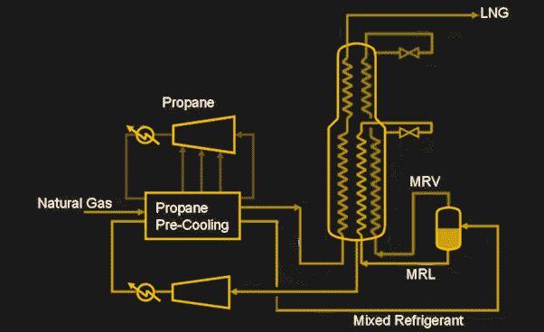
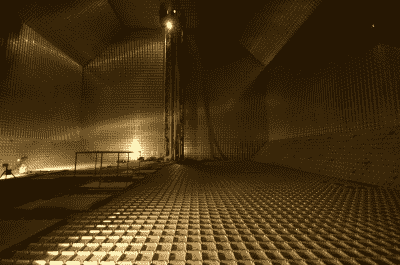
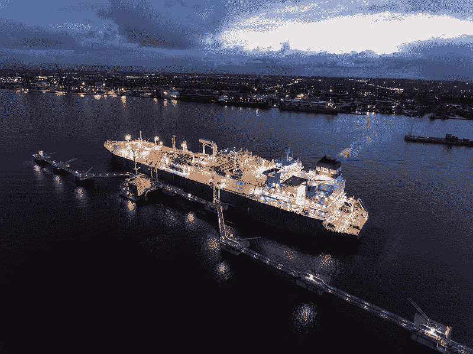

# 大化学:液化天然气

> 原文：<https://hackaday.com/2022/12/21/big-chemistry-liquefied-natural-gas/>

自从我们的祖先第一次从树上下来寻找不会吃掉他们的食物时，能源这个话题就一直是我们的头等大事。但在当今世界，由于地缘政治因素的影响，人们对于能源的永无止境的追求已经被电灯开关或恒温器的轻轻一指所吸引。面对寒冬的怒火，我们中的许多人对于如何保持温暖有着完全不同的看法。

问题不一定是我们没有足够的能量，而是我们所拥有的既不是均匀分布的，也不是容易获得的。将能源从生产地转移到需要的地方很少是一件简单的事情，而且经常会带来重大而有趣的工程挑战。这对于那些不会在小空间里聚集太多能量的能源来说尤其如此，比如天然气。让它穿越一个大陆已经够有挑战性了；将它运过海洋完全是另一回事，这就是液化天然气(LNG)的用武之地。

## 液化

在我们开始研究液化天然气是如何制造的之前，最好先问一下我们为什么需要液化天然气。毕竟，我们有一个极其复杂的、横跨大陆的管道基础设施，它是为天然气的长距离大宗运输而优化的。为什么要费心去经历液化天然气的所有努力和费用呢？

一句话:海洋。这些巨大的管道网络几乎都停在了水边，虽然肯定有一些海底天然气管道，但最近的事件让我们看到了这些管道有多脆弱。因此，通过海路运输天然气已经成为将能源从 A 点运输到 b 点的必要手段。为了有效地做到这一点，你需要大幅减少其体积。将天然气转化为液体正是这样做的:它的密度增加了 600 倍，使得散装运输成为可能。

液化天然气的原料当然是天然气。我们已经报道了相当多的关于[采集和分配天然气](https://hackaday.com/2022/08/24/how-resilient-is-the-natural-gas-grid/)的过程，但是简单来说，天然气是一种碳氢化合物的混合物，如甲烷和乙烷，产生于地质构造中古老生物质的腐烂。随着液态碳氢化合物和污染物，如氮、二氧化碳、含硫化合物和水蒸气，这些气体积聚在通过钻井开采的地下储层中。

原始天然气在其自然压力下或在巨大压缩机的帮助下，通过管道输送到净化天然气的工厂。从原料气中回收硫和氦这两种有价值的化学元素尤其重要，但从天然气中去除水和一氧化碳等低价值污染物也很重要，因为它们都可能导致冻结问题。通过使粗天然气鼓泡通过三甘醇(TEG)来去除水，三甘醇是一种极易吸湿的溶液，同时使用胺洗涤器去除 CO [2] ，胺洗涤器将酸性粗天然气暴露于二乙胺(DEA)等含氮胺溶液中，二乙胺吸附 CO [2] 。在进一步净化后，去除任何剩余的较重的碳氢化合物和污染物，如汞，当暴露于铝和不锈钢时不会表现出来，天然气原料是大约 85%到 90%的甲烷(CH [4] ，其余是乙烷(C [2] H [6] )、丙烷(C [3] H [8] )和丁烷(C[4]H[10[10】的混合物]]

清洁、干燥的天然气就可以液化了。与大多数气体一样，当温度降至沸点以下时，天然气将凝结成液体，甲烷的沸点为-161.5℃。因此，要制造液化天然气，需要工业规模的低温工艺。如今，大多数液化天然气都是通过一种叫做 C3MR 的工艺生产的，这是一种双回路渐进冷却系统。“C3”指的是丙烷，一种三碳化合物，用作预冷回路中的制冷剂。每半个循环基本上与任何冰箱相同，尽管在规模上有很大不同。在预冷阶段，液态丙烷通过膨胀阀，导致相变和温度突然下降。冷却的丙烷通过热交换器从天然气中带走热量，丙烷通过三级压缩机压缩，热量通过冷凝器带走，因此循环可以再次开始。

Air Product’s C3MR liquefaction process. The propane (C3) loop cools incoming natural gas to about -33°C, which is followed by a mixed refrigerant (MR) loop that takes it below the phase transition temperature of -162°C.

预冷后，天然气的温度约为-33℃——冷，但还不够冷。冷却的气体现在进入“MR”或“混合制冷剂”回路，使用丙烷、戊烷、甲烷和乙烯的混合物。同样，热循环是熟悉的，但规模更大——一些 MR 环路中使用的盘管式热交换器内部可以有数千公里的管道盘绕，热交换面积为 40，000 平方米。还有板翅式热交换器，它有多层波纹翅片夹在扁平铝板之间。板翅式热交换器安装在被称为冷箱的绝缘填充外壳中。这两种类型的热交换器通常部署在称为机组的平行组件中，以实现巨大的吞吐量和冗余。

在 MR 回路之后，天然气已经下降到大约-160°C，并且现在是无色、无味、无毒的液体。达到这一点的能源投入是相当可观的——生产一吨液化天然气大约需要 13 千瓦。截至 2021 年，全球液化产能超过每年 4.5 亿吨，更多产能仍在建设中。

## 储存和运输

但如果没有地方存放这些液化天然气，所有这些生产都毫无意义。LNG 的低温特性提出了某些工程挑战。虽然不像液氮或液氧那样冷，但液化天然气仍然会导致钢脆化，这就是为什么特殊的不锈钢合金被用于液化天然气管道和储罐。用于在生产和运输之间临时储存液化天然气的储罐也必须精心设计。这些储罐通常部分或全部建在地下；虽然底土提供了减少传递到液化天然气中的热量的绝缘，但寒冷会冻结地下水并导致储罐下的冻胀。储罐还必须考虑到液化天然气的一些汽化，由此产生的天然气要么被捕获，通过常规的分配渠道出售，要么通过管道输送回工艺的起点，重新液化。

Interior of a membrane-type LNG tank. The interior is lined with high-nickel stainless steel; the waffle pattern helps with thermal expansion and contraction. Source: [Thinfourth](https://commons.wikimedia.org/wiki/File:Liquid_natural_gas_membrane_tank.jpg), CC0.

将液化天然气从一个地方运送到另一个地方是专门的液化天然气油轮的工作，这些大型船只是专门为安全有效地运送尽可能多的液化天然气而建造的。尽管船舶设计各不相同，但液化天然气船队中约 550 艘船舶中的大多数都使用所谓的“苔藓罐”，即高出甲板的巨型球体。大多数船只都有四到五个这种高度隔热的油箱；虽然它们的球形形状在利用船体的所有体积方面不是非常有效，但它确实消除了货物晃动的危险。新的“棱柱形”液化天然气运输船正在设计中，其货舱可以更完全地填满船体空间。水箱衬有由高镍不锈钢或因瓦合金制成的绝缘膜，可减少热膨胀和收缩。最大的油轮可以装载超过 25 万立方米的液化天然气。

由于货物的危险性，LNG 船的建造必须考虑到安全性。无论储罐的隔热性能有多好，货物在运输过程中不可避免地会蒸发。许多油轮利用这种气体作为燃料。这些船也有广泛的监测系统来检测泄漏；与通过管道输送到家庭和企业的天然气不同，液化天然气不含甲硫醇气味剂。因此，甲烷传感器几乎安装在液化天然气船的每一个空间。

## 再气化

一旦一船液化天然气到达目的地，在使用之前，它必须变回气体。再气化过程基本上与液化相反，液化天然气被温和地加热到沸点以上。由于液化天然气是在略低于其沸点的温度下运输的，因此不需要很大的温度变化就能促使相变。但这并不意味着这是一个简单的过程。

再气化可以发生在位于港口设施附近的工厂中，该港口设施是为容纳 LNG 油轮而专门建造的，或者可以通过浮式储存和再气化装置或 FSRUs 来完成。FSRUs 看起来非常类似于 LNG 油轮，并且有许多相同的设备，包括醚苔型球形储罐或棱柱形储罐。FSRUs 还配备了再气化装置，从储罐中提取液化天然气，使其通过热交换器，并通过水下管道将汽化的天然气输送到岸上。与陆上再气化厂相比，FSRUs 的优势在于多功能性 LNG 油轮无需等待有利的潮汐就能靠岸，因此只要船只到达，就可以进行卸载。

FSRU *Independence* at anchor off Lithuania. FSRUs are basically LNG tankers that can store and regasify LNG, and allow tankers to offload their cargo regardless of tides and without deep-water ports. Source: [AB Klaipėdos Nafta](https://commons.wikimedia.org/wiki/File:FSRU_Independence_in_the_port_of_Klaip%C4%97da,_Lithuania.jpg), CC BY-SA 4.0.

无论是在岸上还是在水上，用于再气化的热量来自各种来源。许多工厂使用汽化器，通过用巨大的风扇将环境温度的空气吹过热交换器来加热液化天然气。有时，海水用作传热介质，环境温度的水喷洒在热交换器盘管上。在环境温度较低的地方，一些再气化器将使用浸没燃烧蒸发器(scv ),其燃烧器浸没在大桶水中。来自燃烧器的废气加热水，当液化天然气通过储罐中的盘管时，水又加热液化天然气。scv 通常由输出的天然气驱动。

一旦天然气回到气态，它就可以进入当地的分配系统。管道运营商通常在 30-80 巴(3，000-8，000 千帕)的压力下运行其分配系统，因此再气化厂的输出必须符合该规格。与压缩来自再气化器的输出气体相比，使用泵对 LNG 输入进行加压变得更容易和更有效。管道运营商通常会在将一批液化天然气交付给客户之前对其进行质量控制测试，当然还会添加所需的甲硫醇气味剂。

液化天然气供应链相当复杂，但能效惊人。大部分能量进入液化和运输，只需要很少的能量将低温液体推回气体。就基础设施而言，在供应链的两端肯定都有很多。但在大多数情况下，液化天然气系统是长距离运输化学能的最有效方式。

【特色图片:苔藓型 LNG 船*北极公主*。资料来源: [JoachimKohlerBremen](https://commons.wikimedia.org/wiki/File:LNG_Tanker_ARCTIC_PRINCESS_vor_Hammerfest_(N)_-_Juni_2015.jpg) ，CC BY-SA 4.0。]