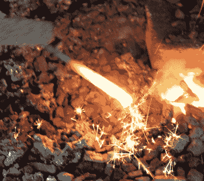
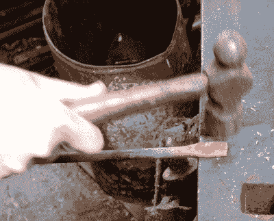
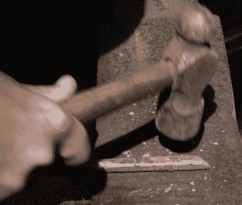
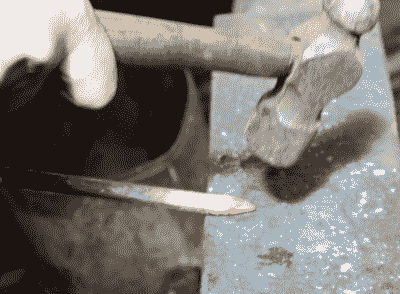
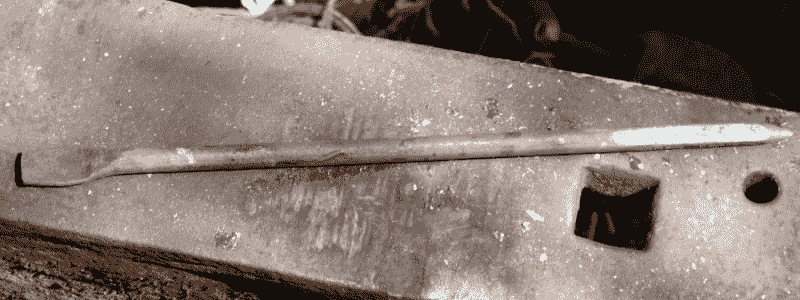

# 外行人的锻造:你的第一次铁砧

> 原文：<https://hackaday.com/2019/06/12/blacksmithing-for-the-uninitiated-your-first-time-at-the-anvil/>

在过去的几个月里，我们一直在为未入门的帖子运行这一系列的*锻造，探索新手的锻造艺术。这是基于我的经历，我在一个工作的铁匠的生意中成长，并成为一个热情的，虽然有些不熟练的铁匠，到目前为止，我们已经花了我们的时间来看你可能会需要的设备，如果你开始自己的铁匠工作。现在，我们已经组装好了自己的基本熔炉，是时候启动它，在铁砧上进行我们的第一次锻造了。*

点燃铁匠铺很容易。有些人用气枪来做，但是我用锤子把一片柴火劈成小棍，锤子上有一个很大的孔，作为一个临时的劈木工具。在我放在靠近风口的壁炉上的一堆柴火下面点燃一些纸来生一个小火，我启动鼓风机，然后在产生的大火上堆上焦炭。大约 10 分钟后，我会有一个令人满意的轰鸣声和一堆燃烧的煤，当它们燃烧时，会有一些炉渣聚集在火的底部，我最终需要耙出来。

## 想想你用的钢

This piece of steel has been left in the fire too long, and is burning like a sparkler.

在你的第一个实验中，选择一块直径约为 10 毫米(3/8 英寸)的钢，无论是方形还是圆形，都没关系。我建议一个 300 毫米(1′)或更长，这样你就可以处理冷端而不需要钳子。毫无疑问，你会根据你遇到的情况尝试各种各样的材料，你会发现什么最适合你。较硬的钢相应地更难加工，所以有时较低质量的原料可能更适合实验。

如果你把它的末端，大约 25 毫米(1 英寸)左右，放入火中最热的部分，在那里它是亮黄色的，你可以看到它达到温度。理想情况下，你希望它达到接近但不完全像它周围的煤一样黄的程度，在这个程度上，你可以撤回它并开始工作。如果你把它放得太久，它首先会开始燃烧，当你把它抽出来时，它会像烟火一样发出火花，如果你把它放得更久，它会开始融化。

## 你的第一锤

Hammering a flat on the end of a piece of bar stock. Mine has by good fortune remained consistent, but don’t worry if yours has a slightly oval shape.

给定一片 10 毫米的钢，其末端 25 毫米是黄热的，抓住它的冷端，你可以把它放在铁砧的表面。在同一个地方反复锤热的一端，它就会开始散开。你在这里什么也做不了，相反，这是一个简单的练习，让你习惯金属和锤打运动。你的目标不是在铁匠的刻板形象中每次击球都把锤子举得高高的，而是在你的下臂和手腕上创造一种节奏，充分利用我们在讨论什么是好的铁砧时提到的反弹。当你锤打时，你会看到作品失去温度，它会从黄色、橙色和红色变成暗红色，有灰色渗入。在这一点上，你需要把它放回煤炭中，如上所述，使它恢复温度，并重复这一过程。

当你继续锤打时，如果你始终如一，你会看到枪托的末端变平，直到它最终成为你枪托末端的一块扁平的钢。它可能不会是一致的形状，你还没有做出任何有用的东西，但你已经开始对金属本身和所需的锤击动作有了感觉。将它放在一大缸水中淬火，这样它就足够冷，你可以处理它，你会看到一些灰色的氧化物已经从它的表面剥落，这是正常的。

## 从圆形到方形，反之亦然

I’ve squared off the end of my piece of round stock. The bright sunlight makes it difficult to see, but the metal is now a dull red and needs to go back in the fire.

现在你对金属有了一点感觉，是时候学习一些更有用的东西了。拿起你刚刚压平的另一端，像以前一样在煤中加热大约 50 毫米(2 英寸)。如果它是一块方形的木头，你就把它弄圆，反之，如果它是圆的，你就把它锤成方形。把它放在铁砧上，用锤子均匀地敲击它。如果你继续，你会像以前一样得到一个更长的扁平金属片，但在这种情况下，你要在锤的时候转动枪托。

如果它是圆形的，你将锤打它的一面，直到它开始稍微变平，然后将其旋转 90 度，再锤打另一面，而如果它是方形的，你将首先锤打它的角，使它们变圆，然后在锤打时不断旋转它，以确保打击均匀分布在其表面。你可能会发现，当你这样做时，它开始弯曲，在这种情况下，只需将它放在你想要拉直的轴的砧面上，然后锤平它。在整个过程中，你需要继续把它放回火中加热，你可能会惊讶地发现锤子需要比你想象的更轻的接触。

最终，你会发现自己要么是在一个圆坯的末端有一个新的方坯，要么是在某个方坯上有一个圆坯。犯错误并尝试多次并不可耻，但是你很快就会找到窍门。你会学到更多关于金属和锤子的感觉，以及在这个过程中需要怎样的努力。

## 给它一个点

Forging a point, the piece of stock is held at an angle to the face of the anvil and rotated, while it is hammered to the desired angle.

最后，今天，你要在你新买的方形或圆形股票上加一个点。将末端加热 25 毫米，将其尖端以大约 20 度的角度放在砧面上。当你慢慢旋转它的时候，用锤子以直角敲它的末端，你会看到一个点开始形成。当你从这一点开始锤打时，它会变得更加明显。你永远也不会把它弄得像铅笔一样锋利，但是稍加练习，你就能得到一致的结果。淬火，一切顺利，你应该有一个股票的一片叶子一样的单位在一端，和一个点在另一端。你并没有真正制造出任何有用的东西，但是你已经学会了一些基本的锻造。

本系列将继续介绍更基本的锻造技术，在下一部分中，我们将尝试弯曲钢材，制作曲线、环和卷轴。你还不会成为铁匠专家，事实上，虽然我在铁匠专家身边长大，但我也不是其中之一，但是随着你的进步，你应该积累一套基本技能，在此基础上，你可以建立制造更复杂工件的能力。

My finished piece of work. It doesn’t have a use, but it shows all three techniques from the session.

感谢亨利·李斯特拍摄了这篇文章中用到的图片。