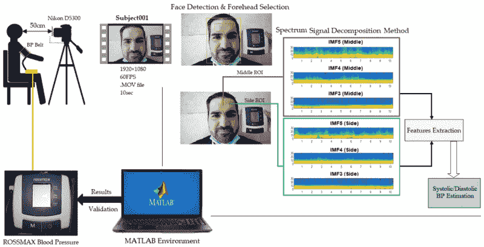
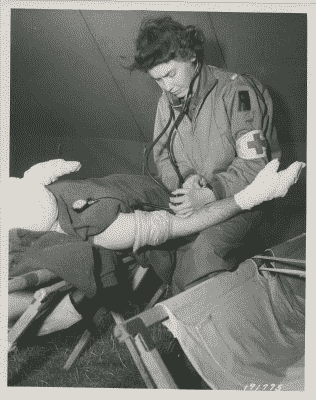

# 血压监测，由摄像头和人工智能提供

> 原文：<https://hackaday.com/2022/12/21/blood-pressure-monitoring-courtesy-of-cameras-and-ai/>

在基础水平上，血压监测的方法在过去的几十年里已经慢慢改变了。虽然大多数类型的血压计仍然依赖于环绕在手臂上的 Velcro 袖带，但是测量中使用的方法各不相同。模拟水银和无液血压计仍然大量存在，而使用电子传感器的数字血压计如今已经成为主流。

研究人员现在已经开发出一种新的非侵入式测量方法，可以完全去除手臂袖带。该方法完全依赖于摄像机的视频捕捉和人工智能的处理。

## 压力下

这项技术是由南澳大利亚大学和巴格达中等技术大学的研究人员开发的。它依靠使用 DSLR 相机来捕捉病人大约 10 秒钟的镜头。摄像机放置在离患者很近的地方，对准面部。捕获的视频然后由 AI 分析，以从两个不同的前额区域提取心脏活动的指示信号。该系统能够在心脏泵出和重新充满时捕获收缩压和舒张压值。

该系统依赖于以 60 fps 的分辨率 1920×1080 捕获的视频。面部检测首先用于找到图像中包含患者头部的部分，然后对准前额和感兴趣的精确区域，一个在前额中心，另一个在一侧。选择前额区域进行分析是因为它受面部表情、呼吸或眨眼运动的影响最小。绿色通道用于分析，因为先前的研究表明，它容易揭示更强的体积描记信号，即对应于血压相关体积变化的信号。对所选分析区域中像素变化的分析被输入到估计患者血压值的模型中。

The system relies on video captured via a common consumer-grade camera. Machine learning algorithms are used to determine areas of interest in the video data to feed into an algorithm that predicts blood pressure. *Credit: [Research paper](https://www.mdpi.com/2411-5134/7/3/84#B27-inventions-07-00084)*

这项研究建立在同一所大学的早期工作基础上，这些大学在 2017 年开发了一种通过无人机拍摄的视频来确定人的心率的方法。其他工作包括采集血氧水平和呼吸频率的数据。在过去的十年里，基于相机的技术变得越来越普遍，SIGGRAPH 多年来定期进行这样的研究。

这些测量方法有一个简单的医学好处，因为它们理论上可以减少密切接触传播的疾病的传播。参与该项目的研究人员将此作为他们工作的主要动力，其中大部分工作都是在冠状病毒疫情的阴影下进行的。

“[Taking blood pressure](https://www.flickr.com/photos/medicalmuseum/5201016091/)” by National Museum of Health and Medicine.

然而，与传统医疗实践相比，这些非接触式方法可能会放弃一些准确性。在血压测量系统的情况下，测试显示它比数字血压计准确 90%。对于一个研究项目来说，这是一个可靠的结果，但这意味着十分之一的患者会出现测量错误——对于医疗级设备来说，这是一个不可接受的性能水平。还需要注意的是，数字血压计不被视为黄金级测量选项。他们的测量使用某些基础假设来支持他们的计算，并且不能总是依赖于某些复杂情况下的患者。与实验室等级的水银血压计相比，可以提供更真实的基线数据。

人工智能在医学评估中的作用也是一个有争议的问题。除了简单的测量，研究还探索了人工智能在使用人类感知能力之外的技术进行复杂诊断中的应用。问题是，在许多方面，人工智能系统可能有点像黑匣子。没有对人工智能到底在做什么的正确和全面的理解，很难相信它的测量或结论。在医疗领域，这是一个主要问题，在这里，治疗的决定通常会涉及到生死。

用于生命体征的非接触测量的技术在医学领域具有大量有用的应用。虽然现在还为时过早，但这些方法将在未来几年内不断完善和提高可靠性。由于其固有的局限性，期待它们发挥补充作用，而不是完全取代传统方法。