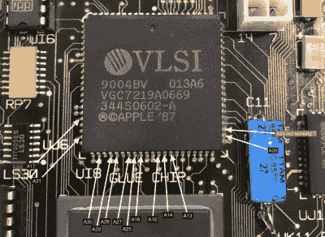

# 博奇电线从堆中保存一个老式 Mac SE/30

> 原文：<https://hackaday.com/2020/11/01/bodge-wire-saves-a-vintage-mac-se-30-from-the-heap/>

任何一个在旧电子产品周围摸索的人都知道，年龄对电容器是不友好的。如果你有一个已经用了几十年的小玩意，很有可能它的一些电容器要么濒临失效，要么已经死了。先发制人地把它们换出来在逆向计算界很常见，但是如果你珍贵的计算机已经成为一个麻烦的电解质的牺牲品，你该怎么办呢？

这就是[Ronan Gaillard]最近发现自己处于的情况，当他启动他的 Mac SE/30 时，屏幕上出现了一个类似斑马的图案。互联网上汇集的智慧告诉他，一些坏帽子几乎肯定是罪魁祸首，尽管目测没有发现任何太可疑的东西。知道时钟在走着，他更换了 Mac 主板上的所有电容器，并彻底清洗了一下。

 可惜，什么都没变。这让[罗南]有点吃惊，他又跑了一趟兔子洞，试图找到更多的信息。有了机器的原理图，他开始手动检查 ROM 和 CPU 之间所有轨迹的连续性。但他还是空手而归。他继续 RAM 和胶水芯片的过程，最终发现迹线 A24 没有连接。根据它采取的路线，他意识到它正好在他之前更换的 C11 轴向电容器下面。

突然间，一切都有了意义。电容器一定是漏电了，以一种几乎察觉不到的方式腐蚀了下面的线路，切断了计算机组件之间的一个重要链接。为了证实他的怀疑，[罗南]用一根博奇线连接 A24 的两端，让这台 30 多年的旧电脑起死回生。好吧，没有那么多的咆哮，因为原来软盘驱动器也被击中…但这是一个修复的另一天。

似乎每个硬件黑客都有一个糟糕的电容故事。从[老式便携式打字机](https://hackaday.com/2020/10/22/clacker-hacker-popping-a-cap-in-a-brother-ep43-thermal-typewriter/)到[简陋的家用路由器](https://hackaday.com/2014/12/17/repairing-a-router-plagued-by-capacitors/)，这些小恶魔和它们可能造成的损害应该永远是你检查某个硬件是否有问题的第一件事。