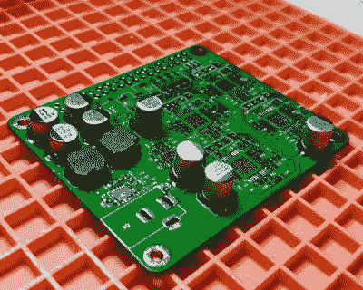

# 树莓 Pi 的螺栓固定步进电机驱动器

> 原文：<https://hackaday.com/2019/08/13/bolt-on-stepper-motor-driver-for-the-raspberry-pi/>

为了参加 2019 年 Hackaday 奖，[Tobius Daichi]正在努力为每个人都喜欢的 Linux SBC 添加一些运动控制功能。他的 3+Pi 板连接到 Raspberry Pi 的 GPIO 头，让您可以方便地控制四个独立的步进电机。非常适合 3D 打印机、激光切割机、CNC 或任何你能想到的需要在几个维度上移动的东西。

但是这种对 3+Pi 的简单描述可能有点低估了它。虽然[Tobius]表示，他的灵感来自为无数 DIY 3D 打印机提供动力的经典 Arduino CNC Shield，但他已经设法改进了这一概念。3+Pi 不是让主机 Pi 直接与步进驱动器通信，而是具有一个板载 STM32F302CBT6 来处理实际的电机控制。Pi 只需要告诉它通过 UART 做什么。

 如果你想实时处理事情，让板载微控制器处理与步进驱动器对话的低级方面会有很大帮助。[该板的一个自然扩展可能是对 Klipper 固件](https://hackaday.com/2017/12/26/fast-3d-printing-with-raspberry-pi-but-not-how-you-think/)的支持，这利用了树莓 Pi 比普通 3D 打印机控制板强大许多倍的事实。通过 Pi 处理数学并提供微控制器指令，Klipper 可以实现比微控制器单独完成的更快、更准确的打印。

至于步进驱动器本身，[Tobius]已决定采用 Trinamic TMC2041-LA-T。该芯片引人注目，因为它将双驱动器放在一个 48 QFN 封装中，如果您希望节省电路板空间，这是非常好的选择。有些人可能会抱怨，如果你设法在 Arduino CNC shield 上制作一个类似的步进驱动器，3+Pi 不允许轻易更换步进驱动器，但实际上你[可以对许多专门建造的步进控制板](https://hackaday.com/2016/07/19/new-part-day-sts-32-bit-3d-printer-controller/)说同样的话。

[Tobius]目前正在独自处理这个项目，但他确实提到，他愿意与任何对此类事情感兴趣的人合作。过去曾有过创造 Linux 驱动的 3D 打印机控制器的尝试，但我们认为这种方法有着特殊的前景，如果不是因为树莓 Pi 的流行。

The [HackadayPrize2019](https://prize.supplyframe.com) is Sponsored by:     