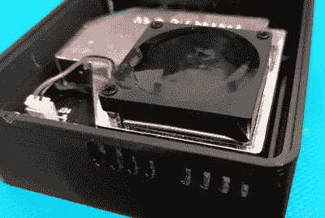

# 使用这款在线灰尘传感器盒，轻松呼吸

> 原文：<https://hackaday.com/2019/12/27/breathe-easy-with-this-online-dust-sensor-box/>

对我们许多人来说，我们的空气远没有我们希望的那么干净，这是一个不幸的现实。从烟雾到野火，空气中有一大堆我们只想远离肺部的东西。但是为了打击这个敌人，你首先需要了解它。这意味着要弄清楚你呼吸的空气中有什么，以及有多少。这就是像物联网专家 T3 的集尘盒这样的 T2 设备可以派上用场的地方。

3D 打印外壳内是一个 Wemos D1 迷你 ESP8266 开发板，位于定制的分线 PCB 上。该板为您添加自己的传感器和硬件提供了一些简单的可扩展性，尽管在这种特殊配置中，集尘盒使用 BME280 传感器进行一般环境监控，使用 SDS011 激光粒子传感器来确定空气中的物质。只要将它插入一个方便的 USB 电源，确保它连接到 WiFi，它就可以走了。

但是所有这些可爱的数据最终去了哪里呢？这取决于你，但在这种情况下，[物联网专家]正在将一切都推到一个网络界面上，允许用户查看灰尘盒可以检查的每个参数的年度、月度和每周历史数据。这可能比我们大多数人所需要的更细一些，但是这是一个很好的例子，说明如果您需要那么多信息，可能会发生什么。

对于一个类似的项目，让你可以让你的传感器远离人迹罕至的道路， [checkout FieldKit](https://hackaday.io/project/26354-fieldkit) ，这是[最近获得的 2019 年 Hackaday 奖](https://hackaday.com/2019/11/16/fieldkit-is-the-grand-prize-winner-of-the-2019-hackaday-prize/)。