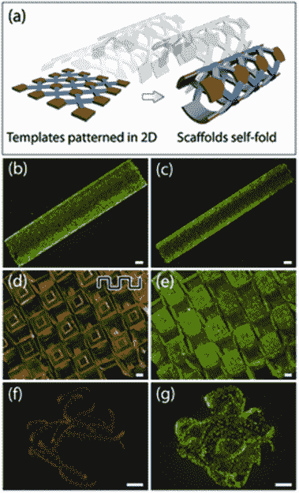
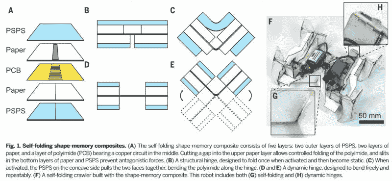
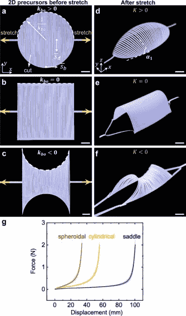
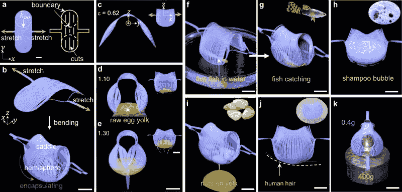

# 将折纸和 Kirigami 艺术引入机器人和医疗技术

> 原文：<https://hackaday.com/2022/03/09/bringing-the-art-of-origami-and-kirigami-to-robotics-and-medical-technology/>

传统上，当涉及到用于药物输送的高科技自我组装微观结构以及用于机器人的精致、精密的夹钳时，一直缺乏有效、经济的选择。虽然存在一些选择，但它们很少如期望的那样有效，例如，微观药物输送机制不具有最佳的孔隙率。同样，在所谓的软机器人技术中，必须做出许多妥协。

这里一项有前途的技术涉及操纵扁平结构，使它们能够自动组装成 3D 结构，或者无损地转变成具有特定特征的 3D 结构，例如可能在微观和宏观应用中有用的夹钳，包括机器人。

也许最有趣的部分是这些技术有多少借鉴了日本的折纸艺术，以及相关的 T2 剪纸艺术。

## 平的更好

Self-folding scaffolds in anatomically relevant geometries. (Randall et al., 2012)

如果人们能够引导一片材料甚至单个分子自我组装成想要的形状，那么比试图构建三维结构要有效得多。例如，在生物医学工程领域，从可以精确高效地将某些药物输送到所需位置的药物输送机制，到可以使用外部触发器控制的显微镜手术工具(如夹钳),都有强大的用例。

在 Randall 等人(2012 年)的综述论文中，探讨了潜在的应用和当时的技术水平，重点是基于铰链的自折叠机制的使用。这里令人兴奋的想法是，它将允许我们使用二维光刻方法和类似的常见 2D 制造机制来创建微小的机制。

如右图所示，Randall 等人在之前的研究中能够生产出 2D 结构，当从基底上释放时，使用内置铰链自动折叠成 3D 结构。通过设计铰链的位置，这实质上使这些结构成为一种自我组装类型的折纸。

他们注意到，通常在半导体工业中使用的光刻技术对于这种类型的组装并不是最佳的，因为优选使用在半导体光刻技术中不常见的有机和其他材料。使用软平版印刷方法将生物聚合物和类似物成形为所需的形状被认为是有前途的。

## 自动组装机器

在一篇由[Felton et al .(2014)](https://www.science.org/doi/10.1126/science.1252610)([PDF](https://erikdemaine.org/papers/PPR_Science2014/paper.pdf))撰写的文章中，使用了一种与 Randall et al .类似的方法，除了在更大规模上使用自组装机器人。这里的基本思想是使用计算折纸的概念来创建一个嵌入电子设备的平板电路板。激活时，沿着嵌入铰链的形状记忆复合材料被激活

(Credit: Felton et al., 2014)

他们展示的机器人使用预拉伸聚苯乙烯(PSPS)、纸和 PCB 的夹层。PSPS 是一种形状记忆聚合物，当加热到大约 100 摄氏度时会收缩。当接头完成旋转时，热源被移除，并且随着 PSPS 变硬，新的取向是永久的，直到再次被加热。

将机器人从扁平形状折叠成最终的 3D 形状需要五个步骤，其中三个是自折叠，剩下的两个步骤由电机处理。将电源连接到平板组件后，完成折叠步骤和接头冷却大约需要四分钟。折叠后，机器人就可以开始以新的三维形态行走。

然而，并非所有的机器人都成功折叠:正如他们在论文中指出的，他们需要三次尝试才能成功自我组装。显然，精确地用铰链将它们调整到想要的方向是一个问题。即便如此，考虑到材料的低成本，人们可以想象像这样的扁平、自组装机器人正在大规模生产。

如上所述，这种技术对于快速原型制作非常有用，一旦到达预定位置，从机器人到卫星的一切都可以很容易地自行组装。热敏聚合物的温度为 100°C，这是所选材料的质量，根据预期的环境工作条件，可以选择不同的材料来适应不同的温度范围。

## 生花妙笔

Example of kirigami: St. Paul’s Cathedral by Bharath Kishore.

前面提到的研究涉及了本质上是高科技折纸的类型，因为它们的 3D 形状来自于它们的 2D 表面，仅仅使用了一些折叠。这不同于 kirigami(切り紙)，正如其名称所表明的那样:切り (kiri)意为“切割”和紙(kami)意为“纸”。对于 kirigami 来说，不是折叠纸张来创建最终形状，而是在纸张上进行最初的切割来确定它将呈现的 3D 形状。

一个众所周知的西方 kirigami 的例子可以在所谓的[弹出式书籍](https://en.wikipedia.org/wiki/Pop-up_book)中找到，在那里打开一页会由于纸张的切割方式而导致平面纸张形成各种形状，偶尔还会有引导折叠的帮助。根据复杂程度的不同，这种方式可以制作出最精致的形状。

The 2D kirigami sheets, their transformations and force-displacement curves (Hong et al., 2022)

这也是最近由洪等人(2022)发表在自然通讯(T3)上的一项研究背后的指导原则，该研究试图创造一种计算 kirigami，这种计算 kiri gami 允许将三维形状转化为平面上的一系列切割。本文用三种基本形状演示了一个简单的例子:

他们计算 kirigami 方法的核心是高斯-邦尼特定理。在微分几何领域，这涵盖了曲面之间的关系，将曲面的几何曲率与其欧拉特征(拓扑曲率)联系起来。这适用于例如地球的[测地线](https://en.wikipedia.org/wiki/Geodesic_curvature)曲率及其[高斯](https://en.wikipedia.org/wiki/Gaussian_curvature)曲率。这有效地提供了一种数学方法来描述它们从不同的表示移动时的转换

使用有限元方法(FEM)模拟和分析建模，将形态变化与理论模型进行比较，建立 2D 基里加米片的边界曲率和 3D 形状的高斯曲率之间的相关性。

利用这样开发的模型，Hong 等人创造了一种可以施加精确定义的力的软抓取器，允许在没有损坏的情况下拾取和释放精细的物体。

Programmable delicate and noninvasive kirigami gripper. (Hong et al., 2022)

这种结构基本上由两个位于中心区域旁边的折翼组成，外力(拉力)施加在该中心区域上。由于结构中精确计算的狭缝，施加的力导致由此产生的夹具的非永久变形。由于控制量大，这种简单的结构可以用来抓住、保持和轻轻地释放任何东西，从生蛋黄到活鱼。它也有足够的力量捡起并抓住一根头发，如嵌入视频所示:

 [https://www.youtube.com/embed/1oEXhKBoYc8?version=3&rel=1&showsearch=0&showinfo=1&iv_load_policy=1&fs=1&hl=en-US&autohide=2&wmode=transparent](https://www.youtube.com/embed/1oEXhKBoYc8?version=3&rel=1&showsearch=0&showinfo=1&iv_load_policy=1&fs=1&hl=en-US&autohide=2&wmode=transparent)

## 跳出框框思考

前面的研究中最有趣的方面可能是有多少已经被应用到今天。我们可以让盒子自己组装起来，而不是走一条明显的道路，专注于寻找直接构建复杂三维结构的方法——无论是在宏观还是微观尺度上。

尽管目前还很难说这项研究有多少会在现实生活中得到应用，以及在此过程中会遇到哪些障碍，但这些以 2D 转型为重点的方法似乎有很大的前景。就像对自组装纳米结构的一般研究一样，似乎有一种趋势是工程系统可以自己处理组装。

虽然自我折叠的医疗应用、手术纳米机器人可能还有一段时间，但这并不意味着我们不能制造自我组装、扁平包装式的机器人，以及温和的机器人夹钳和我们的想象力和数学带我们去的任何地方。