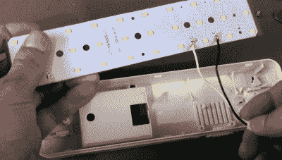

# 用黑灯将地震闪烁变得栩栩如生

> 原文：<https://hackaday.com/2021/09/21/bringing-the-quake-flicker-to-life-with-a-hacked-light/>

如果你因为多年来一直在项目中重用相同的代码片段而感到羞愧，不要这样做。即使是大牌也这么做，事实证明，1996 年为 *Quake* 编写的管理闪烁灯光的代码仍被用于 AAA 级游戏，如 2020 年的*半衰期:Alyx* 。为了纪念这个数字推卸责任的标志性例子，[【罗德里戈·费利西亚诺】认为他应该将有问题的代码移植到 Arduino](https://github.com/Pakequis/arduino-quake-flicker-lamp) 上，并在现实生活中重现这种效果。

由于 Quake 引擎已经在 GPLv2 下发布，所以很容易[调出代码的相关部分](https://github.com/id-Software/Quake/blob/bf4ac424ce754894ac8f1dae6a3981954bc9852d/qw-qc/world.qc#L328-L372)来查看灯光是如何配置的。有趣的是，照明模式被实现为字符串，其中从 *a* 到 *z* 的字母表示光线应该有多亮。例如，介于最小和最大亮度之间的闪光灯可以写成“aaaaaaaazzzzzzzz”，而闪烁的灯光可以用字符串“nmonqnmomnmomomno”来表示。

An emergency light provided the LEDs and enclosure.

这很容易在 Arduino 上实现，只需几行代码，因为【罗德里戈】只需使用`map`为字符串中的每个字母分配一个 0 到 255 之间的数值，然后使用结果数字通过`analogWrite`设置 LED 亮度。

写好代码后，[Rodrigo]必须将硬件组装起来。他拆下一个基本的应急灯，得到一排白色发光二极管和一个方便的外壳。他还在一块废弃的 perfboard 上连接了一个简单的晶体管电路，这样 Arduino Pro Mini 就可以通过一个 GPIO 引脚控制所有的 led。再加上一根长长的 USB 电缆为它供电，他就有了一个完美的深夜游戏桌面配件。

在下面的视频中，你可以看到最终的结果，其中[罗德里戈]甚至同步到 1996 年经典射手的镜头。灯光是一个有趣的话题，但我们认为合乎逻辑的下一步是[将这种技术应用到一个类似流光溢彩的系统中](https://hackaday.com/2016/12/03/beautiful-diy-ambilight-display/),让你感觉像是在昏暗的走廊中漫步。

 [https://www.youtube.com/embed/ldI8LOxTwaM?version=3&rel=1&showsearch=0&showinfo=1&iv_load_policy=1&fs=1&hl=en-US&autohide=2&wmode=transparent](https://www.youtube.com/embed/ldI8LOxTwaM?version=3&rel=1&showsearch=0&showinfo=1&iv_load_policy=1&fs=1&hl=en-US&autohide=2&wmode=transparent)

