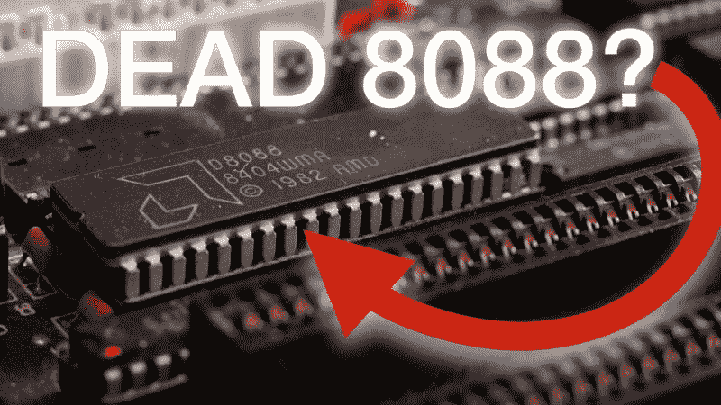

# 使用旧主板是一个微妙的过程

> 原文：<https://hackaday.com/2022/11/12/bringing-up-an-old-motherboard-is-a-delicate-process/>

如果你生活在个人电脑革命的早期，你无疑会回忆起每次 IBM 宣布其米色盒子的新版本时的兴奋。对我们大多数人来说，这种兴奋纯粹是间接的，因为尽管有“个人”的绰号，普通人很少能买得起一台品牌 IBM 机器。但跟踪最新的发行版，梦想廉价的克隆产品有可能成为游戏的那一天，仍然是一件很酷的事情。

[Anders Nielsen]最近发现了一个原始的 5160 型主板,这在某种程度上呼应了很久以前的兴奋，但以不同的方式。这块板来自 1984 年生产的 PC XT，在到达时处于未知状态，因此[Anders]开始仔细处理，试图让这块板起死回生。快速的视觉检查给人留下了一种感觉，既有多少东西发生了变化，又有多少东西保持不变。除了大的 40 针 DIP 8088 CPU 和 BIOS ROMs，主板几乎完全由分立逻辑芯片组成，但同时，主板的基本尺寸变化很小。

下面视频中的启动过程包括检查所有电源轨的短路，这最终是一个很好的决定——去那些钽。在解决了这个问题后，[Anders]在让主板发布时遇到了一点麻烦，最终他转储了 BIOS ROMs 并检查了内容。其中一个芯片在某个时候发现了一个扰频信号，由于网上有 5160 ROMs 的图片，这个问题很容易解决。我们认为使用 64k ROM 并只写两次 BIOS 映像的技巧非常聪明。

最后，主板出现了，尽管没有视频或键盘——那是以后的事了。找不到自己的 PC XT 主板玩？[那也许你可以只造一个](https://hackaday.com/2022/05/21/building-your-own-8088-xt-motherboard/)。

