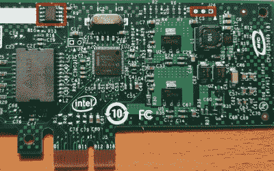

# 构建概念验证硬件植入

> 原文：<https://hackaday.com/2018/10/24/building-a-proof-of-concept-hardware-implant/>

你肯定听说过一些服务器主板上的“硬件植入”，这导致了网上各种各样的苦恼。关于这种设备的能力，它们需要多大，坦率地说，如果它们存在的话，这是一个没有尽头的争论。我们现在已经透过镜子，可以理解的是，人们疯狂地急于尽可能多地了解这些类型的设备所代表的威胁。

EEPROM (left) can be edited to enable SMBus access on this card (header to the right)

Kudelski Security 的 Nicolas Oberli 想做的不仅仅是无所事事的推测，所以他决定提出一个植入硬件间谍设备如何与主机系统互动的模型。他能够用现成的硬件做到这一点，这意味着任何人都可以在自己的家庭实验室里重建这个“硬件植入玩具组”进行实验。显然，这并不意味着从硬件本身的角度来描述实际的攻击，而是提供了一些关于这种设备可能如何工作的有价值的见解。

硬件植入最明显的攻击媒介之一是基板管理控制器(BMC)。这是一种在现代主板上使用的芯片，允许远程控制和监控系统的硬件，并有望成为攻击者的成熟目标。BMC 芯片可以使用几个边带通道与其它芯片通信。为了简单起见，[Nicolas]将注意力集中在老式的 SMBus 上(而不是更新更复杂的 NC-SI ),演示一旦你控制了那条总线，你能做什么。

唯一的问题是，他没有带 BMC 的主板来做实验。经过一番研究，答案以 Intel EXPI9301CTBLK 网卡的形式出现，它采用了 82574L SMBus 芯片。这允许在任何具有 PCI-E 插槽的机器上试验 SMBus 功能的子集。更好的是，该卡在顶部有一个 SMBus 插头可以插入。[Nicolas]详细描述了他如何通过修改卡的 EEPROM 来启用 SMBus 接口，然后允许他用 HydraBus 检测它。

完成硬件设置后，本文的其余部分将重点讨论如何直接控制网卡上的 SMBus。[Nicolas]不仅演示了创建和发送以太网数据包，还演示了拦截传入的数据包。在这两种情况下，主机上正在运行的`tcpdump`实例甚至看不到包的存在。

他继续解释说，由于 SMBus 与 I2C 非常相似，并且只需要四条线，因此所展示的技术可以很容易地从演示中使用的 Hydrabus 开发板移植到 ATtiny85 这样的小型微控制器上。但是你仍然需要找到一种方法把微控制器直接加到网卡上，而不被不经意的观察者发现。

我们之前对疑似硬件植入的报道引发了广泛的讨论，看起来无论你站在哪一边，这场争论都不会很快结束。